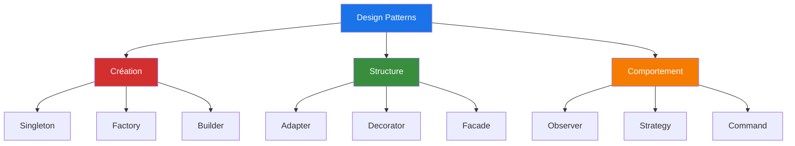

# Qu'est-ce qu'un Design Pattern ?

<v-clicks>

- 🎯 **Solution éprouvée** à un problème récurrent
- 📚 **Vocabulaire commun** entre développeurs
- 🔧 **Boîte à outils** de conception logicielle
- ✨ **Bonnes pratiques** accumulées depuis des années

</v-clicks>

💡 <strong>Analogie</strong> : Comme des recettes de cuisine pour résoudre des problèmes de conception

<!--
Un design pattern n'est pas du code à copier-coller, mais une approche conceptuelle.
C'est comme avoir un plan d'architecture avant de construire une maison.
-->

---

# Les 3 Catégories

<v-click>

### 🏗️ Création
Gestion de la création d'objets

</v-click>

<v-click>

### 🔗 Structure
Organisation des classes et objets

</v-click>

<v-click>

### 🎭 Comportement
Communication entre objets

</v-click>

<!--
Chaque catégorie répond à un type de problème spécifique.
Nous allons voir des exemples concrets pour chacune.
-->

