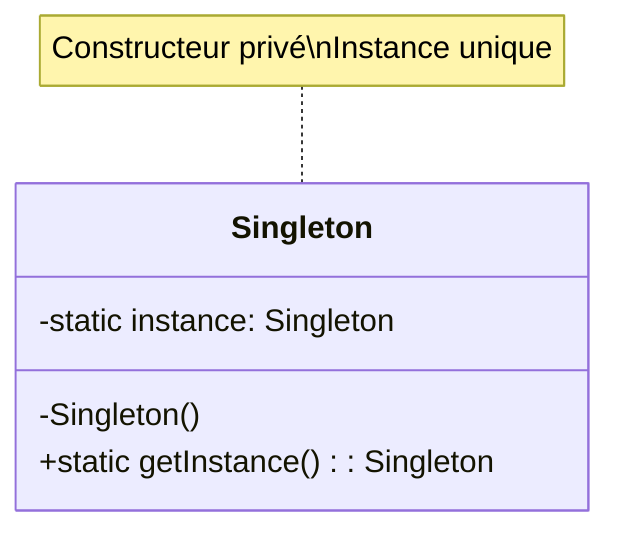

layout: center
---

# Singleton

<div class="text-xl mb-4">
Garantir qu'une classe n'a qu'une seule instance
</div>

<v-clicks>

- 🎯 **Problème** : Besoin d'une instance unique (configuration, connexion DB)
- ✅ **Solution** : Contrôler l'instanciation via la classe elle-même
- 📦 **Cas d'usage** : Logger, gestionnaire de configuration, pool de connexions

</v-clicks>

<div v-click class="mt-4">



</div>

<!--
Le Singleton est probablement le pattern le plus connu, mais aussi le plus controversé.
Il faut l'utiliser avec parcimonie car il peut créer des dépendances cachées.
-->

---

# Singleton - Implémentation

````md magic-move

```typescript
// Étape 1 : Classe de base
class DatabaseConnection {
  constructor() {
    console.log("Connexion à la base de données");
  }
}
```

```typescript
class DatabaseConnection {
  // Étape 2 : Ajouter l'instance statique
  private static instance: DatabaseConnection;
  
  constructor() {
    console.log("Connexion à la base de données");
  }
}
```

```typescript
class DatabaseConnection {
  private static instance: DatabaseConnection;
  
  // Étape 3 : Constructeur privé + méthode getInstance
  private constructor() {
    console.log("Connexion à la base de données");
  }
  
  public static getInstance(): DatabaseConnection {
    if (!DatabaseConnection.instance) {
      DatabaseConnection.instance = new DatabaseConnection();
    }
    return DatabaseConnection.instance;
  }
}
```

```typescript
class DatabaseConnection {
  private static instance: DatabaseConnection;
  
  private constructor() {
    console.log("Connexion à la base de données");
  }
  
  public static getInstance(): DatabaseConnection {
    if (!DatabaseConnection.instance) {
      DatabaseConnection.instance = new DatabaseConnection();
    }
    return DatabaseConnection.instance;
  }
}

// Étape 4 : Utilisation
const db1 = DatabaseConnection.getInstance();
const db2 = DatabaseConnection.getInstance();
console.log(db1 === db2); // true - même instance !
```

````

<!--
Notez comment nous construisons progressivement le pattern :
1. Classe normale
2. Ajout de l'instance statique
3. Constructeur privé pour empêcher new
4. Méthode getInstance pour contrôler la création
-->

