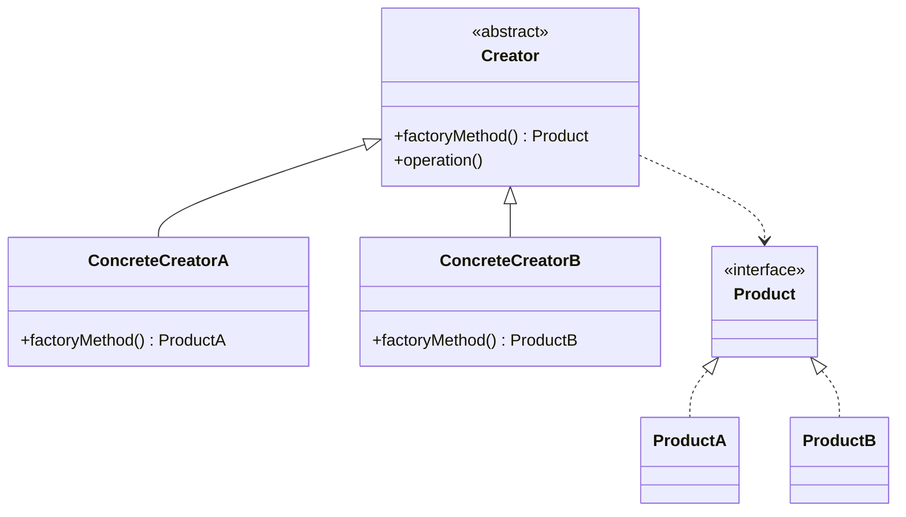

# Factory Method

<div class="text-xl mb-4">
Déléguer la création d'objets à des sous-classes
</div>

<v-clicks>

- 🎯 **Problème** : Créer des objets sans spécifier leur classe exacte
- ✅ **Solution** : Interface de création, implémentation dans les sous-classes
- 📦 **Cas d'usage** : Créer différents types de documents, véhicules, notifications

</v-clicks>

<div v-click class="mt-8">



</div>

<!--
La Factory Method permet de créer des objets sans connaître leur type exact.
C'est très utile quand on veut étendre le système avec de nouveaux types.
-->

---

# Factory Method - Implémentation

<div class="overflow-y-auto" style="max-height: 90%;">

````md magic-move

```typescript
// Étape 1 : Interface du produit
interface Notification {
  send(message: string): void;
}
```

```typescript
// Étape 1 : Interface du produit
interface Notification {
  send(message: string): void;
}

class EmailNotification implements Notification {
  send(message: string): void {
    console.log(`📧 Email: ${message}`);
  }
}

class SMSNotification implements Notification {
  send(message: string): void {
    console.log(`📱 SMS: ${message}`);
  }
}
```

```typescript
interface Notification {
  send(message: string): void;
}

class EmailNotification implements Notification {
  send(message: string): void {
    console.log(`📧 Email: ${message}`);
  }
}

class SMSNotification implements Notification {
  send(message: string): void {
    console.log(`📱 SMS: ${message}`);
  }
}

// Étape 3 : Factory abstraite
abstract class NotificationFactory {
  abstract createNotification(): Notification;
  
  public notify(message: string): void {
    const notification = this.createNotification();
    notification.send(message);
  }
}
```

```typescript
interface Notification {
  send(message: string): void;
}

class EmailNotification implements Notification {
  send(message: string): void {
    console.log(`📧 Email: ${message}`);
  }
}

class SMSNotification implements Notification {
  send(message: string): void {
    console.log(`📱 SMS: ${message}`);
  }
}

abstract class NotificationFactory {
  abstract createNotification(): Notification;
  
  public notify(message: string): void {
    const notification = this.createNotification();
    notification.send(message);
  }
}

// Étape 4 : Factories concrètes
class EmailFactory extends NotificationFactory {
  createNotification(): Notification {
    return new EmailNotification();
  }
}

class SMSFactory extends NotificationFactory {
  createNotification(): Notification {
    return new SMSNotification();
  }
}
```

```typescript
interface Notification {
  send(message: string): void;
}

class EmailNotification implements Notification {
  send(message: string): void {
    console.log(`📧 Email: ${message}`);
  }
}

class SMSNotification implements Notification {
  send(message: string): void {
    console.log(`📱 SMS: ${message}`);
  }
}

abstract class NotificationFactory {
  abstract createNotification(): Notification;
  
  public notify(message: string): void {
    const notification = this.createNotification();
    notification.send(message);
  }
}

class EmailFactory extends NotificationFactory {
  createNotification(): Notification {
    return new EmailNotification();
  }
}

class SMSFactory extends NotificationFactory {
  createNotification(): Notification {
    return new SMSNotification();
  }
}

// Étape 5 : Utilisation
function sendAlert(factory: NotificationFactory, message: string) {
  factory.notify(message);
}

sendAlert(new EmailFactory(), "Alerte importante !");
sendAlert(new SMSFactory(), "Code de vérification : 1234");
```

````

</div>

<!--
La progression montre comment :
1. On définit l'interface commune
2. On crée les implémentations concrètes
3. On abstrait la création
4. On implémente les factories spécifiques
5. On utilise le pattern de manière flexible
-->
