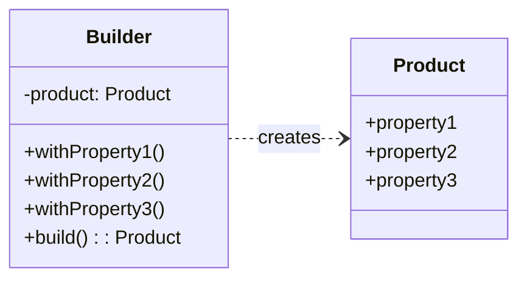

# Builder

<div class="text-xl mb-4">
Construire des objets complexes étape par étape
</div>

<v-clicks>

- 🎯 **Problème** : Créer des objets avec beaucoup de paramètres optionnels
- ✅ **Solution** : Séparer la construction de la représentation
- 📦 **Cas d'usage** : Requêtes SQL, documents, configurations complexes, test doubles

</v-clicks>

<div v-click class="mt-4">



</div>

<!--
Le Builder rend le code beaucoup plus lisible et maintenable.
On peut créer des objets avec seulement les propriétés nécessaires.
-->

---

# Builder - Implémentation

<div class="overflow-y-auto" style="max-height: 90%;">

````md magic-move

```typescript
// Étape 1 : La classe produit
class User {
  constructor(
    public firstName: string,
    public lastName: string,
    public email: string,
    public age?: number,
    public address?: string,
    public phone?: string,
    public isActive?: boolean
  ) {}
}
```

```typescript
class User {
  constructor(
    public firstName: string,
    public lastName: string,
    public email: string,
    public age?: number,
    public address?: string,
    public phone?: string,
    public isActive?: boolean
  ) {}
}

// Étape 2 : Le Builder
class UserBuilder {
  private firstName: string = "";
  private lastName: string = "";
  private email: string = "";
  private age?: number;
  private address?: string;
  private phone?: string;
  private active: boolean = false;
}
```

```typescript
class User {
  constructor(
    public firstName: string,
    public lastName: string,
    public email: string,
    public age?: number,
    public address?: string,
    public phone?: string,
    public isActive?: boolean
  ) {}
}

class UserBuilder {
  private firstName: string = "";
  private lastName: string = "";
  private email: string = "";
  private age?: number;
  private address?: string;
  private phone?: string;
  private active: boolean = false;

  // Étape 3 : Méthodes de construction
  withFirstName(firstName: string): UserBuilder {
    this.firstName = firstName;
    return this;
  }

  withLastName(lastName: string): UserBuilder {
    this.lastName = lastName;
    return this;
  }

  withEmail(email: string): UserBuilder {
    this.email = email;
    return this;
  }

  withAge(age: number): UserBuilder {
    this.age = age;
    return this;
  }

  withAddress(address: string): UserBuilder {
    this.address = address;
    return this;
  }

  withPhone(phone: string): UserBuilder {
    this.phone = phone;
    return this;
  }

  isActive(active: boolean): UserBuilder {
    this.active = active;
    return this;
  }
}
```

```typescript
class User {
  constructor(
    public firstName: string,
    public lastName: string,
    public email: string,
    public age?: number,
    public address?: string,
    public phone?: string,
    public isActive?: boolean
  ) {}
}

class UserBuilder {
  private firstName: string = "";
  private lastName: string = "";
  private email: string = "";
  private age?: number;
  private address?: string;
  private phone?: string;
  private active: boolean = false;

  withFirstName(firstName: string): UserBuilder {
    this.firstName = firstName;
    return this;
  }

  withLastName(lastName: string): UserBuilder {
    this.lastName = lastName;
    return this;
  }

  withEmail(email: string): UserBuilder {
    this.email = email;
    return this;
  }

  withAge(age: number): UserBuilder {
    this.age = age;
    return this;
  }

  withAddress(address: string): UserBuilder {
    this.address = address;
    return this;
  }

  withPhone(phone: string): UserBuilder {
    this.phone = phone;
    return this;
  }

  isActive(active: boolean): UserBuilder {
    this.active = active;
    return this;
  }

  // Étape 4 : Méthode build()
  build(): User {
    return new User(
      this.firstName,
      this.lastName,
      this.email,
      this.age,
      this.address,
      this.phone,
      this.active
    );
  }
}
```

```typescript
class User {
  constructor(
    public firstName: string,
    public lastName: string,
    public email: string,
    public age?: number,
    public address?: string,
    public phone?: string,
    public isActive?: boolean
  ) {}
}

class UserBuilder {
  private firstName: string = "";
  private lastName: string = "";
  private email: string = "";
  private age?: number;
  private address?: string;
  private phone?: string;
  private active: boolean = false;

  withFirstName(firstName: string): UserBuilder {
    this.firstName = firstName;
    return this;
  }

  withLastName(lastName: string): UserBuilder {
    this.lastName = lastName;
    return this;
  }

  withEmail(email: string): UserBuilder {
    this.email = email;
    return this;
  }

  withAge(age: number): UserBuilder {
    this.age = age;
    return this;
  }

  withAddress(address: string): UserBuilder {
    this.address = address;
    return this;
  }

  withPhone(phone: string): UserBuilder {
    this.phone = phone;
    return this;
  }

  isActive(active: boolean): UserBuilder {
    this.active = active;
    return this;
  }

  build(): User {
    return new User(
      this.firstName,
      this.lastName,
      this.email,
      this.age,
      this.address,
      this.phone,
      this.active
    );
  }
}

// Étape 5 : Utilisation
const user = new UserBuilder()
  .withFirstName("John")
  .withLastName("Doe")
  .withEmail("john@example.com")
  .withAge(30)
  .isActive(true)
  .build();

const simpleUser = new UserBuilder()
  .withFirstName("Jane")
  .withEmail("jane@example.com")
  .build();
```

````

</div>

<!--
La progression montre comment :
1. On définit la classe produit complexe
2. On crée le Builder avec les propriétés privées
3. On ajoute les méthodes fluent (qui retournent this)
4. On implémente la méthode build() finale
5. On utilise le Builder de manière claire et flexible
-->

