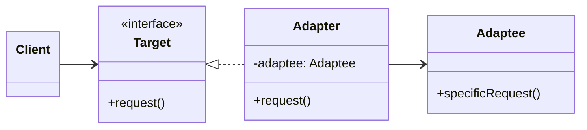

# Adapter

<div class="text-xl mb-4">
Convertir l'interface d'une classe en une autre interface
</div>

<v-clicks>

- 🎯 **Problème** : Faire fonctionner ensemble des classes incompatibles
- ✅ **Solution** : Créer un adaptateur qui traduit les appels
- 📦 **Cas d'usage** : Intégrer des bibliothèques tierces, legacy code

</v-clicks>

<div v-click class="mt-4">



</div>

<!--
L'Adapter est comme un adaptateur de prise électrique :
il permet de brancher un appareil sur une prise incompatible.
-->

---

# Adapter - Implémentation

<div class="overflow-y-auto" style="max-height: 90%;">

````md magic-move

```typescript
// Étape 1 : Système existant (ancien)
class OldPaymentSystem {
  processPayment(amount: number): void {
    console.log(`Traitement de ${amount}€ via l'ancien système`);
  }
}
```

```typescript
class OldPaymentSystem {
  processPayment(amount: number): void {
    console.log(`Traitement de ${amount}€ via l'ancien système`);
  }
}

// Étape 2 : Nouvelle interface attendue
interface ModernPaymentProcessor {
  pay(amount: number, currency: string): void;
  refund(transactionId: string): void;
}
```

```typescript
class OldPaymentSystem {
  processPayment(amount: number): void {
    console.log(`Traitement de ${amount}€ via l'ancien système`);
  }
}

interface ModernPaymentProcessor {
  pay(amount: number, currency: string): void;
  refund(transactionId: string): void;
}

// Étape 3 : Créer l'adaptateur
class PaymentAdapter implements ModernPaymentProcessor {
  private oldSystem: OldPaymentSystem;
  
  constructor(oldSystem: OldPaymentSystem) {
    this.oldSystem = oldSystem;
  }
  
  pay(amount: number, currency: string): void {
    console.log(`Conversion ${currency} → EUR`);
    this.oldSystem.processPayment(amount);
  }
  
  refund(transactionId: string): void {
    console.log(`Remboursement ${transactionId} via ancien système`);
  }
}
```

```typescript
class OldPaymentSystem {
  processPayment(amount: number): void {
    console.log(`Traitement de ${amount}€ via l'ancien système`);
  }
}

interface ModernPaymentProcessor {
  pay(amount: number, currency: string): void;
  refund(transactionId: string): void;
}

class PaymentAdapter implements ModernPaymentProcessor {
  private oldSystem: OldPaymentSystem;
  
  constructor(oldSystem: OldPaymentSystem) {
    this.oldSystem = oldSystem;
  }
  
  pay(amount: number, currency: string): void {
    console.log(`Conversion ${currency} → EUR`);
    this.oldSystem.processPayment(amount);
  }
  
  refund(transactionId: string): void {
    console.log(`Remboursement ${transactionId} via ancien système`);
  }
}

// Étape 4 : Utilisation
function processOrder(processor: ModernPaymentProcessor) {
  processor.pay(100, "USD");
}

const oldSystem = new OldPaymentSystem();
const adapter = new PaymentAdapter(oldSystem);
processOrder(adapter); // Fonctionne avec l'ancien système !
```

````

</div>

<!--
L'adaptateur permet de réutiliser du code existant sans le modifier.
C'est particulièrement utile lors de migrations ou d'intégrations.
-->
