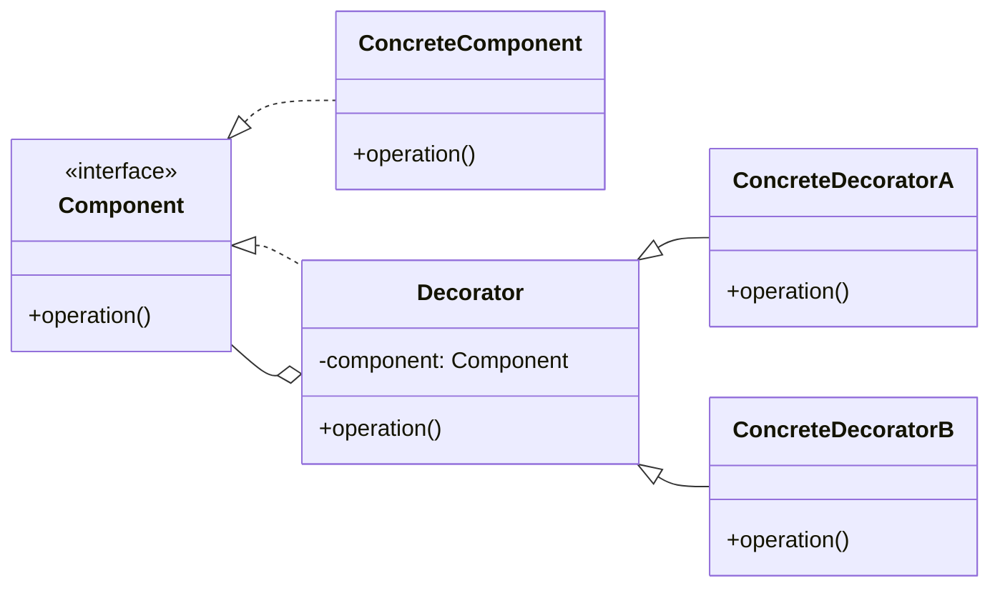

# Decorator

<div class="text-xl mb-4">
Ajouter dynamiquement des responsabilités à un objet
</div>

<v-clicks>

- 🎯 **Problème** : Étendre les fonctionnalités sans modifier la classe
- ✅ **Solution** : Envelopper l'objet dans des décorateurs
- 📦 **Cas d'usage** : Ajouter des fonctionnalités (logging, cache, validation)

</v-clicks>

<div v-click class="mt-4">



</div>

<!--
Le Decorator permet d'ajouter des fonctionnalités de manière flexible.
On peut combiner les décorateurs comme on veut, dans l'ordre qu'on veut.
-->

---

# Decorator - Implémentation

<div class="overflow-y-auto" style="max-height: 90%;">

````md magic-move

```typescript
// Étape 1 : Interface de base
interface Coffee {
  cost(): number;
  description(): string;
}
```

```typescript
interface Coffee {
  cost(): number;
  description(): string;
}

// Étape 2 : Implémentation simple
class SimpleCoffee implements Coffee {
  cost(): number {
    return 2;
  }
  
  description(): string {
    return "Café simple";
  }
}
```

```typescript
interface Coffee {
  cost(): number;
  description(): string;
}

class SimpleCoffee implements Coffee {
  cost(): number {
    return 2;
  }
  
  description(): string {
    return "Café simple";
  }
}

// Étape 3 : Premier décorateur
class MilkDecorator implements Coffee {
  constructor(private coffee: Coffee) {}
  
  cost(): number {
    return this.coffee.cost() + 0.5;
  }
  
  description(): string {
    return this.coffee.description() + " + lait";
  }
}
```

```typescript
interface Coffee {
  cost(): number;
  description(): string;
}

class SimpleCoffee implements Coffee {
  cost(): number {
    return 2;
  }
  
  description(): string {
    return "Café simple";
  }
}

class MilkDecorator implements Coffee {
  constructor(private coffee: Coffee) {}
  
  cost(): number {
    return this.coffee.cost() + 0.5;
  }
  
  description(): string {
    return this.coffee.description() + " + lait";
  }
}

// Étape 4 : Deuxième décorateur
class SugarDecorator implements Coffee {
  constructor(private coffee: Coffee) {}
  
  cost(): number {
    return this.coffee.cost() + 0.2;
  }
  
  description(): string {
    return this.coffee.description() + " + sucre";
  }
}
```

```typescript
interface Coffee {
  cost(): number;
  description(): string;
}

class SimpleCoffee implements Coffee {
  cost(): number {
    return 2;
  }
  
  description(): string {
    return "Café simple";
  }
}

class MilkDecorator implements Coffee {
  constructor(private coffee: Coffee) {}
  
  cost(): number {
    return this.coffee.cost() + 0.5;
  }
  
  description(): string {
    return this.coffee.description() + " + lait";
  }
}

class SugarDecorator implements Coffee {
  constructor(private coffee: Coffee) {}
  
  cost(): number {
    return this.coffee.cost() + 0.2;
  }
  
  description(): string {
    return this.coffee.description() + " + sucre";
  }
}

// Étape 5 : Utilisation - empiler les décorateurs
let coffee: Coffee = new SimpleCoffee();
coffee = new MilkDecorator(coffee);
coffee = new SugarDecorator(coffee);

console.log(coffee.description()); // "Café simple + lait + sucre"
console.log(coffee.cost()); // 2.7
```

````

</div>

<!--
La progression montre comment :
1. On définit l'interface commune
2. On crée l'implémentation de base
3. On ajoute le premier décorateur qui enveloppe
4. On ajoute d'autres décorateurs
5. On empile les décorateurs pour combiner les fonctionnalités
-->
