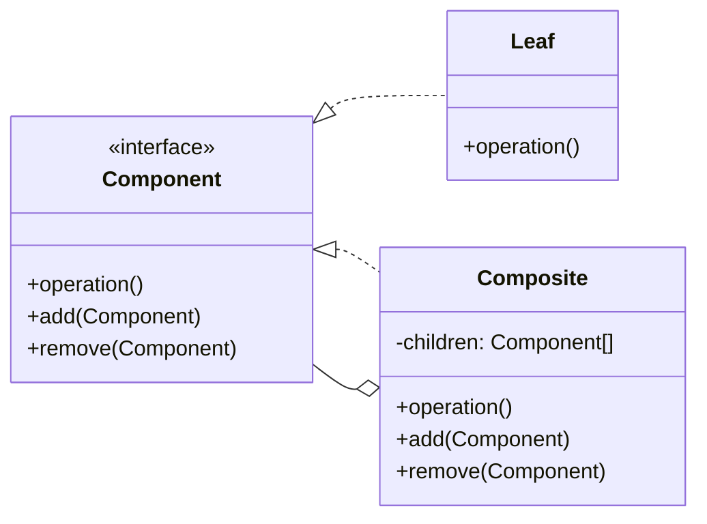

# Composite

<div class="text-xl mb-4">
Composer des objets en structures arborescentes
</div>

<v-clicks>

- 🎯 **Problème** : Traiter uniformément objets individuels et compositions d'objets
- ✅ **Solution** : Structure arborescente avec interface commune
- 📦 **Cas d'usage** : Systèmes de fichiers, menus, arbres DOM, organisations

</v-clicks>

<div v-click class="mt-4">



</div>

<!--
Le Composite permet de traiter de la même manière un objet seul ou un groupe d'objets.
C'est comme un système de fichiers : un fichier ou un dossier peuvent être manipulés de la même façon.
-->

---

# Composite - Implémentation

<div class="overflow-y-auto" style="max-height: 90%;">

````md magic-move

```typescript
// Étape 1 : Interface commune
interface FileSystemComponent {
  getName(): string;
  getSize(): number;
  display(indent: string): void;
}
```

```typescript
interface FileSystemComponent {
  getName(): string;
  getSize(): number;
  display(indent: string): void;
}

// Étape 2 : Feuille (File)
class File implements FileSystemComponent {
  constructor(
    private name: string,
    private size: number
  ) {}
  
  getName(): string {
    return this.name;
  }
  
  getSize(): number {
    return this.size;
  }
  
  display(indent: string): void {
    console.log(`${indent}📄 ${this.name} (${this.size} KB)`);
  }
}
```

```typescript
interface FileSystemComponent {
  getName(): string;
  getSize(): number;
  display(indent: string): void;
}

class File implements FileSystemComponent {
  constructor(
    private name: string,
    private size: number
  ) {}
  
  getName(): string {
    return this.name;
  }
  
  getSize(): number {
    return this.size;
  }
  
  display(indent: string): void {
    console.log(`${indent}📄 ${this.name} (${this.size} KB)`);
  }
}

// Étape 3 : Composite (Folder)
class Folder implements FileSystemComponent {
  private children: FileSystemComponent[] = [];
  
  constructor(private name: string) {}
  
  add(component: FileSystemComponent): void {
    this.children.push(component);
  }
  
  remove(component: FileSystemComponent): void {
    const index = this.children.indexOf(component);
    if (index > -1) this.children.splice(index, 1);
  }
  
  getName(): string {
    return this.name;
  }
  
  getSize(): number {
    return this.children.reduce((sum, child) => sum + child.getSize(), 0);
  }
  
  display(indent: string): void {
    console.log(`${indent}📁 ${this.name} (${this.getSize()} KB)`);
    this.children.forEach(child => child.display(indent + "  "));
  }
}
```

```typescript
interface FileSystemComponent {
  getName(): string;
  getSize(): number;
  display(indent: string): void;
}

class File implements FileSystemComponent {
  constructor(
    private name: string,
    private size: number
  ) {}
  
  getName(): string {
    return this.name;
  }
  
  getSize(): number {
    return this.size;
  }
  
  display(indent: string): void {
    console.log(`${indent}📄 ${this.name} (${this.size} KB)`);
  }
}

class Folder implements FileSystemComponent {
  private children: FileSystemComponent[] = [];
  
  constructor(private name: string) {}
  
  add(component: FileSystemComponent): void {
    this.children.push(component);
  }
  
  remove(component: FileSystemComponent): void {
    const index = this.children.indexOf(component);
    if (index > -1) this.children.splice(index, 1);
  }
  
  getName(): string {
    return this.name;
  }
  
  getSize(): number {
    return this.children.reduce((sum, child) => sum + child.getSize(), 0);
  }
  
  display(indent: string): void {
    console.log(`${indent}📁 ${this.name} (${this.getSize()} KB)`);
    this.children.forEach(child => child.display(indent + "  "));
  }
}

// Étape 4 : Utilisation - créer une arborescence
const root = new Folder("root");
const documents = new Folder("documents");
const images = new Folder("images");

documents.add(new File("cv.pdf", 150));
documents.add(new File("lettre.docx", 50));

images.add(new File("photo1.jpg", 2000));
images.add(new File("photo2.jpg", 1800));

root.add(documents);
root.add(images);
root.add(new File("readme.txt", 5));

root.display(""); // Affiche toute l'arborescence
```

````

</div>

<!--
La progression montre comment :
1. On définit l'interface commune
2. On crée les feuilles (objets simples)
3. On crée le composite (conteneur)
4. On utilise le pattern pour créer une structure arborescente
-->

