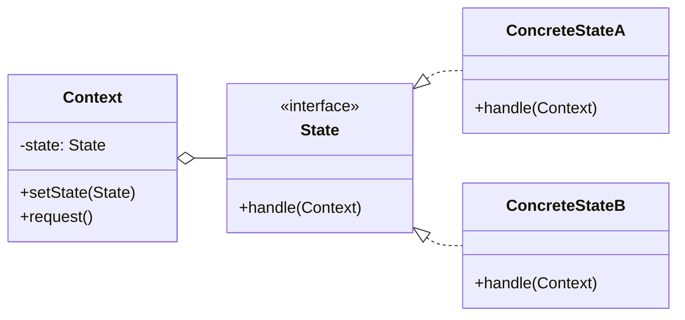

# État (State)

<div class="text-xl mb-4">
Modifier le comportement d'un objet selon son état interne
</div>

<v-clicks>

- 🎯 **Problème** : Comportement différent selon l'état, éviter les if/else
- ✅ **Solution** : Encapsuler chaque état dans une classe
- 📦 **Cas d'usage** : Machines à états, workflows, jeux vidéo

</v-clicks>

<div v-click class="mt-4">



</div>

<!--
Le pattern État évite les longues chaînes de if/else pour gérer les états.
C'est comme un distributeur automatique qui change de comportement selon son état.
-->

---

# État - Implémentation

<div class="overflow-y-auto" style="max-height: 90%;">

````md magic-move

```typescript
// Étape 1 : Interface State
interface OrderState {
  cancel(order: Order): void;
  ship(order: Order): void;
  deliver(order: Order): void;
}
```

```typescript
interface OrderState {
  cancel(order: Order): void;
  ship(order: Order): void;
  deliver(order: Order): void;
}

// Étape 2 : États concrets
class PendingState implements OrderState {
  cancel(order: Order): void {
    console.log("✅ Commande annulée");
    order.setState(new CancelledState());
  }
  
  ship(order: Order): void {
    console.log("📦 Commande expédiée");
    order.setState(new ShippedState());
  }
  
  deliver(order: Order): void {
    console.log("❌ Impossible de livrer une commande non expédiée");
  }
}

class ShippedState implements OrderState {
  cancel(order: Order): void {
    console.log("❌ Impossible d'annuler une commande expédiée");
  }
  
  ship(order: Order): void {
    console.log("❌ Commande déjà expédiée");
  }
  
  deliver(order: Order): void {
    console.log("🎉 Commande livrée");
    order.setState(new DeliveredState());
  }
}
```

```typescript
interface OrderState {
  cancel(order: Order): void;
  ship(order: Order): void;
  deliver(order: Order): void;
}

class PendingState implements OrderState {
  cancel(order: Order): void {
    console.log("✅ Commande annulée");
    order.setState(new CancelledState());
  }
  
  ship(order: Order): void {
    console.log("📦 Commande expédiée");
    order.setState(new ShippedState());
  }
  
  deliver(order: Order): void {
    console.log("❌ Impossible de livrer une commande non expédiée");
  }
}

class ShippedState implements OrderState {
  cancel(order: Order): void {
    console.log("❌ Impossible d'annuler une commande expédiée");
  }
  
  ship(order: Order): void {
    console.log("❌ Commande déjà expédiée");
  }
  
  deliver(order: Order): void {
    console.log("🎉 Commande livrée");
    order.setState(new DeliveredState());
  }
}

class DeliveredState implements OrderState {
  cancel(order: Order): void {
    console.log("❌ Impossible d'annuler une commande livrée");
  }
  
  ship(order: Order): void {
    console.log("❌ Commande déjà livrée");
  }
  
  deliver(order: Order): void {
    console.log("❌ Commande déjà livrée");
  }
}

class CancelledState implements OrderState {
  cancel(order: Order): void {
    console.log("❌ Commande déjà annulée");
  }
  
  ship(order: Order): void {
    console.log("❌ Impossible d'expédier une commande annulée");
  }
  
  deliver(order: Order): void {
    console.log("❌ Impossible de livrer une commande annulée");
  }
}
```

```typescript
interface OrderState {
  cancel(order: Order): void;
  ship(order: Order): void;
  deliver(order: Order): void;
}

class PendingState implements OrderState {
  cancel(order: Order): void {
    console.log("✅ Commande annulée");
    order.setState(new CancelledState());
  }
  
  ship(order: Order): void {
    console.log("📦 Commande expédiée");
    order.setState(new ShippedState());
  }
  
  deliver(order: Order): void {
    console.log("❌ Impossible de livrer une commande non expédiée");
  }
}

class ShippedState implements OrderState {
  cancel(order: Order): void {
    console.log("❌ Impossible d'annuler une commande expédiée");
  }
  
  ship(order: Order): void {
    console.log("❌ Commande déjà expédiée");
  }
  
  deliver(order: Order): void {
    console.log("🎉 Commande livrée");
    order.setState(new DeliveredState());
  }
}

class DeliveredState implements OrderState {
  cancel(order: Order): void {
    console.log("❌ Impossible d'annuler une commande livrée");
  }
  
  ship(order: Order): void {
    console.log("❌ Commande déjà livrée");
  }
  
  deliver(order: Order): void {
    console.log("❌ Commande déjà livrée");
  }
}

class CancelledState implements OrderState {
  cancel(order: Order): void {
    console.log("❌ Commande déjà annulée");
  }
  
  ship(order: Order): void {
    console.log("❌ Impossible d'expédier une commande annulée");
  }
  
  deliver(order: Order): void {
    console.log("❌ Impossible de livrer une commande annulée");
  }
}

// Étape 3 : Contexte
class Order {
  private state: OrderState;
  
  constructor() {
    this.state = new PendingState();
  }
  
  setState(state: OrderState): void {
    this.state = state;
  }
  
  cancel(): void {
    this.state.cancel(this);
  }
  
  ship(): void {
    this.state.ship(this);
  }
  
  deliver(): void {
    this.state.deliver(this);
  }
}
```

```typescript
interface OrderState {
  cancel(order: Order): void;
  ship(order: Order): void;
  deliver(order: Order): void;
}

class PendingState implements OrderState {
  cancel(order: Order): void {
    console.log("✅ Commande annulée");
    order.setState(new CancelledState());
  }
  
  ship(order: Order): void {
    console.log("📦 Commande expédiée");
    order.setState(new ShippedState());
  }
  
  deliver(order: Order): void {
    console.log("❌ Impossible de livrer une commande non expédiée");
  }
}

class ShippedState implements OrderState {
  cancel(order: Order): void {
    console.log("❌ Impossible d'annuler une commande expédiée");
  }
  
  ship(order: Order): void {
    console.log("❌ Commande déjà expédiée");
  }
  
  deliver(order: Order): void {
    console.log("🎉 Commande livrée");
    order.setState(new DeliveredState());
  }
}

class DeliveredState implements OrderState {
  cancel(order: Order): void {
    console.log("❌ Impossible d'annuler une commande livrée");
  }
  
  ship(order: Order): void {
    console.log("❌ Commande déjà livrée");
  }
  
  deliver(order: Order): void {
    console.log("❌ Commande déjà livrée");
  }
}

class CancelledState implements OrderState {
  cancel(order: Order): void {
    console.log("❌ Commande déjà annulée");
  }
  
  ship(order: Order): void {
    console.log("❌ Impossible d'expédier une commande annulée");
  }
  
  deliver(order: Order): void {
    console.log("❌ Impossible de livrer une commande annulée");
  }
}

class Order {
  private state: OrderState;
  
  constructor() {
    this.state = new PendingState();
  }
  
  setState(state: OrderState): void {
    this.state = state;
  }
  
  cancel(): void {
    this.state.cancel(this);
  }
  
  ship(): void {
    this.state.ship(this);
  }
  
  deliver(): void {
    this.state.deliver(this);
  }
}

// Étape 4 : Utilisation
const order = new Order();

order.ship();    // � Commande expédiée
order.deliver(); // 🎉 Commande livrée
order.cancel();  // ❌ Impossible d'annuler une commande livrée
```

````

</div>

<!--
La progression montre comment :
1. On définit l'interface State
2. On crée les états concrets avec leurs comportements
3. On crée le contexte qui délègue aux états
4. On utilise le pattern pour gérer les transitions d'état
-->
