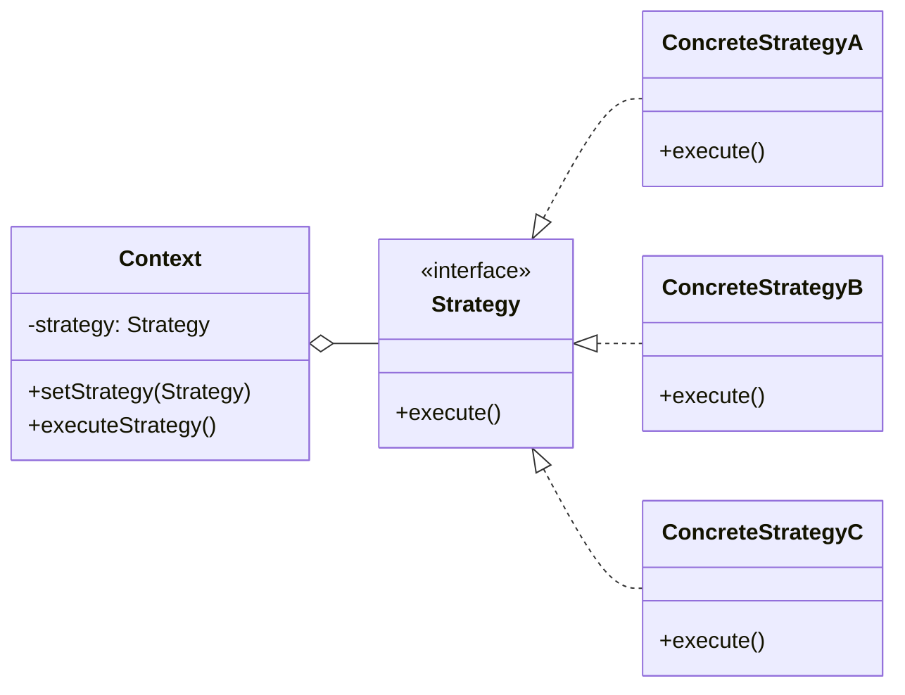

# Strategy

<div class="text-xl mb-4">
Définir une famille d'algorithmes interchangeables
</div>

<v-clicks>

- 🎯 **Problème** : Choisir un algorithme à l'exécution
- ✅ **Solution** : Encapsuler chaque algorithme dans une classe
- 📦 **Cas d'usage** : Tri, compression, validation, calcul de prix

</v-clicks>

<div v-click class="mt-4">



</div>

<!--
Strategy permet de changer d'algorithme dynamiquement.
C'est comme choisir un moyen de transport : voiture, vélo, train...
-->

---

# Strategy - Implémentation

<div class="overflow-y-auto" style="max-height: 90%;">

````md magic-move

```typescript
// Étape 1 : Interface de stratégie
interface PaymentStrategy {
  pay(amount: number): void;
}
```

```typescript
interface PaymentStrategy {
  pay(amount: number): void;
}

// Étape 2 : Première stratégie concrète
class CreditCardPayment implements PaymentStrategy {
  constructor(private cardNumber: string) {}
  
  pay(amount: number): void {
    console.log(`💳 Paiement de ${amount}€ par carte ${this.cardNumber}`);
  }
}
```

```typescript
interface PaymentStrategy {
  pay(amount: number): void;
}

class CreditCardPayment implements PaymentStrategy {
  constructor(private cardNumber: string) {}
  
  pay(amount: number): void {
    console.log(`💳 Paiement de ${amount}€ par carte ${this.cardNumber}`);
  }
}

// Étape 3 : Autres stratégies
class PayPalPayment implements PaymentStrategy {
  constructor(private email: string) {}
  
  pay(amount: number): void {
    console.log(`🅿️ Paiement de ${amount}€ via PayPal (${this.email})`);
  }
}

class CryptoPayment implements PaymentStrategy {
  constructor(private wallet: string) {}
  
  pay(amount: number): void {
    console.log(`₿ Paiement de ${amount}€ en crypto (${this.wallet})`);
  }
}
```

```typescript
interface PaymentStrategy {
  pay(amount: number): void;
}

class CreditCardPayment implements PaymentStrategy {
  constructor(private cardNumber: string) {}
  
  pay(amount: number): void {
    console.log(`💳 Paiement de ${amount}€ par carte ${this.cardNumber}`);
  }
}

class PayPalPayment implements PaymentStrategy {
  constructor(private email: string) {}
  
  pay(amount: number): void {
    console.log(`🅿️ Paiement de ${amount}€ via PayPal (${this.email})`);
  }
}

class CryptoPayment implements PaymentStrategy {
  constructor(private wallet: string) {}
  
  pay(amount: number): void {
    console.log(`₿ Paiement de ${amount}€ en crypto (${this.wallet})`);
  }
}

// Étape 4 : Contexte qui utilise la stratégie
class ShoppingCart {
  private strategy: PaymentStrategy;
  
  setPaymentStrategy(strategy: PaymentStrategy): void {
    this.strategy = strategy;
  }
  
  checkout(amount: number): void {
    this.strategy.pay(amount);
  }
}
```

```typescript
interface PaymentStrategy {
  pay(amount: number): void;
}

class CreditCardPayment implements PaymentStrategy {
  constructor(private cardNumber: string) {}
  
  pay(amount: number): void {
    console.log(`💳 Paiement de ${amount}€ par carte ${this.cardNumber}`);
  }
}

class PayPalPayment implements PaymentStrategy {
  constructor(private email: string) {}
  
  pay(amount: number): void {
    console.log(`🅿️ Paiement de ${amount}€ via PayPal (${this.email})`);
  }
}

class CryptoPayment implements PaymentStrategy {
  constructor(private wallet: string) {}
  
  pay(amount: number): void {
    console.log(`₿ Paiement de ${amount}€ en crypto (${this.wallet})`);
  }
}

class ShoppingCart {
  private strategy: PaymentStrategy;
  
  setPaymentStrategy(strategy: PaymentStrategy): void {
    this.strategy = strategy;
  }
  
  checkout(amount: number): void {
    this.strategy.pay(amount);
  }
}

// Étape 5 : Utilisation - changer de stratégie dynamiquement
const cart = new ShoppingCart();

cart.setPaymentStrategy(new CreditCardPayment("1234-5678"));
cart.checkout(100);

cart.setPaymentStrategy(new PayPalPayment("user@example.com"));
cart.checkout(50);
```

````

</div>

<!--
La progression montre comment :
1. On définit l'interface de stratégie
2. On crée une première stratégie concrète
3. On ajoute d'autres stratégies alternatives
4. On crée le contexte qui utilise les stratégies
5. On change de stratégie dynamiquement à l'exécution
-->
