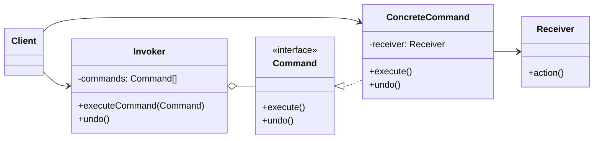

# Command

<div class="text-xl mb-4">
Encapsuler une requête comme un objet
</div>

<v-clicks>

- 🎯 **Problème** : Paramétrer des objets avec des opérations
- ✅ **Solution** : Transformer les requêtes en objets
- 📦 **Cas d'usage** : Undo/Redo, file d'attente, transactions

</v-clicks>

<div v-click class="mt-4">



</div>

<!--
Command transforme les actions en objets.
Cela permet de les stocker, les annuler, les rejouer...
-->

---

# Command - Implémentation

<div class="overflow-y-auto" style="max-height: 90%;">

````md magic-move

```typescript
// Étape 1 : Interface Command
interface Command {
  execute(): void;
  undo(): void;
}
```

```typescript
interface Command {
  execute(): void;
  undo(): void;
}

// Étape 2 : Receiver (celui qui fait le travail)
class Light {
  on(): void {
    console.log("💡 Lumière allumée");
  }
  
  off(): void {
    console.log("🌑 Lumière éteinte");
  }
}
```

```typescript
interface Command {
  execute(): void;
  undo(): void;
}

class Light {
  on(): void {
    console.log("💡 Lumière allumée");
  }
  
  off(): void {
    console.log("🌑 Lumière éteinte");
  }
}

// Étape 3 : Commandes concrètes
class LightOnCommand implements Command {
  constructor(private light: Light) {}
  
  execute(): void {
    this.light.on();
  }
  
  undo(): void {
    this.light.off();
  }
}

class LightOffCommand implements Command {
  constructor(private light: Light) {}
  
  execute(): void {
    this.light.off();
  }
  
  undo(): void {
    this.light.on();
  }
}
```

```typescript
interface Command {
  execute(): void;
  undo(): void;
}

class Light {
  on(): void {
    console.log("💡 Lumière allumée");
  }
  
  off(): void {
    console.log("🌑 Lumière éteinte");
  }
}

class LightOnCommand implements Command {
  constructor(private light: Light) {}
  
  execute(): void {
    this.light.on();
  }
  
  undo(): void {
    this.light.off();
  }
}

class LightOffCommand implements Command {
  constructor(private light: Light) {}
  
  execute(): void {
    this.light.off();
  }
  
  undo(): void {
    this.light.on();
  }
}

// Étape 4 : Invoker (télécommande)
class RemoteControl {
  private history: Command[] = [];
  
  executeCommand(command: Command): void {
    command.execute();
    this.history.push(command);
  }
  
  undo(): void {
    const command = this.history.pop();
    if (command) command.undo();
  }
}
```

```typescript
interface Command {
  execute(): void;
  undo(): void;
}

class Light {
  on(): void {
    console.log("💡 Lumière allumée");
  }
  
  off(): void {
    console.log("🌑 Lumière éteinte");
  }
}

class LightOnCommand implements Command {
  constructor(private light: Light) {}
  
  execute(): void {
    this.light.on();
  }
  
  undo(): void {
    this.light.off();
  }
}

class LightOffCommand implements Command {
  constructor(private light: Light) {}
  
  execute(): void {
    this.light.off();
  }
  
  undo(): void {
    this.light.on();
  }
}

class RemoteControl {
  private history: Command[] = [];
  
  executeCommand(command: Command): void {
    command.execute();
    this.history.push(command);
  }
  
  undo(): void {
    const command = this.history.pop();
    if (command) command.undo();
  }
}

// Étape 5 : Utilisation avec undo/redo
const light = new Light();
const remote = new RemoteControl();

remote.executeCommand(new LightOnCommand(light));  // 💡 Lumière allumée
remote.executeCommand(new LightOffCommand(light)); // 🌑 Lumière éteinte
remote.undo(); // 💡 Lumière allumée (annulation)
```

````

</div>

<!--
La progression montre comment :
1. On définit l'interface Command
2. On crée le Receiver qui exécute les actions
3. On encapsule les actions dans des commandes concrètes
4. On crée l'Invoker qui gère l'historique
5. On utilise le pattern avec undo/redo
-->
