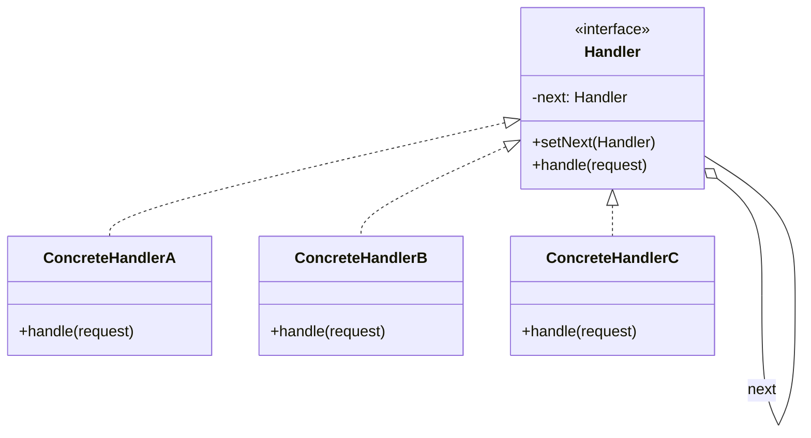

# Chaîne de responsabilité

<div class="text-xl mb-4">
Faire passer une requête le long d'une chaîne de gestionnaires
</div>

<v-clicks>

- 🎯 **Problème** : Plusieurs objets peuvent traiter une requête
- ✅ **Solution** : Chaîner les gestionnaires, chacun décide s'il traite ou passe
- 📦 **Cas d'usage** : Middleware, validation, logging, gestion d'événements

</v-clicks>

<div v-click class="mt-4">



</div>

<!--
La Chaîne de responsabilité permet de découpler l'émetteur du récepteur.
C'est comme un système de support client avec plusieurs niveaux d'escalade.
-->

---

# Chaîne de responsabilité - Implémentation

<div class="overflow-y-auto" style="max-height: 90%;">

````md magic-move

```typescript
// Étape 1 : Interface Handler
interface SupportHandler {
  setNext(handler: SupportHandler): SupportHandler;
  handle(request: string): void;
}
```

```typescript
interface SupportHandler {
  setNext(handler: SupportHandler): SupportHandler;
  handle(request: string): void;
}

// Étape 2 : Handler abstrait
abstract class AbstractSupportHandler implements SupportHandler {
  private nextHandler: SupportHandler | null = null;
  
  setNext(handler: SupportHandler): SupportHandler {
    this.nextHandler = handler;
    return handler;
  }
  
  handle(request: string): void {
    if (this.nextHandler) {
      this.nextHandler.handle(request);
    }
  }
}
```

```typescript
interface SupportHandler {
  setNext(handler: SupportHandler): SupportHandler;
  handle(request: string): void;
}

abstract class AbstractSupportHandler implements SupportHandler {
  private nextHandler: SupportHandler | null = null;
  
  setNext(handler: SupportHandler): SupportHandler {
    this.nextHandler = handler;
    return handler;
  }
  
  handle(request: string): void {
    if (this.nextHandler) {
      this.nextHandler.handle(request);
    }
  }
}

// Étape 3 : Handlers concrets
class Level1Support extends AbstractSupportHandler {
  handle(request: string): void {
    if (request === "simple") {
      console.log("✅ Level 1: Problème résolu");
    } else {
      console.log("⏭️ Level 1: Escalade au niveau 2");
      super.handle(request);
    }
  }
}

class Level2Support extends AbstractSupportHandler {
  handle(request: string): void {
    if (request === "medium") {
      console.log("✅ Level 2: Problème résolu");
    } else {
      console.log("⏭️ Level 2: Escalade au niveau 3");
      super.handle(request);
    }
  }
}

class Level3Support extends AbstractSupportHandler {
  handle(request: string): void {
    console.log("✅ Level 3: Problème complexe résolu");
  }
}
```

```typescript
interface SupportHandler {
  setNext(handler: SupportHandler): SupportHandler;
  handle(request: string): void;
}

abstract class AbstractSupportHandler implements SupportHandler {
  private nextHandler: SupportHandler | null = null;
  
  setNext(handler: SupportHandler): SupportHandler {
    this.nextHandler = handler;
    return handler;
  }
  
  handle(request: string): void {
    if (this.nextHandler) {
      this.nextHandler.handle(request);
    }
  }
}

class Level1Support extends AbstractSupportHandler {
  handle(request: string): void {
    if (request === "simple") {
      console.log("✅ Level 1: Problème résolu");
    } else {
      console.log("⏭️ Level 1: Escalade au niveau 2");
      super.handle(request);
    }
  }
}

class Level2Support extends AbstractSupportHandler {
  handle(request: string): void {
    if (request === "medium") {
      console.log("✅ Level 2: Problème résolu");
    } else {
      console.log("⏭️ Level 2: Escalade au niveau 3");
      super.handle(request);
    }
  }
}

class Level3Support extends AbstractSupportHandler {
  handle(request: string): void {
    console.log("✅ Level 3: Problème complexe résolu");
  }
}

// Étape 4 : Utilisation - construire la chaîne
const level1 = new Level1Support();
const level2 = new Level2Support();
const level3 = new Level3Support();

level1.setNext(level2).setNext(level3);

level1.handle("simple");  // ✅ Level 1: Problème résolu
level1.handle("medium");  // ⏭️ Level 1 → ✅ Level 2: Problème résolu
level1.handle("complex"); // ⏭️ Level 1 → ⏭️ Level 2 → ✅ Level 3
```

````

</div>

<!--
La progression montre comment :
1. On définit l'interface Handler
2. On crée un handler abstrait avec la logique de chaînage
3. On implémente les handlers concrets
4. On construit et utilise la chaîne
-->
