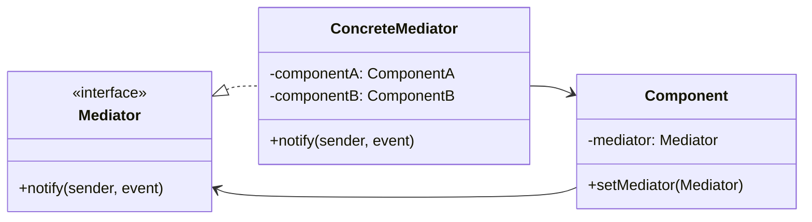

# Médiateur

<div class="text-xl mb-4">
Centraliser les communications entre objets
</div>

<v-clicks>

- 🎯 **Problème** : Communications complexes entre plusieurs objets
- ✅ **Solution** : Objet médiateur qui centralise les interactions
- 📦 **Cas d'usage** : Chat rooms, contrôleurs MVC, systèmes de dialogue

</v-clicks>

<div v-click class="mt-4">



</div>

<!--
Le Médiateur réduit les dépendances entre objets communicants.
C'est comme un contrôleur aérien qui coordonne les avions.
-->

---

# Médiateur - Implémentation

<div class="overflow-y-auto" style="max-height: 90%;">

````md magic-move

```typescript
// Étape 1 : Interface Mediator
interface ChatMediator {
  sendMessage(message: string, user: User): void;
  addUser(user: User): void;
}
```

```typescript
interface ChatMediator {
  sendMessage(message: string, user: User): void;
  addUser(user: User): void;
}

// Étape 2 : Composant (User)
class User {
  constructor(
    private name: string,
    private mediator: ChatMediator
  ) {
    this.mediator.addUser(this);
  }
  
  send(message: string): void {
    console.log(`${this.name} envoie: ${message}`);
    this.mediator.sendMessage(message, this);
  }
  
  receive(message: string): void {
    console.log(`${this.name} reçoit: ${message}`);
  }
  
  getName(): string {
    return this.name;
  }
}
```

```typescript
interface ChatMediator {
  sendMessage(message: string, user: User): void;
  addUser(user: User): void;
}

class User {
  constructor(
    private name: string,
    private mediator: ChatMediator
  ) {
    this.mediator.addUser(this);
  }
  
  send(message: string): void {
    console.log(`${this.name} envoie: ${message}`);
    this.mediator.sendMessage(message, this);
  }
  
  receive(message: string): void {
    console.log(`${this.name} reçoit: ${message}`);
  }
  
  getName(): string {
    return this.name;
  }
}

// Étape 3 : Médiateur concret
class ChatRoom implements ChatMediator {
  private users: User[] = [];
  
  addUser(user: User): void {
    this.users.push(user);
  }
  
  sendMessage(message: string, sender: User): void {
    this.users.forEach(user => {
      if (user !== sender) {
        user.receive(message);
      }
    });
  }
}
```

```typescript
interface ChatMediator {
  sendMessage(message: string, user: User): void;
  addUser(user: User): void;
}

class User {
  constructor(
    private name: string,
    private mediator: ChatMediator
  ) {
    this.mediator.addUser(this);
  }
  
  send(message: string): void {
    console.log(`${this.name} envoie: ${message}`);
    this.mediator.sendMessage(message, this);
  }
  
  receive(message: string): void {
    console.log(`${this.name} reçoit: ${message}`);
  }
  
  getName(): string {
    return this.name;
  }
}

class ChatRoom implements ChatMediator {
  private users: User[] = [];
  
  addUser(user: User): void {
    this.users.push(user);
  }
  
  sendMessage(message: string, sender: User): void {
    this.users.forEach(user => {
      if (user !== sender) {
        user.receive(message);
      }
    });
  }
}

// Étape 4 : Utilisation
const chatRoom = new ChatRoom();

const alice = new User("Alice", chatRoom);
const bob = new User("Bob", chatRoom);
const charlie = new User("Charlie", chatRoom);

alice.send("Bonjour tout le monde !");
// Bob reçoit: Bonjour tout le monde !
// Charlie reçoit: Bonjour tout le monde !
```

````

</div>

<!--
La progression montre comment :
1. On définit l'interface Mediator
2. On crée les composants qui communiquent via le médiateur
3. On implémente le médiateur concret
4. On utilise le pattern pour coordonner les communications
-->
