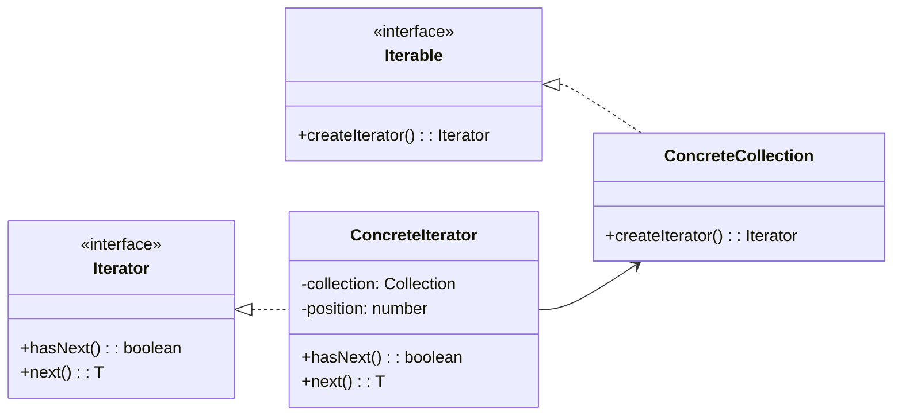

# Itérateur

<div class="text-xl mb-4">
Parcourir une collection sans exposer sa structure interne
</div>

<v-clicks>

- 🎯 **Problème** : Accéder aux éléments d'une collection de manière uniforme
- ✅ **Solution** : Interface d'itération indépendante de la structure
- 📦 **Cas d'usage** : Parcours de collections, arbres, graphes

</v-clicks>

<div v-click class="mt-4">



</div>

<!--
L'Itérateur permet de parcourir une collection sans connaître sa structure.
C'est la base du for...of en JavaScript et des boucles foreach dans d'autres langages.
-->

---

# Itérateur - Implémentation

<div class="overflow-y-auto" style="max-height: 90%;">

````md magic-move

```typescript
// Étape 1 : Interface Iterator
interface Iterator<T> {
  hasNext(): boolean;
  next(): T | null;
}
```

```typescript
interface Iterator<T> {
  hasNext(): boolean;
  next(): T | null;
}

// Étape 2 : Interface Iterable
interface Iterable<T> {
  createIterator(): Iterator<T>;
}
```

```typescript
interface Iterator<T> {
  hasNext(): boolean;
  next(): T | null;
}

interface Iterable<T> {
  createIterator(): Iterator<T>;
}

// Étape 3 : Collection concrète
class BookCollection implements Iterable<string> {
  private books: string[] = [];
  
  addBook(book: string): void {
    this.books.push(book);
  }
  
  createIterator(): Iterator<string> {
    return new BookIterator(this.books);
  }
}
```

```typescript
interface Iterator<T> {
  hasNext(): boolean;
  next(): T | null;
}

interface Iterable<T> {
  createIterator(): Iterator<T>;
}

class BookCollection implements Iterable<string> {
  private books: string[] = [];
  
  addBook(book: string): void {
    this.books.push(book);
  }
  
  createIterator(): Iterator<string> {
    return new BookIterator(this.books);
  }
}

// Étape 4 : Itérateur concret
class BookIterator implements Iterator<string> {
  private position: number = 0;
  
  constructor(private books: string[]) {}
  
  hasNext(): boolean {
    return this.position < this.books.length;
  }
  
  next(): string | null {
    if (this.hasNext()) {
      return this.books[this.position++];
    }
    return null;
  }
}
```

```typescript
interface Iterator<T> {
  hasNext(): boolean;
  next(): T | null;
}

interface Iterable<T> {
  createIterator(): Iterator<T>;
}

class BookCollection implements Iterable<string> {
  private books: string[] = [];
  
  addBook(book: string): void {
    this.books.push(book);
  }
  
  createIterator(): Iterator<string> {
    return new BookIterator(this.books);
  }
}

class BookIterator implements Iterator<string> {
  private position: number = 0;
  
  constructor(private books: string[]) {}
  
  hasNext(): boolean {
    return this.position < this.books.length;
  }
  
  next(): string | null {
    if (this.hasNext()) {
      return this.books[this.position++];
    }
    return null;
  }
}

// Étape 5 : Utilisation
const collection = new BookCollection();
collection.addBook("Design Patterns");
collection.addBook("Clean Code");
collection.addBook("Refactoring");

const iterator = collection.createIterator();

while (iterator.hasNext()) {
  console.log(`📖 ${iterator.next()}`);
}
```

````

</div>

<!--
La progression montre comment :
1. On définit l'interface Iterator
2. On définit l'interface Iterable
3. On crée la collection qui peut être itérée
4. On implémente l'itérateur concret
5. On utilise le pattern pour parcourir la collection
-->

