# Les Design Patterns

Les 3 Catégories Fondamentales

<!--
Bienvenue dans cette présentation sur les Design Patterns.
Nous allons explorer les trois grandes catégories de patterns de conception.
-->

---
layout: center
---

# Qu'est-ce qu'un Design Pattern ?

<v-clicks>

- 🎯 **Solution éprouvée** à un problème récurrent
- 📚 **Vocabulaire commun** entre développeurs
- 🔧 **Boîte à outils** de conception logicielle
- ✨ **Bonnes pratiques** accumulées depuis des années

</v-clicks>

<div v-click class="mt-8 p-4 bg-blue-50 dark:bg-blue-900 rounded">
💡 <strong>Analogie</strong> : Comme des recettes de cuisine pour résoudre des problèmes de conception
</div>

<!--
Un design pattern n'est pas du code à copier-coller, mais une approche conceptuelle.
C'est comme avoir un plan d'architecture avant de construire une maison.
-->

---

# Les 3 Catégories

<div class="flex gap-4 mt-8">

<v-click>
<div class="flex-1 p-4">

### 🏗️ Création
Gestion de la création d'objets

</div>
</v-click>

<v-click>
<div class="flex-1 p-4">

### 🔗 Structure
Organisation des classes et objets

</div>
</v-click>

<v-click>
<div class="flex-1 p-4">

### 🎭 Comportement
Communication entre objets

</div>
</v-click>

</div>

<div v-click class="mt-8">

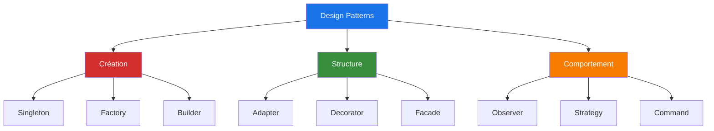

</div>

<!--
Chaque catégorie répond à un type de problème spécifique.
Nous allons voir des exemples concrets pour chacune.
-->

---
layout: section
---

# 🏗️ Patterns de Création

Contrôler la création d'objets

---
layout: center
---

# Singleton

<div class="text-xl mb-4">
Garantir qu'une classe n'a qu'une seule instance
</div>

<v-clicks>

- 🎯 **Problème** : Besoin d'une instance unique (configuration, connexion DB)
- ✅ **Solution** : Contrôler l'instanciation via la classe elle-même
- 📦 **Cas d'usage** : Logger, gestionnaire de configuration, pool de connexions

</v-clicks>

<div v-click class="mt-4">

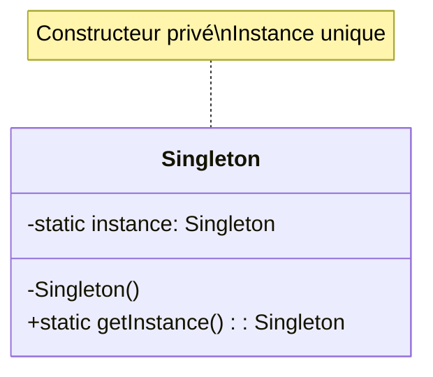

</div>

<!--
Le Singleton est probablement le pattern le plus connu, mais aussi le plus controversé.
Il faut l'utiliser avec parcimonie car il peut créer des dépendances cachées.
-->

---

# Singleton - Implémentation

````md magic-move {lines: true}

```typescript
// Étape 1 : Classe de base
class DatabaseConnection {
  constructor() {
    console.log("Connexion à la base de données");
  }
}
```

```typescript
class DatabaseConnection {
  // Étape 2 : Ajouter l'instance statique
  private static instance: DatabaseConnection;
  
  constructor() {
    console.log("Connexion à la base de données");
  }
}
```

```typescript
class DatabaseConnection {
  private static instance: DatabaseConnection;
  
  // Étape 3 : Constructeur privé + méthode getInstance
  private constructor() {
    console.log("Connexion à la base de données");
  }
  
  public static getInstance(): DatabaseConnection {
    if (!DatabaseConnection.instance) {
      DatabaseConnection.instance = new DatabaseConnection();
    }
    return DatabaseConnection.instance;
  }
}
```

```typescript
class DatabaseConnection {
  private static instance: DatabaseConnection;
  
  private constructor() {
    console.log("Connexion à la base de données");
  }
  
  public static getInstance(): DatabaseConnection {
    if (!DatabaseConnection.instance) {
      DatabaseConnection.instance = new DatabaseConnection();
    }
    return DatabaseConnection.instance;
  }
}

// Étape 4 : Utilisation
const db1 = DatabaseConnection.getInstance();
const db2 = DatabaseConnection.getInstance();
console.log(db1 === db2); // true - même instance !
```

````

<!--
Notez comment nous construisons progressivement le pattern :
1. Classe normale
2. Ajout de l'instance statique
3. Constructeur privé pour empêcher new
4. Méthode getInstance pour contrôler la création
-->

---

# Factory Method

<div class="text-xl mb-4">
Déléguer la création d'objets à des sous-classes
</div>

<v-clicks>

- 🎯 **Problème** : Créer des objets sans spécifier leur classe exacte
- ✅ **Solution** : Interface de création, implémentation dans les sous-classes
- 📦 **Cas d'usage** : Créer différents types de documents, véhicules, notifications

</v-clicks>

<div v-click class="mt-8">

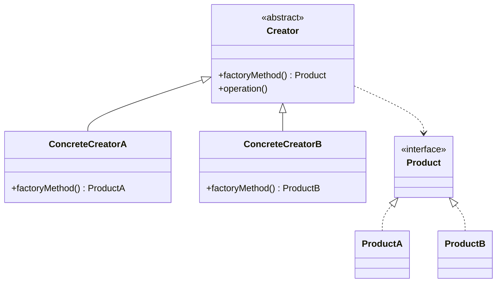

</div>

<!--
La Factory Method permet de créer des objets sans connaître leur type exact.
C'est très utile quand on veut étendre le système avec de nouveaux types.
-->

---

# Factory Method - Implémentation

<div class="overflow-y-auto" style="max-height: 90%;">

````md magic-move {lines: true}

```typescript
// Étape 1 : Interface du produit
interface Notification {
  send(message: string): void;
}
```

```typescript
// Étape 1 : Interface du produit
interface Notification {
  send(message: string): void;
}

class EmailNotification implements Notification {
  send(message: string): void {
    console.log(`📧 Email: ${message}`);
  }
}

class SMSNotification implements Notification {
  send(message: string): void {
    console.log(`📱 SMS: ${message}`);
  }
}
```

```typescript
interface Notification {
  send(message: string): void;
}

class EmailNotification implements Notification {
  send(message: string): void {
    console.log(`📧 Email: ${message}`);
  }
}

class SMSNotification implements Notification {
  send(message: string): void {
    console.log(`📱 SMS: ${message}`);
  }
}

// Étape 3 : Factory abstraite
abstract class NotificationFactory {
  abstract createNotification(): Notification;
  
  public notify(message: string): void {
    const notification = this.createNotification();
    notification.send(message);
  }
}
```

```typescript
interface Notification {
  send(message: string): void;
}

class EmailNotification implements Notification {
  send(message: string): void {
    console.log(`📧 Email: ${message}`);
  }
}

class SMSNotification implements Notification {
  send(message: string): void {
    console.log(`📱 SMS: ${message}`);
  }
}

abstract class NotificationFactory {
  abstract createNotification(): Notification;
  
  public notify(message: string): void {
    const notification = this.createNotification();
    notification.send(message);
  }
}

// Étape 4 : Factories concrètes
class EmailFactory extends NotificationFactory {
  createNotification(): Notification {
    return new EmailNotification();
  }
}

class SMSFactory extends NotificationFactory {
  createNotification(): Notification {
    return new SMSNotification();
  }
}
```

```typescript
interface Notification {
  send(message: string): void;
}

class EmailNotification implements Notification {
  send(message: string): void {
    console.log(`📧 Email: ${message}`);
  }
}

class SMSNotification implements Notification {
  send(message: string): void {
    console.log(`📱 SMS: ${message}`);
  }
}

abstract class NotificationFactory {
  abstract createNotification(): Notification;
  
  public notify(message: string): void {
    const notification = this.createNotification();
    notification.send(message);
  }
}

class EmailFactory extends NotificationFactory {
  createNotification(): Notification {
    return new EmailNotification();
  }
}

class SMSFactory extends NotificationFactory {
  createNotification(): Notification {
    return new SMSNotification();
  }
}

// Étape 5 : Utilisation
function sendAlert(factory: NotificationFactory, message: string) {
  factory.notify(message);
}

sendAlert(new EmailFactory(), "Alerte importante !");
sendAlert(new SMSFactory(), "Code de vérification : 1234");
```

````

</div>

<!--
La progression montre comment :
1. On définit l'interface commune
2. On crée les implémentations concrètes
3. On abstrait la création
4. On implémente les factories spécifiques
5. On utilise le pattern de manière flexible
-->

---

# Builder

<div class="text-xl mb-4">
Construire des objets complexes étape par étape
</div>

<v-clicks>

- 🎯 **Problème** : Créer des objets avec beaucoup de paramètres optionnels
- ✅ **Solution** : Séparer la construction de la représentation
- 📦 **Cas d'usage** : Requêtes SQL, documents, configurations complexes, test doubles

</v-clicks>

<div v-click class="mt-4">

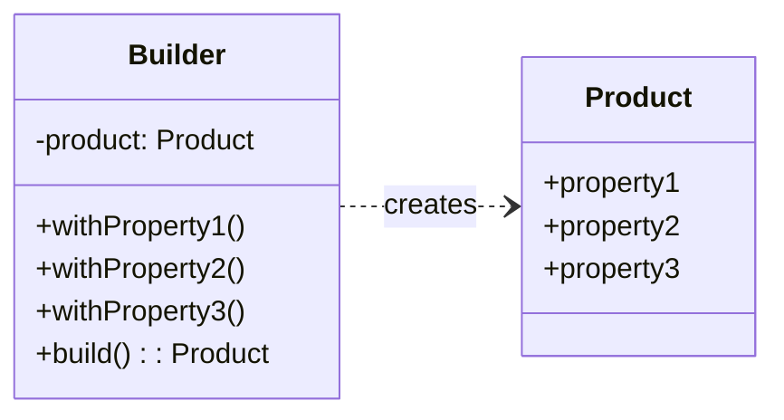

</div>

<!--
Le Builder rend le code beaucoup plus lisible et maintenable.
On peut créer des objets avec seulement les propriétés nécessaires.
-->

---

# Builder - Implémentation

<div class="overflow-y-auto" style="max-height: 90%;">

````md magic-move {lines: true}

```typescript
// Étape 1 : La classe produit
class User {
  constructor(
    public firstName: string,
    public lastName: string,
    public email: string,
    public age?: number,
    public address?: string,
    public phone?: string,
    public isActive?: boolean
  ) {}
}
```

```typescript
class User {
  constructor(
    public firstName: string,
    public lastName: string,
    public email: string,
    public age?: number,
    public address?: string,
    public phone?: string,
    public isActive?: boolean
  ) {}
}

// Étape 2 : Le Builder
class UserBuilder {
  private firstName: string = "";
  private lastName: string = "";
  private email: string = "";
  private age?: number;
  private address?: string;
  private phone?: string;
  private active: boolean = false;
}
```

```typescript
class User {
  constructor(
    public firstName: string,
    public lastName: string,
    public email: string,
    public age?: number,
    public address?: string,
    public phone?: string,
    public isActive?: boolean
  ) {}
}

class UserBuilder {
  private firstName: string = "";
  private lastName: string = "";
  private email: string = "";
  private age?: number;
  private address?: string;
  private phone?: string;
  private active: boolean = false;

  // Étape 3 : Méthodes de construction
  withFirstName(firstName: string): UserBuilder {
    this.firstName = firstName;
    return this;
  }

  withLastName(lastName: string): UserBuilder {
    this.lastName = lastName;
    return this;
  }

  withEmail(email: string): UserBuilder {
    this.email = email;
    return this;
  }

  withAge(age: number): UserBuilder {
    this.age = age;
    return this;
  }

  withAddress(address: string): UserBuilder {
    this.address = address;
    return this;
  }

  withPhone(phone: string): UserBuilder {
    this.phone = phone;
    return this;
  }

  isActive(active: boolean): UserBuilder {
    this.active = active;
    return this;
  }
}
```

```typescript
class User {
  constructor(
    public firstName: string,
    public lastName: string,
    public email: string,
    public age?: number,
    public address?: string,
    public phone?: string,
    public isActive?: boolean
  ) {}
}

class UserBuilder {
  private firstName: string = "";
  private lastName: string = "";
  private email: string = "";
  private age?: number;
  private address?: string;
  private phone?: string;
  private active: boolean = false;

  withFirstName(firstName: string): UserBuilder {
    this.firstName = firstName;
    return this;
  }

  withLastName(lastName: string): UserBuilder {
    this.lastName = lastName;
    return this;
  }

  withEmail(email: string): UserBuilder {
    this.email = email;
    return this;
  }

  withAge(age: number): UserBuilder {
    this.age = age;
    return this;
  }

  withAddress(address: string): UserBuilder {
    this.address = address;
    return this;
  }

  withPhone(phone: string): UserBuilder {
    this.phone = phone;
    return this;
  }

  isActive(active: boolean): UserBuilder {
    this.active = active;
    return this;
  }

  // Étape 4 : Méthode build()
  build(): User {
    return new User(
      this.firstName,
      this.lastName,
      this.email,
      this.age,
      this.address,
      this.phone,
      this.active
    );
  }
}
```

```typescript
class User {
  constructor(
    public firstName: string,
    public lastName: string,
    public email: string,
    public age?: number,
    public address?: string,
    public phone?: string,
    public isActive?: boolean
  ) {}
}

class UserBuilder {
  private firstName: string = "";
  private lastName: string = "";
  private email: string = "";
  private age?: number;
  private address?: string;
  private phone?: string;
  private active: boolean = false;

  withFirstName(firstName: string): UserBuilder {
    this.firstName = firstName;
    return this;
  }

  withLastName(lastName: string): UserBuilder {
    this.lastName = lastName;
    return this;
  }

  withEmail(email: string): UserBuilder {
    this.email = email;
    return this;
  }

  withAge(age: number): UserBuilder {
    this.age = age;
    return this;
  }

  withAddress(address: string): UserBuilder {
    this.address = address;
    return this;
  }

  withPhone(phone: string): UserBuilder {
    this.phone = phone;
    return this;
  }

  isActive(active: boolean): UserBuilder {
    this.active = active;
    return this;
  }

  build(): User {
    return new User(
      this.firstName,
      this.lastName,
      this.email,
      this.age,
      this.address,
      this.phone,
      this.active
    );
  }
}

// Étape 5 : Utilisation
const user = new UserBuilder()
  .withFirstName("John")
  .withLastName("Doe")
  .withEmail("john@example.com")
  .withAge(30)
  .isActive(true)
  .build();

const simpleUser = new UserBuilder()
  .withFirstName("Jane")
  .withEmail("jane@example.com")
  .build();
```

````

</div>

<!--
La progression montre comment :
1. On définit la classe produit complexe
2. On crée le Builder avec les propriétés privées
3. On ajoute les méthodes fluent (qui retournent this)
4. On implémente la méthode build() finale
5. On utilise le Builder de manière claire et flexible
-->

---
layout: section
---

# 🔗 Patterns de Structure

Organiser les classes et objets

---

# Adapter

<div class="text-xl mb-4">
Convertir l'interface d'une classe en une autre interface
</div>

<v-clicks>

- 🎯 **Problème** : Faire fonctionner ensemble des classes incompatibles
- ✅ **Solution** : Créer un adaptateur qui traduit les appels
- 📦 **Cas d'usage** : Intégrer des bibliothèques tierces, legacy code

</v-clicks>

<div v-click class="mt-4">

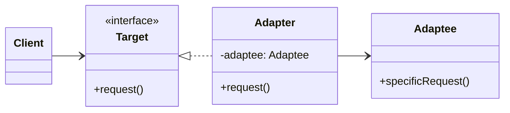

</div>

<!--
L'Adapter est comme un adaptateur de prise électrique :
il permet de brancher un appareil sur une prise incompatible.
-->

---

# Adapter - Implémentation

<div class="overflow-y-auto" style="max-height: 90%;">

````md magic-move {lines: true}

```typescript
// Étape 1 : Système existant (ancien)
class OldPaymentSystem {
  processPayment(amount: number): void {
    console.log(`Traitement de ${amount}€ via l'ancien système`);
  }
}
```

```typescript
class OldPaymentSystem {
  processPayment(amount: number): void {
    console.log(`Traitement de ${amount}€ via l'ancien système`);
  }
}

// Étape 2 : Nouvelle interface attendue
interface ModernPaymentProcessor {
  pay(amount: number, currency: string): void;
  refund(transactionId: string): void;
}
```

```typescript
class OldPaymentSystem {
  processPayment(amount: number): void {
    console.log(`Traitement de ${amount}€ via l'ancien système`);
  }
}

interface ModernPaymentProcessor {
  pay(amount: number, currency: string): void;
  refund(transactionId: string): void;
}

// Étape 3 : Créer l'adaptateur
class PaymentAdapter implements ModernPaymentProcessor {
  private oldSystem: OldPaymentSystem;
  
  constructor(oldSystem: OldPaymentSystem) {
    this.oldSystem = oldSystem;
  }
  
  pay(amount: number, currency: string): void {
    console.log(`Conversion ${currency} → EUR`);
    this.oldSystem.processPayment(amount);
  }
  
  refund(transactionId: string): void {
    console.log(`Remboursement ${transactionId} via ancien système`);
  }
}
```

```typescript
class OldPaymentSystem {
  processPayment(amount: number): void {
    console.log(`Traitement de ${amount}€ via l'ancien système`);
  }
}

interface ModernPaymentProcessor {
  pay(amount: number, currency: string): void;
  refund(transactionId: string): void;
}

class PaymentAdapter implements ModernPaymentProcessor {
  private oldSystem: OldPaymentSystem;
  
  constructor(oldSystem: OldPaymentSystem) {
    this.oldSystem = oldSystem;
  }
  
  pay(amount: number, currency: string): void {
    console.log(`Conversion ${currency} → EUR`);
    this.oldSystem.processPayment(amount);
  }
  
  refund(transactionId: string): void {
    console.log(`Remboursement ${transactionId} via ancien système`);
  }
}

// Étape 4 : Utilisation
function processOrder(processor: ModernPaymentProcessor) {
  processor.pay(100, "USD");
}

const oldSystem = new OldPaymentSystem();
const adapter = new PaymentAdapter(oldSystem);
processOrder(adapter); // Fonctionne avec l'ancien système !
```

````

</div>

<!--
L'adaptateur permet de réutiliser du code existant sans le modifier.
C'est particulièrement utile lors de migrations ou d'intégrations.
-->

---

# Decorator

<div class="text-xl mb-4">
Ajouter dynamiquement des responsabilités à un objet
</div>

<v-clicks>

- 🎯 **Problème** : Étendre les fonctionnalités sans modifier la classe
- ✅ **Solution** : Envelopper l'objet dans des décorateurs
- 📦 **Cas d'usage** : Ajouter des fonctionnalités (logging, cache, validation)

</v-clicks>

<div v-click class="mt-4">

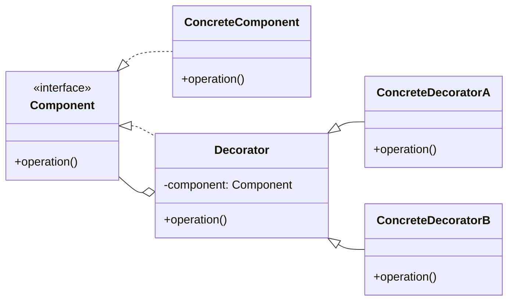

</div>

<!--
Le Decorator permet d'ajouter des fonctionnalités de manière flexible.
On peut combiner les décorateurs comme on veut, dans l'ordre qu'on veut.
-->

---

# Decorator - Implémentation

<div class="overflow-y-auto" style="max-height: 90%;">

````md magic-move {lines: true}

```typescript
// Étape 1 : Interface de base
interface Coffee {
  cost(): number;
  description(): string;
}
```

```typescript
interface Coffee {
  cost(): number;
  description(): string;
}

// Étape 2 : Implémentation simple
class SimpleCoffee implements Coffee {
  cost(): number {
    return 2;
  }
  
  description(): string {
    return "Café simple";
  }
}
```

```typescript
interface Coffee {
  cost(): number;
  description(): string;
}

class SimpleCoffee implements Coffee {
  cost(): number {
    return 2;
  }
  
  description(): string {
    return "Café simple";
  }
}

// Étape 3 : Premier décorateur
class MilkDecorator implements Coffee {
  constructor(private coffee: Coffee) {}
  
  cost(): number {
    return this.coffee.cost() + 0.5;
  }
  
  description(): string {
    return this.coffee.description() + " + lait";
  }
}
```

```typescript
interface Coffee {
  cost(): number;
  description(): string;
}

class SimpleCoffee implements Coffee {
  cost(): number {
    return 2;
  }
  
  description(): string {
    return "Café simple";
  }
}

class MilkDecorator implements Coffee {
  constructor(private coffee: Coffee) {}
  
  cost(): number {
    return this.coffee.cost() + 0.5;
  }
  
  description(): string {
    return this.coffee.description() + " + lait";
  }
}

// Étape 4 : Deuxième décorateur
class SugarDecorator implements Coffee {
  constructor(private coffee: Coffee) {}
  
  cost(): number {
    return this.coffee.cost() + 0.2;
  }
  
  description(): string {
    return this.coffee.description() + " + sucre";
  }
}
```

```typescript
interface Coffee {
  cost(): number;
  description(): string;
}

class SimpleCoffee implements Coffee {
  cost(): number {
    return 2;
  }
  
  description(): string {
    return "Café simple";
  }
}

class MilkDecorator implements Coffee {
  constructor(private coffee: Coffee) {}
  
  cost(): number {
    return this.coffee.cost() + 0.5;
  }
  
  description(): string {
    return this.coffee.description() + " + lait";
  }
}

class SugarDecorator implements Coffee {
  constructor(private coffee: Coffee) {}
  
  cost(): number {
    return this.coffee.cost() + 0.2;
  }
  
  description(): string {
    return this.coffee.description() + " + sucre";
  }
}

// Étape 5 : Utilisation - empiler les décorateurs
let coffee: Coffee = new SimpleCoffee();
coffee = new MilkDecorator(coffee);
coffee = new SugarDecorator(coffee);

console.log(coffee.description()); // "Café simple + lait + sucre"
console.log(coffee.cost()); // 2.7
```

````

</div>

<!--
La progression montre comment :
1. On définit l'interface commune
2. On crée l'implémentation de base
3. On ajoute le premier décorateur qui enveloppe
4. On ajoute d'autres décorateurs
5. On empile les décorateurs pour combiner les fonctionnalités
-->

---

# Composite

<div class="text-xl mb-4">
Composer des objets en structures arborescentes
</div>

<v-clicks>

- 🎯 **Problème** : Traiter uniformément objets individuels et compositions d'objets
- ✅ **Solution** : Structure arborescente avec interface commune
- 📦 **Cas d'usage** : Systèmes de fichiers, menus, arbres DOM, organisations

</v-clicks>

<div v-click class="mt-4">

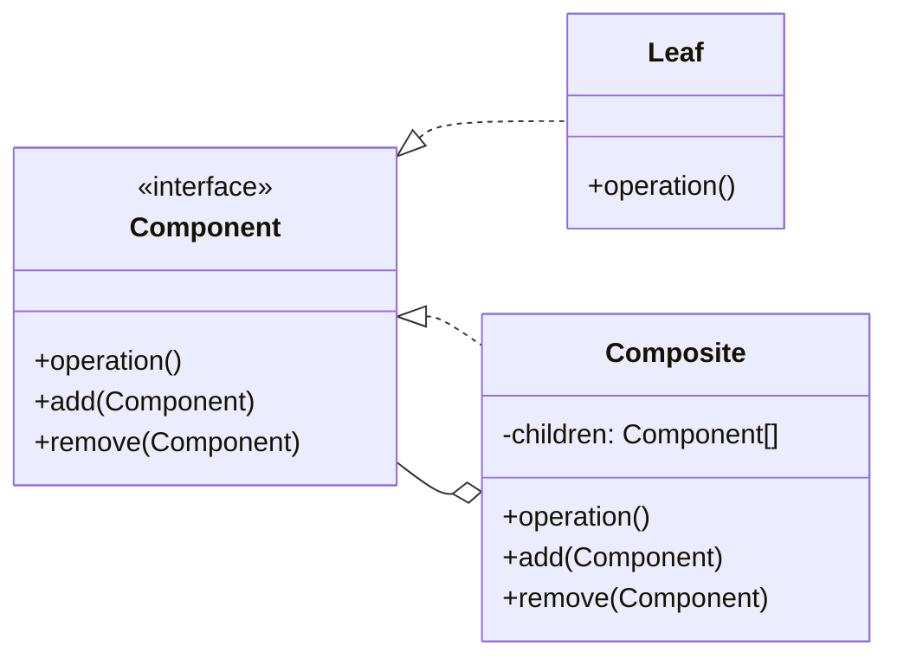

</div>

<!--
Le Composite permet de traiter de la même manière un objet seul ou un groupe d'objets.
C'est comme un système de fichiers : un fichier ou un dossier peuvent être manipulés de la même façon.
-->

---

# Composite - Implémentation

<div class="overflow-y-auto" style="max-height: 90%;">

````md magic-move {lines: true}

```typescript
// Étape 1 : Interface commune
interface FileSystemComponent {
  getName(): string;
  getSize(): number;
  display(indent: string): void;
}
```

```typescript
interface FileSystemComponent {
  getName(): string;
  getSize(): number;
  display(indent: string): void;
}

// Étape 2 : Feuille (File)
class File implements FileSystemComponent {
  constructor(
    private name: string,
    private size: number
  ) {}
  
  getName(): string {
    return this.name;
  }
  
  getSize(): number {
    return this.size;
  }
  
  display(indent: string): void {
    console.log(`${indent}📄 ${this.name} (${this.size} KB)`);
  }
}
```

```typescript
interface FileSystemComponent {
  getName(): string;
  getSize(): number;
  display(indent: string): void;
}

class File implements FileSystemComponent {
  constructor(
    private name: string,
    private size: number
  ) {}
  
  getName(): string {
    return this.name;
  }
  
  getSize(): number {
    return this.size;
  }
  
  display(indent: string): void {
    console.log(`${indent}📄 ${this.name} (${this.size} KB)`);
  }
}

// Étape 3 : Composite (Folder)
class Folder implements FileSystemComponent {
  private children: FileSystemComponent[] = [];
  
  constructor(private name: string) {}
  
  add(component: FileSystemComponent): void {
    this.children.push(component);
  }
  
  remove(component: FileSystemComponent): void {
    const index = this.children.indexOf(component);
    if (index > -1) this.children.splice(index, 1);
  }
  
  getName(): string {
    return this.name;
  }
  
  getSize(): number {
    return this.children.reduce((sum, child) => sum + child.getSize(), 0);
  }
  
  display(indent: string): void {
    console.log(`${indent}📁 ${this.name} (${this.getSize()} KB)`);
    this.children.forEach(child => child.display(indent + "  "));
  }
}
```

```typescript
interface FileSystemComponent {
  getName(): string;
  getSize(): number;
  display(indent: string): void;
}

class File implements FileSystemComponent {
  constructor(
    private name: string,
    private size: number
  ) {}
  
  getName(): string {
    return this.name;
  }
  
  getSize(): number {
    return this.size;
  }
  
  display(indent: string): void {
    console.log(`${indent}📄 ${this.name} (${this.size} KB)`);
  }
}

class Folder implements FileSystemComponent {
  private children: FileSystemComponent[] = [];
  
  constructor(private name: string) {}
  
  add(component: FileSystemComponent): void {
    this.children.push(component);
  }
  
  remove(component: FileSystemComponent): void {
    const index = this.children.indexOf(component);
    if (index > -1) this.children.splice(index, 1);
  }
  
  getName(): string {
    return this.name;
  }
  
  getSize(): number {
    return this.children.reduce((sum, child) => sum + child.getSize(), 0);
  }
  
  display(indent: string): void {
    console.log(`${indent}📁 ${this.name} (${this.getSize()} KB)`);
    this.children.forEach(child => child.display(indent + "  "));
  }
}

// Étape 4 : Utilisation - créer une arborescence
const root = new Folder("root");
const documents = new Folder("documents");
const images = new Folder("images");

documents.add(new File("cv.pdf", 150));
documents.add(new File("lettre.docx", 50));

images.add(new File("photo1.jpg", 2000));
images.add(new File("photo2.jpg", 1800));

root.add(documents);
root.add(images);
root.add(new File("readme.txt", 5));

root.display(""); // Affiche toute l'arborescence
```

````

</div>

<!--
La progression montre comment :
1. On définit l'interface commune
2. On crée les feuilles (objets simples)
3. On crée le composite (conteneur)
4. On utilise le pattern pour créer une structure arborescente
-->

---
layout: section
---

# 🎭 Patterns de Comportement

Gérer les algorithmes et les responsabilités

---

# État (State)

<div class="text-xl mb-4">
Modifier le comportement d'un objet selon son état interne
</div>

<v-clicks>

- 🎯 **Problème** : Comportement différent selon l'état, éviter les if/else
- ✅ **Solution** : Encapsuler chaque état dans une classe
- 📦 **Cas d'usage** : Machines à états, workflows, jeux vidéo

</v-clicks>

<div v-click class="mt-4">

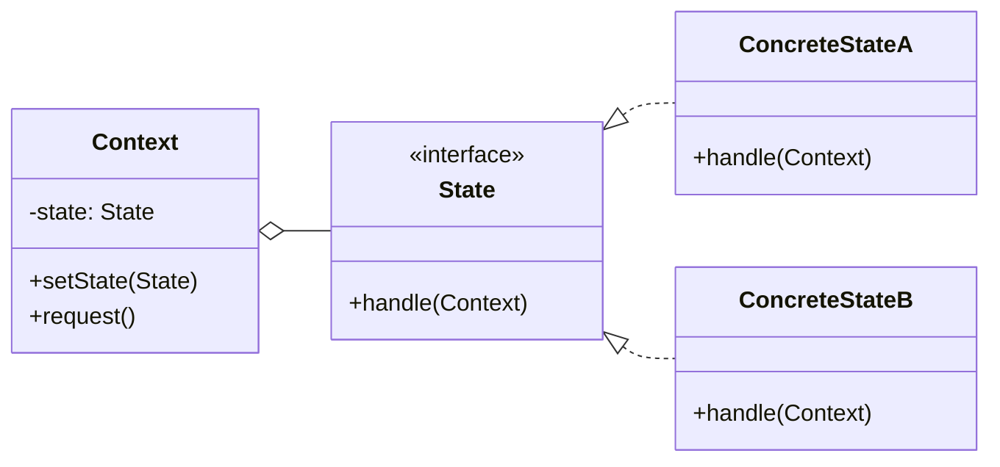

</div>

<!--
Le pattern État évite les longues chaînes de if/else pour gérer les états.
C'est comme un distributeur automatique qui change de comportement selon son état.
-->

---

# État - Implémentation

<div class="overflow-y-auto" style="max-height: 90%;">

````md magic-move {lines: true}

```typescript
// Étape 1 : Interface State
interface OrderState {
  cancel(order: Order): void;
  ship(order: Order): void;
  deliver(order: Order): void;
}
```

```typescript
interface OrderState {
  cancel(order: Order): void;
  ship(order: Order): void;
  deliver(order: Order): void;
}

// Étape 2 : États concrets
class PendingState implements OrderState {
  cancel(order: Order): void {
    console.log("✅ Commande annulée");
    order.setState(new CancelledState());
  }
  
  ship(order: Order): void {
    console.log("📦 Commande expédiée");
    order.setState(new ShippedState());
  }
  
  deliver(order: Order): void {
    console.log("❌ Impossible de livrer une commande non expédiée");
  }
}

class ShippedState implements OrderState {
  cancel(order: Order): void {
    console.log("❌ Impossible d'annuler une commande expédiée");
  }
  
  ship(order: Order): void {
    console.log("❌ Commande déjà expédiée");
  }
  
  deliver(order: Order): void {
    console.log("🎉 Commande livrée");
    order.setState(new DeliveredState());
  }
}
```

```typescript
interface OrderState {
  cancel(order: Order): void;
  ship(order: Order): void;
  deliver(order: Order): void;
}

class PendingState implements OrderState {
  cancel(order: Order): void {
    console.log("✅ Commande annulée");
    order.setState(new CancelledState());
  }
  
  ship(order: Order): void {
    console.log("📦 Commande expédiée");
    order.setState(new ShippedState());
  }
  
  deliver(order: Order): void {
    console.log("❌ Impossible de livrer une commande non expédiée");
  }
}

class ShippedState implements OrderState {
  cancel(order: Order): void {
    console.log("❌ Impossible d'annuler une commande expédiée");
  }
  
  ship(order: Order): void {
    console.log("❌ Commande déjà expédiée");
  }
  
  deliver(order: Order): void {
    console.log("🎉 Commande livrée");
    order.setState(new DeliveredState());
  }
}

class DeliveredState implements OrderState {
  cancel(order: Order): void {
    console.log("❌ Impossible d'annuler une commande livrée");
  }
  
  ship(order: Order): void {
    console.log("❌ Commande déjà livrée");
  }
  
  deliver(order: Order): void {
    console.log("❌ Commande déjà livrée");
  }
}

class CancelledState implements OrderState {
  cancel(order: Order): void {
    console.log("❌ Commande déjà annulée");
  }
  
  ship(order: Order): void {
    console.log("❌ Impossible d'expédier une commande annulée");
  }
  
  deliver(order: Order): void {
    console.log("❌ Impossible de livrer une commande annulée");
  }
}
```

```typescript
interface OrderState {
  cancel(order: Order): void;
  ship(order: Order): void;
  deliver(order: Order): void;
}

class PendingState implements OrderState {
  cancel(order: Order): void {
    console.log("✅ Commande annulée");
    order.setState(new CancelledState());
  }
  
  ship(order: Order): void {
    console.log("📦 Commande expédiée");
    order.setState(new ShippedState());
  }
  
  deliver(order: Order): void {
    console.log("❌ Impossible de livrer une commande non expédiée");
  }
}

class ShippedState implements OrderState {
  cancel(order: Order): void {
    console.log("❌ Impossible d'annuler une commande expédiée");
  }
  
  ship(order: Order): void {
    console.log("❌ Commande déjà expédiée");
  }
  
  deliver(order: Order): void {
    console.log("🎉 Commande livrée");
    order.setState(new DeliveredState());
  }
}

class DeliveredState implements OrderState {
  cancel(order: Order): void {
    console.log("❌ Impossible d'annuler une commande livrée");
  }
  
  ship(order: Order): void {
    console.log("❌ Commande déjà livrée");
  }
  
  deliver(order: Order): void {
    console.log("❌ Commande déjà livrée");
  }
}

class CancelledState implements OrderState {
  cancel(order: Order): void {
    console.log("❌ Commande déjà annulée");
  }
  
  ship(order: Order): void {
    console.log("❌ Impossible d'expédier une commande annulée");
  }
  
  deliver(order: Order): void {
    console.log("❌ Impossible de livrer une commande annulée");
  }
}

// Étape 3 : Contexte
class Order {
  private state: OrderState;
  
  constructor() {
    this.state = new PendingState();
  }
  
  setState(state: OrderState): void {
    this.state = state;
  }
  
  cancel(): void {
    this.state.cancel(this);
  }
  
  ship(): void {
    this.state.ship(this);
  }
  
  deliver(): void {
    this.state.deliver(this);
  }
}
```

```typescript
interface OrderState {
  cancel(order: Order): void;
  ship(order: Order): void;
  deliver(order: Order): void;
}

class PendingState implements OrderState {
  cancel(order: Order): void {
    console.log("✅ Commande annulée");
    order.setState(new CancelledState());
  }
  
  ship(order: Order): void {
    console.log("📦 Commande expédiée");
    order.setState(new ShippedState());
  }
  
  deliver(order: Order): void {
    console.log("❌ Impossible de livrer une commande non expédiée");
  }
}

class ShippedState implements OrderState {
  cancel(order: Order): void {
    console.log("❌ Impossible d'annuler une commande expédiée");
  }
  
  ship(order: Order): void {
    console.log("❌ Commande déjà expédiée");
  }
  
  deliver(order: Order): void {
    console.log("🎉 Commande livrée");
    order.setState(new DeliveredState());
  }
}

class DeliveredState implements OrderState {
  cancel(order: Order): void {
    console.log("❌ Impossible d'annuler une commande livrée");
  }
  
  ship(order: Order): void {
    console.log("❌ Commande déjà livrée");
  }
  
  deliver(order: Order): void {
    console.log("❌ Commande déjà livrée");
  }
}

class CancelledState implements OrderState {
  cancel(order: Order): void {
    console.log("❌ Commande déjà annulée");
  }
  
  ship(order: Order): void {
    console.log("❌ Impossible d'expédier une commande annulée");
  }
  
  deliver(order: Order): void {
    console.log("❌ Impossible de livrer une commande annulée");
  }
}

class Order {
  private state: OrderState;
  
  constructor() {
    this.state = new PendingState();
  }
  
  setState(state: OrderState): void {
    this.state = state;
  }
  
  cancel(): void {
    this.state.cancel(this);
  }
  
  ship(): void {
    this.state.ship(this);
  }
  
  deliver(): void {
    this.state.deliver(this);
  }
}

// Étape 4 : Utilisation
const order = new Order();

order.ship();    // � Commande expédiée
order.deliver(); // 🎉 Commande livrée
order.cancel();  // ❌ Impossible d'annuler une commande livrée
```

````

</div>

<!--
La progression montre comment :
1. On définit l'interface State
2. On crée les états concrets avec leurs comportements
3. On crée le contexte qui délègue aux états
4. On utilise le pattern pour gérer les transitions d'état
-->

---

# Strategy

<div class="text-xl mb-4">
Définir une famille d'algorithmes interchangeables
</div>

<v-clicks>

- 🎯 **Problème** : Choisir un algorithme à l'exécution
- ✅ **Solution** : Encapsuler chaque algorithme dans une classe
- 📦 **Cas d'usage** : Tri, compression, validation, calcul de prix

</v-clicks>

<div v-click class="mt-4">

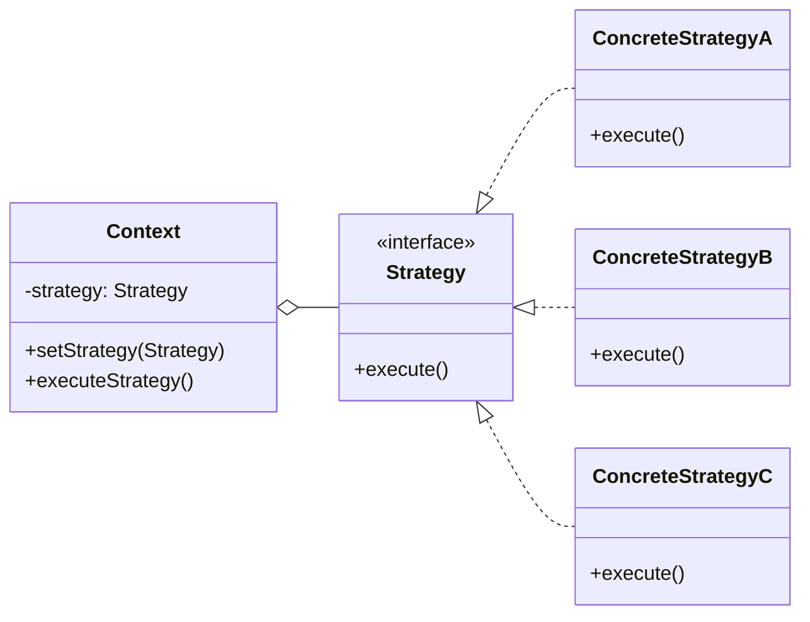

</div>

<!--
Strategy permet de changer d'algorithme dynamiquement.
C'est comme choisir un moyen de transport : voiture, vélo, train...
-->

---

# Strategy - Implémentation

<div class="overflow-y-auto" style="max-height: 90%;">

````md magic-move {lines: true}

```typescript
// Étape 1 : Interface de stratégie
interface PaymentStrategy {
  pay(amount: number): void;
}
```

```typescript
interface PaymentStrategy {
  pay(amount: number): void;
}

// Étape 2 : Première stratégie concrète
class CreditCardPayment implements PaymentStrategy {
  constructor(private cardNumber: string) {}
  
  pay(amount: number): void {
    console.log(`💳 Paiement de ${amount}€ par carte ${this.cardNumber}`);
  }
}
```

```typescript
interface PaymentStrategy {
  pay(amount: number): void;
}

class CreditCardPayment implements PaymentStrategy {
  constructor(private cardNumber: string) {}
  
  pay(amount: number): void {
    console.log(`💳 Paiement de ${amount}€ par carte ${this.cardNumber}`);
  }
}

// Étape 3 : Autres stratégies
class PayPalPayment implements PaymentStrategy {
  constructor(private email: string) {}
  
  pay(amount: number): void {
    console.log(`🅿️ Paiement de ${amount}€ via PayPal (${this.email})`);
  }
}

class CryptoPayment implements PaymentStrategy {
  constructor(private wallet: string) {}
  
  pay(amount: number): void {
    console.log(`₿ Paiement de ${amount}€ en crypto (${this.wallet})`);
  }
}
```

```typescript
interface PaymentStrategy {
  pay(amount: number): void;
}

class CreditCardPayment implements PaymentStrategy {
  constructor(private cardNumber: string) {}
  
  pay(amount: number): void {
    console.log(`💳 Paiement de ${amount}€ par carte ${this.cardNumber}`);
  }
}

class PayPalPayment implements PaymentStrategy {
  constructor(private email: string) {}
  
  pay(amount: number): void {
    console.log(`🅿️ Paiement de ${amount}€ via PayPal (${this.email})`);
  }
}

class CryptoPayment implements PaymentStrategy {
  constructor(private wallet: string) {}
  
  pay(amount: number): void {
    console.log(`₿ Paiement de ${amount}€ en crypto (${this.wallet})`);
  }
}

// Étape 4 : Contexte qui utilise la stratégie
class ShoppingCart {
  private strategy: PaymentStrategy;
  
  setPaymentStrategy(strategy: PaymentStrategy): void {
    this.strategy = strategy;
  }
  
  checkout(amount: number): void {
    this.strategy.pay(amount);
  }
}
```

```typescript
interface PaymentStrategy {
  pay(amount: number): void;
}

class CreditCardPayment implements PaymentStrategy {
  constructor(private cardNumber: string) {}
  
  pay(amount: number): void {
    console.log(`💳 Paiement de ${amount}€ par carte ${this.cardNumber}`);
  }
}

class PayPalPayment implements PaymentStrategy {
  constructor(private email: string) {}
  
  pay(amount: number): void {
    console.log(`🅿️ Paiement de ${amount}€ via PayPal (${this.email})`);
  }
}

class CryptoPayment implements PaymentStrategy {
  constructor(private wallet: string) {}
  
  pay(amount: number): void {
    console.log(`₿ Paiement de ${amount}€ en crypto (${this.wallet})`);
  }
}

class ShoppingCart {
  private strategy: PaymentStrategy;
  
  setPaymentStrategy(strategy: PaymentStrategy): void {
    this.strategy = strategy;
  }
  
  checkout(amount: number): void {
    this.strategy.pay(amount);
  }
}

// Étape 5 : Utilisation - changer de stratégie dynamiquement
const cart = new ShoppingCart();

cart.setPaymentStrategy(new CreditCardPayment("1234-5678"));
cart.checkout(100);

cart.setPaymentStrategy(new PayPalPayment("user@example.com"));
cart.checkout(50);
```

````

</div>

<!--
La progression montre comment :
1. On définit l'interface de stratégie
2. On crée une première stratégie concrète
3. On ajoute d'autres stratégies alternatives
4. On crée le contexte qui utilise les stratégies
5. On change de stratégie dynamiquement à l'exécution
-->

---

# Command

<div class="text-xl mb-4">
Encapsuler une requête comme un objet
</div>

<v-clicks>

- 🎯 **Problème** : Paramétrer des objets avec des opérations
- ✅ **Solution** : Transformer les requêtes en objets
- 📦 **Cas d'usage** : Undo/Redo, file d'attente, transactions

</v-clicks>

<div v-click class="mt-4">

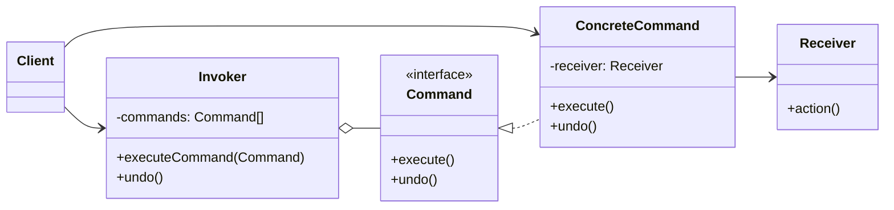

</div>

<!--
Command transforme les actions en objets.
Cela permet de les stocker, les annuler, les rejouer...
-->

---

# Command - Implémentation

<div class="overflow-y-auto" style="max-height: 90%;">

````md magic-move {lines: true}

```typescript
// Étape 1 : Interface Command
interface Command {
  execute(): void;
  undo(): void;
}
```

```typescript
interface Command {
  execute(): void;
  undo(): void;
}

// Étape 2 : Receiver (celui qui fait le travail)
class Light {
  on(): void {
    console.log("💡 Lumière allumée");
  }
  
  off(): void {
    console.log("🌑 Lumière éteinte");
  }
}
```

```typescript
interface Command {
  execute(): void;
  undo(): void;
}

class Light {
  on(): void {
    console.log("💡 Lumière allumée");
  }
  
  off(): void {
    console.log("🌑 Lumière éteinte");
  }
}

// Étape 3 : Commandes concrètes
class LightOnCommand implements Command {
  constructor(private light: Light) {}
  
  execute(): void {
    this.light.on();
  }
  
  undo(): void {
    this.light.off();
  }
}

class LightOffCommand implements Command {
  constructor(private light: Light) {}
  
  execute(): void {
    this.light.off();
  }
  
  undo(): void {
    this.light.on();
  }
}
```

```typescript
interface Command {
  execute(): void;
  undo(): void;
}

class Light {
  on(): void {
    console.log("💡 Lumière allumée");
  }
  
  off(): void {
    console.log("🌑 Lumière éteinte");
  }
}

class LightOnCommand implements Command {
  constructor(private light: Light) {}
  
  execute(): void {
    this.light.on();
  }
  
  undo(): void {
    this.light.off();
  }
}

class LightOffCommand implements Command {
  constructor(private light: Light) {}
  
  execute(): void {
    this.light.off();
  }
  
  undo(): void {
    this.light.on();
  }
}

// Étape 4 : Invoker (télécommande)
class RemoteControl {
  private history: Command[] = [];
  
  executeCommand(command: Command): void {
    command.execute();
    this.history.push(command);
  }
  
  undo(): void {
    const command = this.history.pop();
    if (command) command.undo();
  }
}
```

```typescript
interface Command {
  execute(): void;
  undo(): void;
}

class Light {
  on(): void {
    console.log("💡 Lumière allumée");
  }
  
  off(): void {
    console.log("🌑 Lumière éteinte");
  }
}

class LightOnCommand implements Command {
  constructor(private light: Light) {}
  
  execute(): void {
    this.light.on();
  }
  
  undo(): void {
    this.light.off();
  }
}

class LightOffCommand implements Command {
  constructor(private light: Light) {}
  
  execute(): void {
    this.light.off();
  }
  
  undo(): void {
    this.light.on();
  }
}

class RemoteControl {
  private history: Command[] = [];
  
  executeCommand(command: Command): void {
    command.execute();
    this.history.push(command);
  }
  
  undo(): void {
    const command = this.history.pop();
    if (command) command.undo();
  }
}

// Étape 5 : Utilisation avec undo/redo
const light = new Light();
const remote = new RemoteControl();

remote.executeCommand(new LightOnCommand(light));  // 💡 Lumière allumée
remote.executeCommand(new LightOffCommand(light)); // 🌑 Lumière éteinte
remote.undo(); // 💡 Lumière allumée (annulation)
```

````

</div>

<!--
La progression montre comment :
1. On définit l'interface Command
2. On crée le Receiver qui exécute les actions
3. On encapsule les actions dans des commandes concrètes
4. On crée l'Invoker qui gère l'historique
5. On utilise le pattern avec undo/redo
-->

---

# Chaîne de responsabilité

<div class="text-xl mb-4">
Faire passer une requête le long d'une chaîne de gestionnaires
</div>

<v-clicks>

- 🎯 **Problème** : Plusieurs objets peuvent traiter une requête
- ✅ **Solution** : Chaîner les gestionnaires, chacun décide s'il traite ou passe
- 📦 **Cas d'usage** : Middleware, validation, logging, gestion d'événements

</v-clicks>

<div v-click class="mt-4">

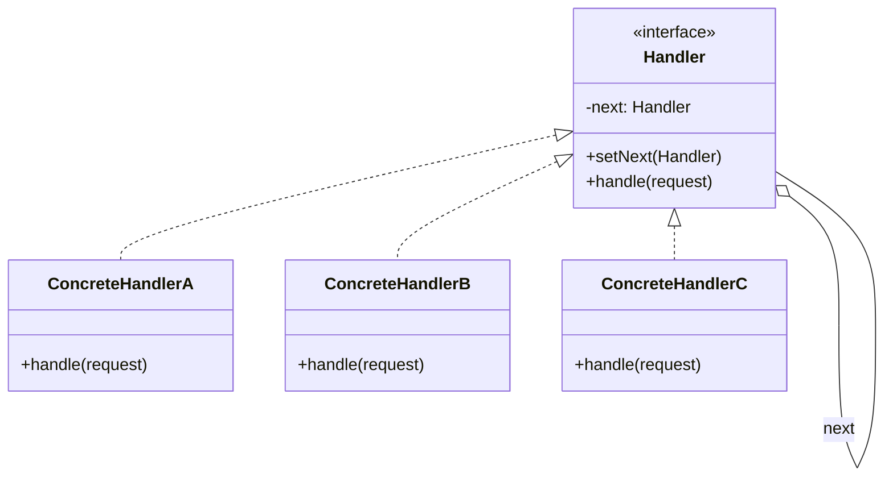

</div>

<!--
La Chaîne de responsabilité permet de découpler l'émetteur du récepteur.
C'est comme un système de support client avec plusieurs niveaux d'escalade.
-->

---

# Chaîne de responsabilité - Implémentation

<div class="overflow-y-auto" style="max-height: 90%;">

````md magic-move {lines: true}

```typescript
// Étape 1 : Interface Handler
interface SupportHandler {
  setNext(handler: SupportHandler): SupportHandler;
  handle(request: string): void;
}
```

```typescript
interface SupportHandler {
  setNext(handler: SupportHandler): SupportHandler;
  handle(request: string): void;
}

// Étape 2 : Handler abstrait
abstract class AbstractSupportHandler implements SupportHandler {
  private nextHandler: SupportHandler | null = null;
  
  setNext(handler: SupportHandler): SupportHandler {
    this.nextHandler = handler;
    return handler;
  }
  
  handle(request: string): void {
    if (this.nextHandler) {
      this.nextHandler.handle(request);
    }
  }
}
```

```typescript
interface SupportHandler {
  setNext(handler: SupportHandler): SupportHandler;
  handle(request: string): void;
}

abstract class AbstractSupportHandler implements SupportHandler {
  private nextHandler: SupportHandler | null = null;
  
  setNext(handler: SupportHandler): SupportHandler {
    this.nextHandler = handler;
    return handler;
  }
  
  handle(request: string): void {
    if (this.nextHandler) {
      this.nextHandler.handle(request);
    }
  }
}

// Étape 3 : Handlers concrets
class Level1Support extends AbstractSupportHandler {
  handle(request: string): void {
    if (request === "simple") {
      console.log("✅ Level 1: Problème résolu");
    } else {
      console.log("⏭️ Level 1: Escalade au niveau 2");
      super.handle(request);
    }
  }
}

class Level2Support extends AbstractSupportHandler {
  handle(request: string): void {
    if (request === "medium") {
      console.log("✅ Level 2: Problème résolu");
    } else {
      console.log("⏭️ Level 2: Escalade au niveau 3");
      super.handle(request);
    }
  }
}

class Level3Support extends AbstractSupportHandler {
  handle(request: string): void {
    console.log("✅ Level 3: Problème complexe résolu");
  }
}
```

```typescript
interface SupportHandler {
  setNext(handler: SupportHandler): SupportHandler;
  handle(request: string): void;
}

abstract class AbstractSupportHandler implements SupportHandler {
  private nextHandler: SupportHandler | null = null;
  
  setNext(handler: SupportHandler): SupportHandler {
    this.nextHandler = handler;
    return handler;
  }
  
  handle(request: string): void {
    if (this.nextHandler) {
      this.nextHandler.handle(request);
    }
  }
}

class Level1Support extends AbstractSupportHandler {
  handle(request: string): void {
    if (request === "simple") {
      console.log("✅ Level 1: Problème résolu");
    } else {
      console.log("⏭️ Level 1: Escalade au niveau 2");
      super.handle(request);
    }
  }
}

class Level2Support extends AbstractSupportHandler {
  handle(request: string): void {
    if (request === "medium") {
      console.log("✅ Level 2: Problème résolu");
    } else {
      console.log("⏭️ Level 2: Escalade au niveau 3");
      super.handle(request);
    }
  }
}

class Level3Support extends AbstractSupportHandler {
  handle(request: string): void {
    console.log("✅ Level 3: Problème complexe résolu");
  }
}

// Étape 4 : Utilisation - construire la chaîne
const level1 = new Level1Support();
const level2 = new Level2Support();
const level3 = new Level3Support();

level1.setNext(level2).setNext(level3);

level1.handle("simple");  // ✅ Level 1: Problème résolu
level1.handle("medium");  // ⏭️ Level 1 → ✅ Level 2: Problème résolu
level1.handle("complex"); // ⏭️ Level 1 → ⏭️ Level 2 → ✅ Level 3
```

````

</div>

<!--
La progression montre comment :
1. On définit l'interface Handler
2. On crée un handler abstrait avec la logique de chaînage
3. On implémente les handlers concrets
4. On construit et utilise la chaîne
-->

---

# Médiateur

<div class="text-xl mb-4">
Centraliser les communications entre objets
</div>

<v-clicks>

- 🎯 **Problème** : Communications complexes entre plusieurs objets
- ✅ **Solution** : Objet médiateur qui centralise les interactions
- 📦 **Cas d'usage** : Chat rooms, contrôleurs MVC, systèmes de dialogue

</v-clicks>

<div v-click class="mt-4">

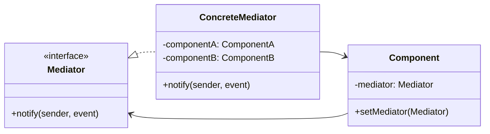

</div>

<!--
Le Médiateur réduit les dépendances entre objets communicants.
C'est comme un contrôleur aérien qui coordonne les avions.
-->

---

# Médiateur - Implémentation

<div class="overflow-y-auto" style="max-height: 90%;">

````md magic-move {lines: true}

```typescript
// Étape 1 : Interface Mediator
interface ChatMediator {
  sendMessage(message: string, user: User): void;
  addUser(user: User): void;
}
```

```typescript
interface ChatMediator {
  sendMessage(message: string, user: User): void;
  addUser(user: User): void;
}

// Étape 2 : Composant (User)
class User {
  constructor(
    private name: string,
    private mediator: ChatMediator
  ) {
    this.mediator.addUser(this);
  }
  
  send(message: string): void {
    console.log(`${this.name} envoie: ${message}`);
    this.mediator.sendMessage(message, this);
  }
  
  receive(message: string): void {
    console.log(`${this.name} reçoit: ${message}`);
  }
  
  getName(): string {
    return this.name;
  }
}
```

```typescript
interface ChatMediator {
  sendMessage(message: string, user: User): void;
  addUser(user: User): void;
}

class User {
  constructor(
    private name: string,
    private mediator: ChatMediator
  ) {
    this.mediator.addUser(this);
  }
  
  send(message: string): void {
    console.log(`${this.name} envoie: ${message}`);
    this.mediator.sendMessage(message, this);
  }
  
  receive(message: string): void {
    console.log(`${this.name} reçoit: ${message}`);
  }
  
  getName(): string {
    return this.name;
  }
}

// Étape 3 : Médiateur concret
class ChatRoom implements ChatMediator {
  private users: User[] = [];
  
  addUser(user: User): void {
    this.users.push(user);
  }
  
  sendMessage(message: string, sender: User): void {
    this.users.forEach(user => {
      if (user !== sender) {
        user.receive(message);
      }
    });
  }
}
```

```typescript
interface ChatMediator {
  sendMessage(message: string, user: User): void;
  addUser(user: User): void;
}

class User {
  constructor(
    private name: string,
    private mediator: ChatMediator
  ) {
    this.mediator.addUser(this);
  }
  
  send(message: string): void {
    console.log(`${this.name} envoie: ${message}`);
    this.mediator.sendMessage(message, this);
  }
  
  receive(message: string): void {
    console.log(`${this.name} reçoit: ${message}`);
  }
  
  getName(): string {
    return this.name;
  }
}

class ChatRoom implements ChatMediator {
  private users: User[] = [];
  
  addUser(user: User): void {
    this.users.push(user);
  }
  
  sendMessage(message: string, sender: User): void {
    this.users.forEach(user => {
      if (user !== sender) {
        user.receive(message);
      }
    });
  }
}

// Étape 4 : Utilisation
const chatRoom = new ChatRoom();

const alice = new User("Alice", chatRoom);
const bob = new User("Bob", chatRoom);
const charlie = new User("Charlie", chatRoom);

alice.send("Bonjour tout le monde !");
// Bob reçoit: Bonjour tout le monde !
// Charlie reçoit: Bonjour tout le monde !
```

````

</div>

<!--
La progression montre comment :
1. On définit l'interface Mediator
2. On crée les composants qui communiquent via le médiateur
3. On implémente le médiateur concret
4. On utilise le pattern pour coordonner les communications
-->

---

# Itérateur

<div class="text-xl mb-4">
Parcourir une collection sans exposer sa structure interne
</div>

<v-clicks>

- 🎯 **Problème** : Accéder aux éléments d'une collection de manière uniforme
- ✅ **Solution** : Interface d'itération indépendante de la structure
- 📦 **Cas d'usage** : Parcours de collections, arbres, graphes

</v-clicks>

<div v-click class="mt-4">

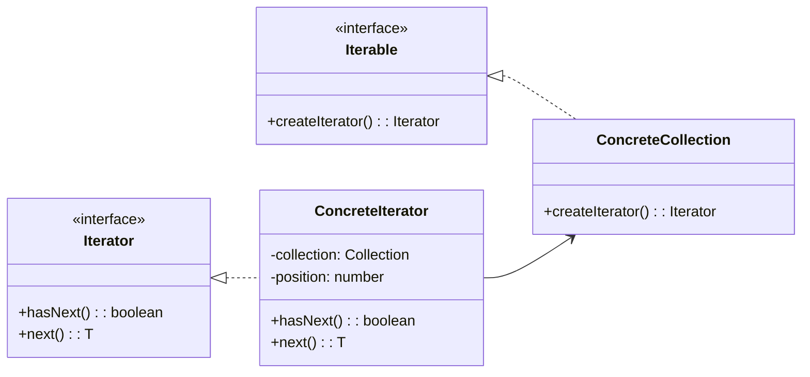

</div>

<!--
L'Itérateur permet de parcourir une collection sans connaître sa structure.
C'est la base du for...of en JavaScript et des boucles foreach dans d'autres langages.
-->

---

# Itérateur - Implémentation

<div class="overflow-y-auto" style="max-height: 90%;">

````md magic-move {lines: true}

```typescript
// Étape 1 : Interface Iterator
interface Iterator<T> {
  hasNext(): boolean;
  next(): T | null;
}
```

```typescript
interface Iterator<T> {
  hasNext(): boolean;
  next(): T | null;
}

// Étape 2 : Interface Iterable
interface Iterable<T> {
  createIterator(): Iterator<T>;
}
```

```typescript
interface Iterator<T> {
  hasNext(): boolean;
  next(): T | null;
}

interface Iterable<T> {
  createIterator(): Iterator<T>;
}

// Étape 3 : Collection concrète
class BookCollection implements Iterable<string> {
  private books: string[] = [];
  
  addBook(book: string): void {
    this.books.push(book);
  }
  
  createIterator(): Iterator<string> {
    return new BookIterator(this.books);
  }
}
```

```typescript
interface Iterator<T> {
  hasNext(): boolean;
  next(): T | null;
}

interface Iterable<T> {
  createIterator(): Iterator<T>;
}

class BookCollection implements Iterable<string> {
  private books: string[] = [];
  
  addBook(book: string): void {
    this.books.push(book);
  }
  
  createIterator(): Iterator<string> {
    return new BookIterator(this.books);
  }
}

// Étape 4 : Itérateur concret
class BookIterator implements Iterator<string> {
  private position: number = 0;
  
  constructor(private books: string[]) {}
  
  hasNext(): boolean {
    return this.position < this.books.length;
  }
  
  next(): string | null {
    if (this.hasNext()) {
      return this.books[this.position++];
    }
    return null;
  }
}
```

```typescript
interface Iterator<T> {
  hasNext(): boolean;
  next(): T | null;
}

interface Iterable<T> {
  createIterator(): Iterator<T>;
}

class BookCollection implements Iterable<string> {
  private books: string[] = [];
  
  addBook(book: string): void {
    this.books.push(book);
  }
  
  createIterator(): Iterator<string> {
    return new BookIterator(this.books);
  }
}

class BookIterator implements Iterator<string> {
  private position: number = 0;
  
  constructor(private books: string[]) {}
  
  hasNext(): boolean {
    return this.position < this.books.length;
  }
  
  next(): string | null {
    if (this.hasNext()) {
      return this.books[this.position++];
    }
    return null;
  }
}

// Étape 5 : Utilisation
const collection = new BookCollection();
collection.addBook("Design Patterns");
collection.addBook("Clean Code");
collection.addBook("Refactoring");

const iterator = collection.createIterator();

while (iterator.hasNext()) {
  console.log(`📖 ${iterator.next()}`);
}
```

````

</div>

<!--
La progression montre comment :
1. On définit l'interface Iterator
2. On définit l'interface Iterable
3. On crée la collection qui peut être itérée
4. On implémente l'itérateur concret
5. On utilise le pattern pour parcourir la collection
-->

---
layout: two-cols
---

# Récapitulatif

## 🏗️ Création

- **Singleton** : Instance unique
- **Factory** : Création déléguée
- **Builder** : Construction étape par étape

## 🔗 Structure

- **Adapter** : Compatibilité d'interfaces
- **Decorator** : Ajout de fonctionnalités
- **Composite** : Structures arborescentes

::right::

## 🎭 Comportement

- **État** : Comportement selon l'état
- **Strategy** : Algorithmes interchangeables
- **Command** : Requêtes en objets
- **Chaîne de responsabilité** : Chaîne de gestionnaires
- **Médiateur** : Communications centralisées
- **Itérateur** : Parcours de collections

<div v-click class="mt-8 p-4 bg-green-50 dark:bg-orange-700 rounded text-sm">

### 💡 Conseils
Ne pas sur-utiliser les patterns !
Utilisez-les quand ils apportent une vraie valeur.

L'essentiel est dans le concept, pas dans l'implémentation ! Les exemples présentés ne représentent qu'une façon parmi d'autres d'implémenter ces patterns. L'important est d'atteindre l'objectif de résolution du problème.

</div>

<!--
Les patterns sont des outils, pas des obligations.
Il faut savoir quand les utiliser et quand s'en passer.
-->

---
layout: center
---

# Pour Aller Plus Loin

- [Refactoring Guru](https://refactoring.guru/design-patterns)
- [Patterns.dev](https://www.patterns.dev/)

<!--
La meilleure façon d'apprendre les patterns est de les pratiquer.
Commencez par les reconnaître dans le code existant.
-->

---
layout: cover
class: text-center
background: https://cover.sli.dev
---

# Merci !

Des questions ?

<!--
N'hésitez pas à poser vos questions !
Les design patterns deviennent plus clairs avec la pratique.
-->
