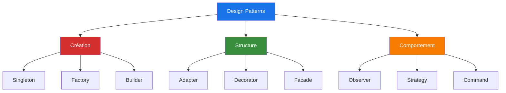
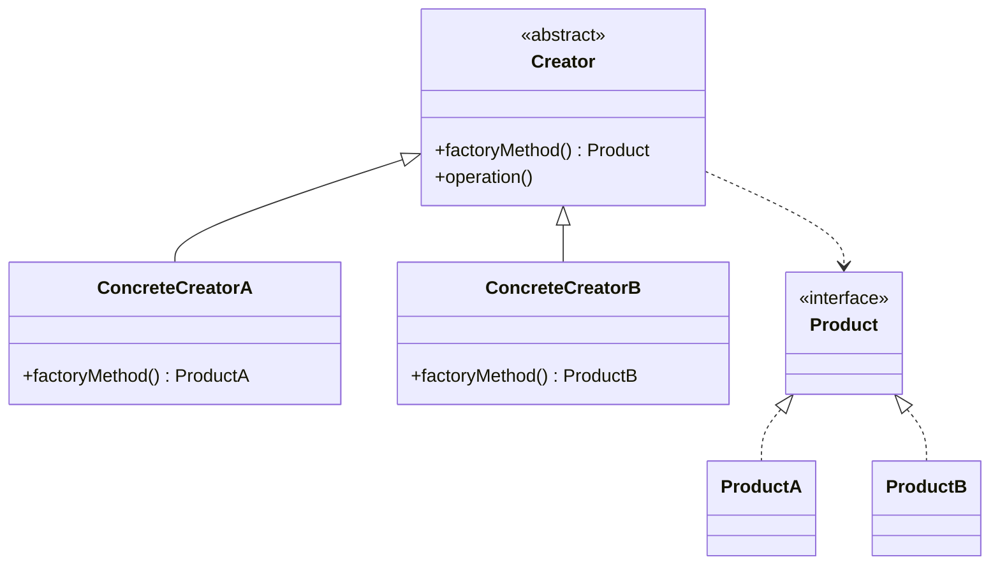
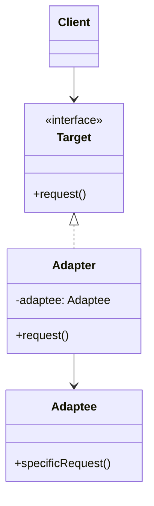
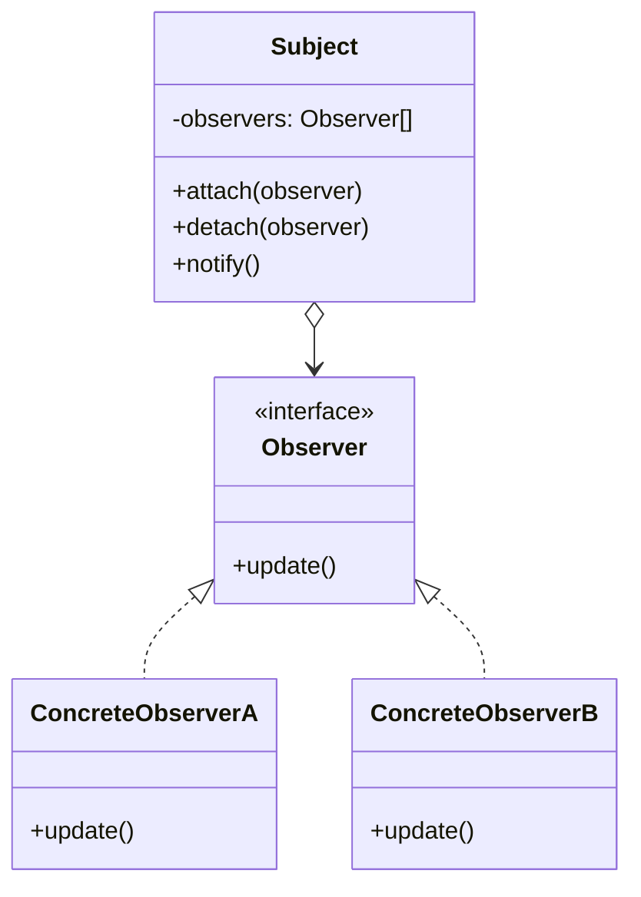

# Les Design Patterns

Les 3 Catégories Fondamentales

<!--
Bienvenue dans cette présentation sur les Design Patterns.
Nous allons explorer les trois grandes catégories de patterns de conception.
-->

---
layout: center
---

# Qu'est-ce qu'un Design Pattern ?

<v-clicks>

- 🎯 **Solution éprouvée** à un problème récurrent
- 📚 **Vocabulaire commun** entre développeurs
- 🔧 **Boîte à outils** de conception logicielle
- ✨ **Bonnes pratiques** accumulées depuis des années

</v-clicks>

<div v-click class="mt-8 p-4 bg-blue-50 dark:bg-blue-900 rounded">
💡 <strong>Analogie</strong> : Comme des recettes de cuisine pour résoudre des problèmes de conception
</div>

<!--
Un design pattern n'est pas du code à copier-coller, mais une approche conceptuelle.
C'est comme avoir un plan d'architecture avant de construire une maison.
-->

---

# Les 3 Catégories

<div class="flex gap-4 mt-8">

<v-click>
<div class="flex-1 p-4">

### 🏗️ Création
Gestion de la création d'objets

</div>
</v-click>

<v-click>
<div class="flex-1 p-4">

### 🔗 Structure
Organisation des classes et objets

</div>
</v-click>

<v-click>
<div class="flex-1 p-4">

### 🎭 Comportement
Communication entre objets

</div>
</v-click>

</div>

<div v-click class="mt-8">



</div>

<!--
Chaque catégorie répond à un type de problème spécifique.
Nous allons voir des exemples concrets pour chacune.
-->

---
layout: section
---

# 🏗️ Patterns de Création

Contrôler la création d'objets

---
layout: center
---

# Singleton

<div class="text-xl mb-4">
Garantir qu'une classe n'a qu'une seule instance
</div>

<v-clicks>

- 🎯 **Problème** : Besoin d'une instance unique (configuration, connexion DB)
- ✅ **Solution** : Contrôler l'instanciation via la classe elle-même
- 📦 **Cas d'usage** : Logger, gestionnaire de configuration, pool de connexions

</v-clicks>

<!--
Le Singleton est probablement le pattern le plus connu, mais aussi le plus controversé.
Il faut l'utiliser avec parcimonie car il peut créer des dépendances cachées.
-->

---

# Singleton - Implémentation

````md magic-move {lines: true}

```typescript
// Étape 1 : Classe de base
class DatabaseConnection {
  constructor() {
    console.log("Connexion à la base de données");
  }
}
```

```typescript
class DatabaseConnection {
  // Étape 2 : Ajouter l'instance statique
  private static instance: DatabaseConnection;
  
  constructor() {
    console.log("Connexion à la base de données");
  }
}
```

```typescript
class DatabaseConnection {
  private static instance: DatabaseConnection;
  
  // Étape 3 : Constructeur privé + méthode getInstance
  private constructor() {
    console.log("Connexion à la base de données");
  }
  
  public static getInstance(): DatabaseConnection {
    if (!DatabaseConnection.instance) {
      DatabaseConnection.instance = new DatabaseConnection();
    }
    return DatabaseConnection.instance;
  }
}
```

```typescript
class DatabaseConnection {
  private static instance: DatabaseConnection;
  
  private constructor() {
    console.log("Connexion à la base de données");
  }
  
  public static getInstance(): DatabaseConnection {
    if (!DatabaseConnection.instance) {
      DatabaseConnection.instance = new DatabaseConnection();
    }
    return DatabaseConnection.instance;
  }
}

// Étape 4 : Utilisation
const db1 = DatabaseConnection.getInstance();
const db2 = DatabaseConnection.getInstance();
console.log(db1 === db2); // true - même instance !
```

````

<!--
Notez comment nous construisons progressivement le pattern :
1. Classe normale
2. Ajout de l'instance statique
3. Constructeur privé pour empêcher new
4. Méthode getInstance pour contrôler la création
-->

---

# Factory Method

<div class="text-xl mb-4">
Déléguer la création d'objets à des sous-classes
</div>

<v-clicks>

- 🎯 **Problème** : Créer des objets sans spécifier leur classe exacte
- ✅ **Solution** : Interface de création, implémentation dans les sous-classes
- 📦 **Cas d'usage** : Créer différents types de documents, véhicules, notifications

</v-clicks>

<div v-click class="mt-8">



</div>

<!--
La Factory Method permet de créer des objets sans connaître leur type exact.
C'est très utile quand on veut étendre le système avec de nouveaux types.
-->

---

# Factory Method - Implémentation

````md magic-move {lines: true}

```typescript
// Étape 1 : Interface du produit
interface Notification {
  send(message: string): void;
}
```

```typescript
interface Notification {
  send(message: string): void;
}

// Étape 2 : Implémentations concrètes
class EmailNotification implements Notification {
  send(message: string): void {
    console.log(`📧 Email: ${message}`);
  }
}

class SMSNotification implements Notification {
  send(message: string): void {
    console.log(`📱 SMS: ${message}`);
  }
}
```

```typescript
interface Notification {
  send(message: string): void;
}

class EmailNotification implements Notification {
  send(message: string): void {
    console.log(`📧 Email: ${message}`);
  }
}

class SMSNotification implements Notification {
  send(message: string): void {
    console.log(`📱 SMS: ${message}`);
  }
}

// Étape 3 : Factory abstraite
abstract class NotificationFactory {
  abstract createNotification(): Notification;
  
  public notify(message: string): void {
    const notification = this.createNotification();
    notification.send(message);
  }
}
```

```ts
interface Notification {
  send(message: string): void;
}

class EmailNotification implements Notification {
  send(message: string): void {
    console.log(`📧 Email: ${message}`);
  }
}

class SMSNotification implements Notification {
  send(message: string): void {
    console.log(`📱 SMS: ${message}`);
  }
}

abstract class NotificationFactory {
  abstract createNotification(): Notification;
  
  public notify(message: string): void {
    const notification = this.createNotification();
    notification.send(message);
  }
}

// Étape 4 : Factories concrètes
class EmailFactory extends NotificationFactory {
  createNotification(): Notification {
    return new EmailNotification();
  }
}

class SMSFactory extends NotificationFactory {
  createNotification(): Notification {
    return new SMSNotification();
  }
}
```

```typescript
interface Notification {
  send(message: string): void;
}

class EmailNotification implements Notification {
  send(message: string): void {
    console.log(`📧 Email: ${message}`);
  }
}

class SMSNotification implements Notification {
  send(message: string): void {
    console.log(`📱 SMS: ${message}`);
  }
}

abstract class NotificationFactory {
  abstract createNotification(): Notification;
  
  public notify(message: string): void {
    const notification = this.createNotification();
    notification.send(message);
  }
}

class EmailFactory extends NotificationFactory {
  createNotification(): Notification {
    return new EmailNotification();
  }
}

class SMSFactory extends NotificationFactory {
  createNotification(): Notification {
    return new SMSNotification();
  }
}

// Étape 5 : Utilisation
function sendAlert(factory: NotificationFactory, message: string) {
  factory.notify(message);
}

sendAlert(new EmailFactory(), "Alerte importante !");
sendAlert(new SMSFactory(), "Code de vérification : 1234");
```

````

<!--
La progression montre comment :
1. On définit l'interface commune
2. On crée les implémentations concrètes
3. On abstrait la création
4. On implémente les factories spécifiques
5. On utilise le pattern de manière flexible
-->

---

# Builder

<div class="text-xl mb-4">
Construire des objets complexes étape par étape
</div>

<v-clicks>

- 🎯 **Problème** : Créer des objets avec beaucoup de paramètres optionnels
- ✅ **Solution** : Séparer la construction de la représentation
- 📦 **Cas d'usage** : Requêtes SQL, documents, configurations complexes

</v-clicks>

<div v-click class="mt-4">

```typescript {1-2|4-8|10-14|16-20|all}
// Sans Builder - difficile à lire
const user = new User("John", "Doe", "john@example.com", 30, "123 Main St", "555-1234", true, false);

// Avec Builder - clair et flexible
const user = new UserBuilder()
  .setFirstName("John")
  .setLastName("Doe")
  .setEmail("john@example.com")
  .setAge(30)
  .setAddress("123 Main St")
  .setPhone("555-1234")
  .setActive(true)
  .build();

// Ou version minimale
const simpleUser = new UserBuilder()
  .setFirstName("Jane")
  .setEmail("jane@example.com")
  .build();
```

</div>

<!--
Le Builder rend le code beaucoup plus lisible et maintenable.
On peut créer des objets avec seulement les propriétés nécessaires.
-->

---
layout: section
---

# 🔗 Patterns de Structure

Organiser les classes et objets

---

# Adapter

<div class="text-xl mb-4">
Convertir l'interface d'une classe en une autre interface
</div>

<v-clicks>

- 🎯 **Problème** : Faire fonctionner ensemble des classes incompatibles
- ✅ **Solution** : Créer un adaptateur qui traduit les appels
- 📦 **Cas d'usage** : Intégrer des bibliothèques tierces, legacy code

</v-clicks>

<div v-click class="mt-4">



</div>

<!--
L'Adapter est comme un adaptateur de prise électrique :
il permet de brancher un appareil sur une prise incompatible.
-->

---

# Adapter - Implémentation

````md magic-move {lines: true}

```typescript
// Étape 1 : Système existant (ancien)
class OldPaymentSystem {
  processPayment(amount: number): void {
    console.log(`Traitement de ${amount}€ via l'ancien système`);
  }
}
```

```typescript {7-11}
// Étape 2 : Nouvelle interface attendue
class OldPaymentSystem {
  processPayment(amount: number): void {
    console.log(`Traitement de ${amount}€ via l'ancien système`);
  }
}

interface ModernPaymentProcessor {
  pay(amount: number, currency: string): void;
  refund(transactionId: string): void;
}
```

```typescript {13-24}
// Étape 3 : Créer l'adaptateur
class OldPaymentSystem {
  processPayment(amount: number): void {
    console.log(`Traitement de ${amount}€ via l'ancien système`);
  }
}

interface ModernPaymentProcessor {
  pay(amount: number, currency: string): void;
  refund(transactionId: string): void;
}

class PaymentAdapter implements ModernPaymentProcessor {
  private oldSystem: OldPaymentSystem;
  
  constructor(oldSystem: OldPaymentSystem) {
    this.oldSystem = oldSystem;
  }
  
  pay(amount: number, currency: string): void {
    console.log(`Conversion ${currency} → EUR`);
    this.oldSystem.processPayment(amount);
  }
  
  refund(transactionId: string): void {
    console.log(`Remboursement ${transactionId} via ancien système`);
  }
}
```

```typescript {26-33}
// Étape 4 : Utilisation
class OldPaymentSystem {
  processPayment(amount: number): void {
    console.log(`Traitement de ${amount}€ via l'ancien système`);
  }
}

interface ModernPaymentProcessor {
  pay(amount: number, currency: string): void;
  refund(transactionId: string): void;
}

class PaymentAdapter implements ModernPaymentProcessor {
  private oldSystem: OldPaymentSystem;
  
  constructor(oldSystem: OldPaymentSystem) {
    this.oldSystem = oldSystem;
  }
  
  pay(amount: number, currency: string): void {
    console.log(`Conversion ${currency} → EUR`);
    this.oldSystem.processPayment(amount);
  }
  
  refund(transactionId: string): void {
    console.log(`Remboursement ${transactionId} via ancien système`);
  }
}

// Code client utilise la nouvelle interface
function processOrder(processor: ModernPaymentProcessor) {
  processor.pay(100, "USD");
}

const oldSystem = new OldPaymentSystem();
const adapter = new PaymentAdapter(oldSystem);
processOrder(adapter); // Fonctionne avec l'ancien système !
```

````

<!--
L'adaptateur permet de réutiliser du code existant sans le modifier.
C'est particulièrement utile lors de migrations ou d'intégrations.
-->

---

# Decorator

<div class="text-xl mb-4">
Ajouter dynamiquement des responsabilités à un objet
</div>

<v-clicks>

- 🎯 **Problème** : Étendre les fonctionnalités sans modifier la classe
- ✅ **Solution** : Envelopper l'objet dans des décorateurs
- 📦 **Cas d'usage** : Ajouter des fonctionnalités (logging, cache, validation)

</v-clicks>

<div v-click class="mt-4">

```typescript {1-3|5-9|11-19|all}
// Interface de base
interface Coffee {
  cost(): number;
  description(): string;
}

// Implémentation simple
class SimpleCoffee implements Coffee {
  cost() { return 2; }
  description() { return "Café simple"; }
}

// Décorateurs qui ajoutent des fonctionnalités
class MilkDecorator implements Coffee {
  constructor(private coffee: Coffee) {}
  cost() { return this.coffee.cost() + 0.5; }
  description() { return this.coffee.description() + " + lait"; }
}

class SugarDecorator implements Coffee {
  constructor(private coffee: Coffee) {}
  cost() { return this.coffee.cost() + 0.2; }
  description() { return this.coffee.description() + " + sucre"; }
}

// Utilisation : on empile les décorateurs
let coffee = new SimpleCoffee();
coffee = new MilkDecorator(coffee);
coffee = new SugarDecorator(coffee);
console.log(coffee.description()); // "Café simple + lait + sucre"
console.log(coffee.cost()); // 2.7
```

</div>

<!--
Le Decorator permet d'ajouter des fonctionnalités de manière flexible.
On peut combiner les décorateurs comme on veut, dans l'ordre qu'on veut.
-->

---

# Facade

<div class="text-xl mb-4">
Fournir une interface simplifiée à un système complexe
</div>

<v-clicks>

- 🎯 **Problème** : Système complexe avec beaucoup de classes interdépendantes
- ✅ **Solution** : Créer une interface unifiée et simple
- 📦 **Cas d'usage** : API simplifiée, bibliothèques complexes

</v-clicks>

<div v-click class="mt-4">

```typescript {1-15|17-29|31-35|all}
// Sous-systèmes complexes
class VideoFile {
  constructor(public filename: string) {}
}

class AudioMixer {
  fix(video: VideoFile): void {
    console.log("Correction audio...");
  }
}

class VideoEncoder {
  encode(video: VideoFile, format: string): void {
    console.log(`Encodage en ${format}...`);
  }
}

// Facade qui simplifie tout
class VideoConverter {
  convert(filename: string, format: string): void {
    console.log("🎬 Début de la conversion");
    
    const video = new VideoFile(filename);
    const audio = new AudioMixer();
    const encoder = new VideoEncoder();
    
    audio.fix(video);
    encoder.encode(video, format);
    
    console.log("✅ Conversion terminée");
  }
}

// Utilisation simple
const converter = new VideoConverter();
converter.convert("video.mp4", "avi");
// Au lieu de gérer VideoFile, AudioMixer, VideoEncoder séparément
```

</div>

<!--
La Facade cache la complexité derrière une interface simple.
L'utilisateur n'a pas besoin de connaître tous les sous-systèmes.
-->

---
layout: section
---

# 🎭 Patterns de Comportement

Gérer les algorithmes et les responsabilités

---

# Observer

<div class="text-xl mb-4">
Notifier automatiquement les objets dépendants des changements
</div>

<v-clicks>

- 🎯 **Problème** : Maintenir la cohérence entre objets liés
- ✅ **Solution** : Système de publication/abonnement
- 📦 **Cas d'usage** : Event listeners, MVC, systèmes réactifs

</v-clicks>

<div v-click class="mt-4">



</div>

<!--
L'Observer est la base des systèmes événementiels.
C'est comme s'abonner à une newsletter : on est notifié automatiquement.
-->

---

# Observer - Implémentation

````md magic-move {lines: true}

```typescript
// Étape 1 : Interface Observer
interface Observer {
  update(data: any): void;
}
```

```typescript {6-18}
// Étape 2 : Subject (Observable)
interface Observer {
  update(data: any): void;
}

class NewsAgency {
  private observers: Observer[] = [];
  private news: string = "";
  
  attach(observer: Observer): void {
    this.observers.push(observer);
  }
  
  detach(observer: Observer): void {
    const index = this.observers.indexOf(observer);
    if (index > -1) this.observers.splice(index, 1);
  }
  
  notify(): void {
    this.observers.forEach(obs => obs.update(this.news));
  }
  
  setNews(news: string): void {
    this.news = news;
    this.notify();
  }
}
```

```typescript {28-40}
// Étape 3 : Observers concrets
interface Observer {
  update(data: any): void;
}

class NewsAgency {
  private observers: Observer[] = [];
  private news: string = "";
  
  attach(observer: Observer): void {
    this.observers.push(observer);
  }
  
  detach(observer: Observer): void {
    const index = this.observers.indexOf(observer);
    if (index > -1) this.observers.splice(index, 1);
  }
  
  notify(): void {
    this.observers.forEach(obs => obs.update(this.news));
  }
  
  setNews(news: string): void {
    this.news = news;
    this.notify();
  }
}

class EmailSubscriber implements Observer {
  constructor(private email: string) {}
  
  update(news: string): void {
    console.log(`📧 Email à ${this.email}: ${news}`);
  }
}

class SMSSubscriber implements Observer {
  constructor(private phone: string) {}
  
  update(news: string): void {
    console.log(`📱 SMS à ${this.phone}: ${news}`);
  }
}
```

```typescript {42-51}
// Étape 4 : Utilisation
interface Observer {
  update(data: any): void;
}

class NewsAgency {
  private observers: Observer[] = [];
  private news: string = "";
  
  attach(observer: Observer): void {
    this.observers.push(observer);
  }
  
  detach(observer: Observer): void {
    const index = this.observers.indexOf(observer);
    if (index > -1) this.observers.splice(index, 1);
  }
  
  notify(): void {
    this.observers.forEach(obs => obs.update(this.news));
  }
  
  setNews(news: string): void {
    this.news = news;
    this.notify();
  }
}

class EmailSubscriber implements Observer {
  constructor(private email: string) {}
  
  update(news: string): void {
    console.log(`📧 Email à ${this.email}: ${news}`);
  }
}

class SMSSubscriber implements Observer {
  constructor(private phone: string) {}
  
  update(news: string): void {
    console.log(`📱 SMS à ${this.phone}: ${news}`);
  }
}

// Utilisation
const agency = new NewsAgency();
const emailSub = new EmailSubscriber("user@example.com");
const smsSub = new SMSSubscriber("555-1234");

agency.attach(emailSub);
agency.attach(smsSub);

agency.setNews("Nouvelle importante !");
// 📧 Email à user@example.com: Nouvelle importante !
// 📱 SMS à 555-1234: Nouvelle importante !
```

````

<!--
L'Observer découple le sujet des observateurs.
Le sujet ne connaît pas les détails des observateurs, juste leur interface.
-->

---

# Strategy

<div class="text-xl mb-4">
Définir une famille d'algorithmes interchangeables
</div>

<v-clicks>

- 🎯 **Problème** : Choisir un algorithme à l'exécution
- ✅ **Solution** : Encapsuler chaque algorithme dans une classe
- 📦 **Cas d'usage** : Tri, compression, validation, calcul de prix

</v-clicks>

<div v-click class="mt-4">

```typescript {1-5|7-19|21-31|all}
// Stratégies de paiement
interface PaymentStrategy {
  pay(amount: number): void;
}

class CreditCardPayment implements PaymentStrategy {
  constructor(private cardNumber: string) {}
  
  pay(amount: number): void {
    console.log(`💳 Paiement de ${amount}€ par carte ${this.cardNumber}`);
  }
}

class PayPalPayment implements PaymentStrategy {
  constructor(private email: string) {}
  
  pay(amount: number): void {
    console.log(`🅿️ Paiement de ${amount}€ via PayPal (${this.email})`);
  }
}

class CryptoPayment implements PaymentStrategy {
  constructor(private wallet: string) {}
  
  pay(amount: number): void {
    console.log(`₿ Paiement de ${amount}€ en crypto (${this.wallet})`);
  }
}

// Contexte qui utilise la stratégie
class ShoppingCart {
  private strategy: PaymentStrategy;
  
  setPaymentStrategy(strategy: PaymentStrategy): void {
    this.strategy = strategy;
  }
  
  checkout(amount: number): void {
    this.strategy.pay(amount);
  }
}

// Utilisation
const cart = new ShoppingCart();
cart.setPaymentStrategy(new CreditCardPayment("1234-5678"));
cart.checkout(100);

cart.setPaymentStrategy(new PayPalPayment("user@example.com"));
cart.checkout(50);
```

</div>

<!--
Strategy permet de changer d'algorithme dynamiquement.
C'est comme choisir un moyen de transport : voiture, vélo, train...
-->

---

# Command

<div class="text-xl mb-4">
Encapsuler une requête comme un objet
</div>

<v-clicks>

- 🎯 **Problème** : Paramétrer des objets avec des opérations
- ✅ **Solution** : Transformer les requêtes en objets
- 📦 **Cas d'usage** : Undo/Redo, file d'attente, transactions

</v-clicks>

<div v-click class="mt-4">

```typescript {1-4|6-18|20-32|34-44|all}
// Interface Command
interface Command {
  execute(): void;
  undo(): void;
}

// Receiver (celui qui fait le travail)
class Light {
  on(): void {
    console.log("💡 Lumière allumée");
  }
  
  off(): void {
    console.log("🌑 Lumière éteinte");
  }
}

// Commandes concrètes
class LightOnCommand implements Command {
  constructor(private light: Light) {}
  
  execute(): void {
    this.light.on();
  }
  
  undo(): void {
    this.light.off();
  }
}

class LightOffCommand implements Command {
  constructor(private light: Light) {}
  
  execute(): void {
    this.light.off();
  }
  
  undo(): void {
    this.light.on();
  }
}

// Invoker (télécommande)
class RemoteControl {
  private history: Command[] = [];
  
  executeCommand(command: Command): void {
    command.execute();
    this.history.push(command);
  }
  
  undo(): void {
    const command = this.history.pop();
    if (command) command.undo();
  }
}

// Utilisation
const light = new Light();
const remote = new RemoteControl();

remote.executeCommand(new LightOnCommand(light));  // 💡 Lumière allumée
remote.executeCommand(new LightOffCommand(light)); // 🌑 Lumière éteinte
remote.undo(); // 💡 Lumière allumée (annulation)
```

</div>

<!--
Command transforme les actions en objets.
Cela permet de les stocker, les annuler, les rejouer...
-->

---
layout: two-cols
---

# Récapitulatif

## 🏗️ Création

- **Singleton** : Instance unique
- **Factory** : Création déléguée
- **Builder** : Construction étape par étape

## 🔗 Structure

- **Adapter** : Compatibilité d'interfaces
- **Decorator** : Ajout de fonctionnalités
- **Facade** : Interface simplifiée

::right::

## 🎭 Comportement

- **Observer** : Notification automatique
- **Strategy** : Algorithmes interchangeables
- **Command** : Requêtes en objets

<div v-click class="mt-8 p-4 bg-green-50 dark:bg-orange-700 rounded">

### 💡 Conseil
Ne pas sur-utiliser les patterns !
Utilisez-les quand ils apportent une vraie valeur.


</div>

<!--
Les patterns sont des outils, pas des obligations.
Il faut savoir quand les utiliser et quand s'en passer.
-->

---
layout: center
---

# Pour Aller Plus Loin

- [Refactoring Guru](https://refactoring.guru/design-patterns)
- [Patterns.dev](https://www.patterns.dev/)

<!--
La meilleure façon d'apprendre les patterns est de les pratiquer.
Commencez par les reconnaître dans le code existant.
-->

---
layout: cover
class: text-center
background: https://cover.sli.dev
---

# Merci !

Des questions ?

<!--
N'hésitez pas à poser vos questions !
Les design patterns deviennent plus clairs avec la pratique.
-->
