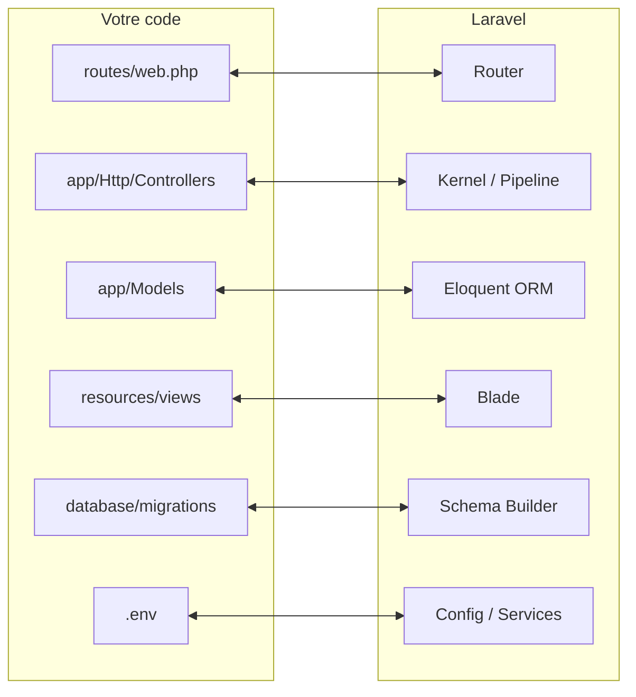

# Architecture d'un projet Laravel

- Comprendre l'arborescence d'un projet Laravel
- Suivre le cycle d'une requête jusqu'à la réponse
- Identifier le rôle d'Artisan et des fichiers de configuration

---
transition: slide-up | slide-down
---

# Arborescence principale

Voici les répertoires que vous allez utiliser chaque jour :

<FileTree :tree="[
  {
    name: 'mon-projet/',
    children: [
      { name: 'app/', highlight: true, children: [
        { name: 'Models/' },
        { name: 'Http/Controllers/' },
        { name: 'Providers/' }
      ]},
      { name: 'bootstrap/', children: [
        { name: 'app.php' },
        { name: 'cache/' }
      ]},
      { name: 'config/' },
      { name: 'database/', highlight: true, children: [
        { name: 'migrations/' },
        { name: 'seeders/' },
        { name: 'factories/' }
      ]},
      { name: 'public/', children: [
        { name: 'index.php' }
      ]},
      { name: 'resources/', highlight: true, children: [
        { name: 'views/' },
        { name: 'css/' },
        { name: 'js/' }
      ]},
      { name: 'routes/', highlight: true, children: [
        { name: 'web.php' },
        { name: 'api.php' },
        { name: 'console.php' }
      ]},
      { name: 'storage/', children: [
        { name: 'logs/' },
        { name: 'framework/cache/' },
        { name: 'app/' }
      ]},
      { name: 'tests/' },
      { name: 'vendor/' },
      { name: '.env' },
      { name: 'artisan' },
      { name: 'composer.json' },
      { name: 'package.json' },
      { name: 'compose.yaml' }
    ]
  }
]" />

<!--
Insister : app/, resources/views/, routes/ et database/migrations/ sont le code de l'apprenant.
vendor/, bootstrap/cache/ et storage/framework/ sont générés ou utilisés par le framework.
Le contenu est maintenant présenté via le composant <FileTree>.
-->

---
transition: slide-up | slide-down
---

# Les dossiers que vous écrivez

- **`app/`** : classes PHP de votre application
  - `Models/` : modèles Eloquent
  - `Http/Controllers/` : contrôleurs
  - `Providers/` : configuration du service container
- **`routes/`** : définition des routes web, API, console
- **`resources/views/`** : templates Blade
- **`database/migrations/`** : versionnement du schéma
- **`tests/`** : tests Feature et Unit

<!--
Analogie : app/ c'est votre cuisine, resources/views/ c'est la salle, routes/ c'est le plan d'accès.
-->

---
transition: slide-up | slide-down
---

# Les dossiers générés automatiquement

- **`storage/`** : fichiers produits automatiquement
  - `logs/` : journaux d'erreurs
  - `framework/cache/` : cache de configuration et vues
  - `app/` : fichiers uploadés
- **`vendor/`** : dépendances Composer
  - Ne jamais modifier à la main
  - Généré par `composer install`
- **`bootstrap/cache/`** : cache de démarrage du framework

<v-click>

> 💡 Ces dossiers sont listés dans `.gitignore`. Ils n'ont pas vocation à être versionnés.

</v-click>

<!--
Expliquer que vider `storage/framework/cache/` ou `bootstrap/cache/` peut résoudre certains comportements étranges.
-->

---
transition: slide-up | slide-down
---

# Le front controller

Le fichier `public/index.php` est le **seul fichier PHP** accessible directement depuis le web.

<v-click>

```php
// public/index.php — version simplifiée
require __DIR__.'/../vendor/autoload.php';

$app = require_once __DIR__.'/../bootstrap/app.php';
$kernel = $app->make(Illuminate\Contracts\Http\Kernel::class);

$response = $kernel->handle(
    $request = Illuminate\Http\Request::capture()
)->send();
```

</v-click>

<v-click>

- Toutes les URLs passent par lui
- Il crée l'application via `bootstrap/app.php`
- Le kernel reçoit la requête et retourne la réponse

</v-click>

<!--
Le vrai fichier contient quelques lignes de plus (maintenance mode, etc.).
L'essentiel est ici : un seul point d'entrée qui charge l'application.
-->

---
transition: slide-up | slide-down
---

# Cycle requête → réponse

<Steps direction="vertical" :clicks="true" :items="[
  { icon: '🌐', title: 'Requête HTTP', desc: 'Le navigateur appelle public/index.php' },
  { icon: '⚙️', title: 'Application', desc: 'Laravel crée le kernel HTTP' },
  { icon: '🔀', title: 'Router', desc: 'La route correspondante est déterminée' },
  { icon: '🎮', title: 'Contrôleur', desc: 'La logique métier est exécutée' },
  { icon: '📄', title: 'Réponse', desc: 'Souvent une vue Blade retournée' },
  { icon: '↩️', title: 'Navigateur', desc: 'Le kernel envoie la réponse' }
]" />

<!--
Ce modèle est commun à de nombreux frameworks : Symfony, NestJS, Ruby on Rails, Django...
La magie réside dans la convention, pas dans la complexité.
Le contenu est maintenant présenté via le composant <Steps>.
-->

---
transition: slide-up | slide-down
---

# Les environnements

Laravel utilise des **environnements** pour adapter le comportement :

| Environnement | Usage | Caractéristiques |
|---------------|-------|------------------|
| `local` | Développement local | Debug activé, logs verbeux |
| `production` | Production | Cache maximal, pas de debug |
| `testing` | Tests automatisés | Base de données en mémoire (SQLite souvent) |

<v-click>

L'environnement est défini par la variable `APP_ENV` dans le fichier `.env` :

```bash
APP_ENV=local
```

</v-click>

<!--
En production, on surchargerait APP_ENV dans un fichier .env.production qui n'est pas versionné.
-->

---
transition: slide-up | slide-down
---

# Artisan : la console Laravel

Le fichier `artisan` donne accès à des **commandes pratiques** :

<Terminal title="bash" prompt="$" :clicks="true" :lines="[{ cmd: './vendor/bin/sail artisan list', out: 'Available artisan commands listed.' }, { cmd: './vendor/bin/sail artisan about', out: 'Laravel 12.x · PHP 8.3.x · Environment local.' }, { cmd: './vendor/bin/sail artisan cache:clear', out: 'INFO  Cache cleared successfully.' }, { cmd: './vendor/bin/sail artisan make:controller QuestController', out: 'INFO  Controller [app/Http/Controllers/QuestController.php] created successfully.' }]" />

<v-click>

> 💡 Artisan est aussi un point d'entrée de l'application, comme `public/index.php`, mais en ligne de commande.

</v-click>

<!--
Montrer `artisan list` et quelques commandes utiles.
Dire qu'on utilisera souvent `make:model`, `make:controller`, `migrate`, `db:seed`, etc.
Le contenu est maintenant présenté via le composant <Terminal>.
-->

---
transition: slide-up | slide-down
---

# Fichiers de configuration

Laravel centralise la configuration dans le dossier `config/` :

- `config/app.php` : configuration générale
- `config/database.php` : connexions aux bases de données
- `config/auth.php` : authentification
- `config/cache.php` : cache
- `config/services.php` : services tiers (API keys)

<v-click>

> 💡 La plupart des valeurs sensibles ne sont pas dans ces fichiers : elles viennent du fichier `.env`.

</v-click>

<!--
Expliquer le principe : configuration versionnée, secrets dans .env non versionné.
C'est une bonne pratique de sécurité transverse à tous les frameworks.
-->

---
transition: slide-up | slide-down
---

# Résumé visuel



<v-click>

Laravel fournit la structure. Vous remplissez les cases avec votre logique métier.

</v-click>

<!--
Cette slide est une synthèse des relations entre le code de l'apprenant et les composants Laravel.
Le diagramme ASCII est remplacé par un diagramme Mermaid.
-->
