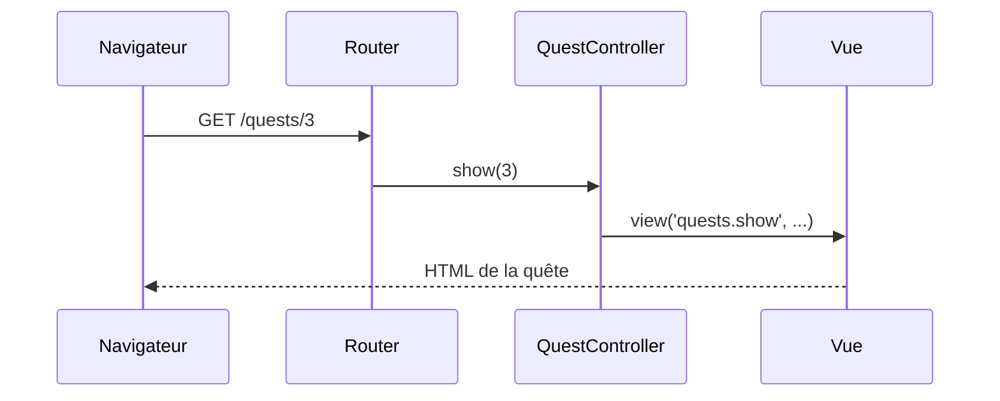

# Contrôleurs

- Sortir la logique des routes vers un contrôleur
- Lire les paramètres d'URL avec l'objet `Request`
- Choisir la bonne réponse : vue, JSON, redirection, erreur

<!--
Transition : la closure marche pour une démo, pas pour un vrai projet.
-->

---
transition: slide-up | slide-down
---

# Contrôleurs
Pourquoi sortir la logique des routes ?

<Compare badLabel="❌ Tout dans web.php" goodLabel="✅ Routes fines + contrôleur">
  <template #bad>

```php
Route::get('/quests', function () {
    $quests = [ /* 30 lignes */ ];
    // + filtre + vue : illisible
});
// × 15 pages = web.php géant
```

  </template>
  <template #good>

```php
Route::get('/quests',
    [QuestController::class, 'index'])
    ->name('quests.index');
// la logique vit dans le contrôleur
```

  </template>
</Compare>

<!--
Un contrôleur regroupe les actions d'une même ressource. web.php redevient une table des matières lisible.
-->

---
layout: two-cols-header
layoutClass: gap-x-6
transition: slide-up | slide-down
---

# Contrôleurs
Générer un contrôleur avec Artisan

::left::

<Terminal
  title="bash" prompt="$"
  :lines="[
    { cmd: 'sail artisan make:controller QuestController', out: '  INFO  Controller [app/Http/Controllers/QuestController.php] created successfully.' }
  ]"
/>

Artisan crée la classe dans `app/Http/Controllers/`, avec le bon `namespace` PHP : rien à écrire à la main.

::right::

<v-click>

<FileTree :tree="[
  { name: 'app', children: [
    { name: 'Http', children: [
      { name: 'Controllers', children: [
        { name: 'Controller.php' },
        { name: 'QuestController.php', highlight: true }
      ]}
    ]}
  ]}
]" />

`Controller.php` est la **classe de base** dont héritent tous vos contrôleurs.

</v-click>

<!--
Montrer le fichier généré : quasi vide, une classe qui extends Controller.
Question probable : "pourquoi Http/Controllers ?" → ce sont les contrôleurs qui répondent aux requêtes HTTP.
-->

---
layout: two-cols-header
layoutClass: gap-x-6
transition: slide-up | slide-down
---

# Contrôleurs
Le contrôleur Campus Quest

::left::

```php {all|3-7|9-12|14-17|all}
class QuestController extends Controller
{
    private array $quests = [
        1 => ['title' => 'Salle 404', 'xp' => 50, 'difficulty' => 'easy'],
        2 => ['title' => 'Quiz campus', 'xp' => 30, 'difficulty' => 'easy'],
        3 => ['title' => 'Selfie mascotte', 'xp' => 80, 'difficulty' => 'hard'],
    ];

    public function index()
    {
        return view('quests.index', ['quests' => $this->quests]);
    }

    public function show(int $id)
    {
        return view('quests.show', ['quest' => $this->quests[$id]]);
    }
}
```

::right::

<div v-click="1">

`$quests` — les données de démo : un **tableau PHP**, remplacé par la base de données plus tard.

</div>

<div v-click="2">

`index()` — l'action de la **liste** : elle passe le tableau à la vue.

</div>

<div v-click="3">

`show(int $id)` — l'action de la **fiche** : elle reçoit le paramètre de route.

</div>

<div v-click="4">

Un contrôleur = des **méthodes publiques** (les *actions*), chacune appelée par une route.

</div>

<!--
Version simplifiée du contrôleur de démo : le filtre ?difficulty arrive à la slide Request.
show() ne vérifie rien : /quests/99 → erreur "Undefined array key". On le sécurise avec abort_unless au chapitre 6.
-->

---
layout: two-cols-header
layoutClass: gap-x-6
transition: slide-up | slide-down
---

# Contrôleurs
Brancher les routes sur le contrôleur

::left::

````md magic-move
```php
Route::get('/quests', function () {
    return 'Liste des quêtes';
});
```

```php
use App\Http\Controllers\QuestController;
use Illuminate\Support\Facades\Route;

Route::get('/quests', [QuestController::class, 'index'])
    ->name('quests.index');
Route::get('/quests/{id}', [QuestController::class, 'show'])
    ->whereNumber('id')
    ->name('quests.show');
```
````

<div v-click="1">

`[Classe::class, 'méthode']` remplace la closure : la route **délègue** au contrôleur.

</div>

<div v-click="3">

<Analogy title="Comme au restaurant" icon="🍽️">

Le router est l'hôte d'accueil qui vous conduit à une table. Le contrôleur est le serveur : il prend votre commande, la fait préparer (les données) et vous apporte l'assiette (la vue).

</Analogy>

</div>

::right::

<div v-click="2">



</div>

<!--
Le paramètre {id} est injecté dans show(int $id) par nom.
Faire le lien avec le cycle requête → réponse vu en S1.
-->

---
transition: slide-up | slide-down
---

# Contrôleurs
L'objet Request : lire les paramètres d'URL

Comment filtrer la liste : `/quests?difficulty=easy` ?

````md magic-move
```php
public function index()
{
    return view('quests.index', ['quests' => $this->quests]);
}
```

```php
public function index(Request $request)
{
    $difficulty = $request->query('difficulty');
    $quests = $difficulty
        ? array_filter($this->quests, fn ($q) => $q['difficulty'] === $difficulty)
        : $this->quests;

    return view('quests.index', ['quests' => $quests]);
}
```
````

<div v-click="1">

Laravel **injecte** `Request $request` dans l'action : `$request->query('difficulty')` lit le paramètre d'URL.

</div>

<div v-click="2">

Testez : `/quests?difficulty=easy` n'affiche que les quêtes faciles.

</div>

<!--
Insister sur l'injection : on ne crée pas l'objet, on le déclare et Laravel le fournit — c'est l'inversion de contrôle vue en S1.
-->

---
transition: slide-up | slide-down
---

# Contrôleurs
Choisir sa réponse

| Code | Cas d'usage |
|------|-------------|
| `view('quests.index', $data)` | Renvoyer une page HTML |
| `response()->json($this->quests)` | Renvoyer du JSON (API, front JS) |
| `redirect()->route('quests.index')` | Renvoyer le navigateur vers une route nommée |
| `abort(404)` | Stopper avec une erreur (quête introuvable) |

<!--
Question probable : "quand utiliser redirect ?" → après un POST réussi, pour éviter la resoumission du formulaire (S5).
abort(404) prépare la slide sur les pages d'erreur du chapitre 6.
-->

---
transition: slide-up | slide-down
---

# Contrôleurs
À vous de jouer

<Quiz
  question="« /quests/abc » renvoie une 404 alors que « /quests/2 » fonctionne. Pourquoi ?"
  :options="[
    'Le contrôleur appelle abort(404) car « abc » est absent du tableau',
    'La contrainte ->whereNumber(\'id\') bloque la route avant d\'atteindre le contrôleur',
    'La vue quests.show plante en affichant un titre inexistant',
    'Laravel interdit par défaut les lettres dans un paramètre de route'
  ]"
  :answer="1"
/>

<!--
La bonne réponse est la contrainte : sans whereNumber, /quests/abc atteint show(int $id) et lève une TypeError → erreur 500, pas une 404 via abort_unless.
Le point à retenir : la contrainte renvoie la 404 au niveau du router, avant le contrôleur.
-->
