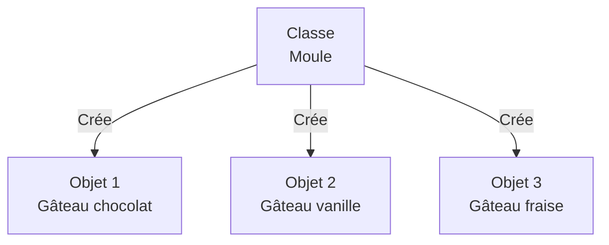
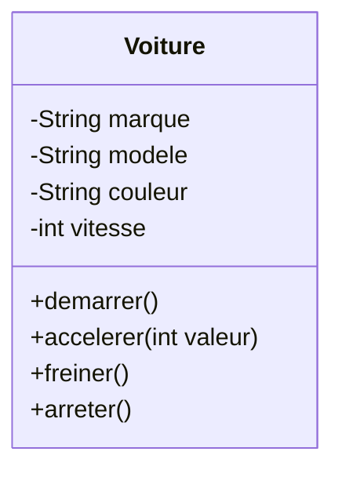

# Chapitre 01 - Découvrir la POO

<!--
Durée : 80 minutes
Objectif : Comprendre les concepts de classe, objet, attributs et méthodes
-->

---
layout: two-cols-header
layoutClass: gap-x-4
---

# Découvrir la POO

Problème du Quotidien : Comment organiser les informations d'une application de gestion de contacts ?

::left::

<div v-click>

**Option 1 : Variables séparées**

```ts
let contact1_nom = "Alice"
let contact1_telephone = "0601020304"
let contact1_email = "alice@email.com"

let contact2_nom = "Bob"
let contact2_telephone = "0605060708"
let contact2_email = "bob@email.com"
```

❌ Difficile à maintenir avec des milliers de contacts

</div>

::right::

<div v-click>

**Option 2 : Regrouper les informations**

```ts
let contact1 = {
  nom: "Alice",
  telephone: "0601020304",
  email: "alice@email.com"
}

let contact2 = {
  nom: "Bob",
  telephone: "0605060708",
  email: "bob@email.com"
}
```

✅ Plus structuré et maintenable

</div>

<!--
Anecdote : Dans une vraie application, on peut avoir des milliers de contacts
Question à poser : Quelle option est la plus maintenable ?
-->

---
layout: two-cols-header
layoutClass: gap-x-4
---

# Découvrir la POO

Avantage 1 : Éviter la Duplication de Code

::left::
<div v-click>

**❌ Sans POO**

```ts {*}{maxHeight:'300px'}
let contact1 = { 
    nom: "Alice",
    email: "alice@email.com"
}
let contact2 = { 
    nom: "Bob",
    email: "bob@email.com"
}

// Envoyer email à Alice
emailService.send({
  to: contact1.email,
  subject: `Bienvenue ${contact1.nom}`,
  body: templateEngine
    .render('welcome', contact1),
  tracking: analyticsService
    .createTracker(contact1.email)
})

// Envoyer email à Bob - MÊME CODE !
emailService.send({
  to: contact2.email,
  subject: `Bienvenue ${contact2.nom}`,
  body: templateEngine
    .render('welcome', contact2),
  tracking: analyticsService
    .createTracker(contact2.email)
})
```

</div>

::right::

<div v-click>

**✅ Avec POO**

```ts {*}{maxHeight:'300px'}
class Contact {
  constructor(nom, email) {
    this.nom = nom
    this.email = email
  }

  envoyerEmail(template) {
    emailService.send({
      to: this.email,
      subject: `Bienvenue ${this.nom}`,
      body: templateEngine
        .render(template, this),
      tracking: analyticsService
        .createTracker(this.email)
    })
  }
}

let contact1 = new Contact(
    "Alice",
    "alice@email.com"
)
let contact2 = new Contact(
    "Bob",
    "bob@email.com"
)

contact1.envoyerEmail('welcome')
contact2.envoyerEmail('welcome')
```

</div>

::bottom::
<div v-click>

**Le comportement complexe est écrit une seule fois**

</div>

<!--
Montrer que la duplication n'est pas juste 2 lignes mais toute la logique métier
Pseudo-code réaliste avec services externes
-->

---
layout: two-cols-header
layoutClass: gap-x-4
---

# Découvrir la POO

Avantage 2 : Garantir la Cohérence des Données

::left::

<div v-click>

**❌ Sans POO**

```ts {*}{maxHeight:'300px'}
let contact = { 
  nom: "Alice", 
  email: "alice@email.com",
  emailVerifie: true
}

// Ailleurs dans le code...
contact.email = "nouvelle-adresse"
// ⚠️ OUBLI : emailVerifie devrait être false !

// Plus tard...
if (contact.emailVerifie) {
  // Envoi à une mauvaise adresse !
  emailService.sendImportant(contact.email)
}
```

**Données incohérentes = bugs**

</div>

::right::

<div v-click>

**✅ Avec POO**

```ts {*}{maxHeight:'300px'}
class Contact {
  #email
  #emailVerifie

  constructor(nom, email) {
    this.nom = nom
    this.#email = email
    this.#emailVerifie = false
  }

  changerEmail(nouvelEmail) {
    if (!this.#validerFormatEmail(nouvelEmail)) {
      throw new Error("Email invalide")
    }
    this.#email = nouvelEmail
    this.#emailVerifie = false // Cohérence garantie !
    this.#envoyerEmailVerification()
  }

  get email() { return this.#email }
  get estVerifie() { return this.#emailVerifie }
}
```

**La méthode garantit la cohérence**

</div>

<!--
Montrer un vrai problème de cohérence de données
Les attributs privés (#) protègent les données
La méthode assure que les règles métier sont respectées
-->

---
layout: two-cols-header
layoutClass: gap-x-4
---

# Découvrir la POO

Avantage 3 : Responsabilité Claire

::left::

<div v-click>

**❌ Sans POO**

```ts {*}{maxHeight:'300px'}
let contact = { nom: "Alice", email: "alice@email.com" }

// Qui est responsable de formater l'affichage ?
function afficherContact(contact) {
  return `${contact.nom} <${contact.email}>`
}

// Qui est responsable de la validation ?
function validerContact(contact) {
  return contact.nom && contact.email.includes('@')
}

// Qui est responsable de l'export ?
function exporterContactVersJSON(contact) {
  return JSON.stringify({
    displayName: contact.nom,
    emailAddress: contact.email
  })
}

// Fonctions éparpillées partout !
```

</div>

::right::

<div v-click>

**✅ Avec POO**

```ts {*}{maxHeight:'300px'}
class Contact {
  constructor(nom, email) {
    this.nom = nom
    this.email = email
  }

  // Le contact sait se formater
  toString() {
    return `${this.nom} <${this.email}>`
  }

  // Le contact sait se valider
  estValide() {
    return this.nom && this.email.includes('@')
  }

  // Le contact sait s'exporter
  toJSON() {
    return {
      displayName: this.nom,
      emailAddress: this.email
    }
  }
}
```
</div>

::bottom::
<div v-click>

**Chaque objet gère ses propres responsabilités**

</div>

<!--
Principe de responsabilité unique
L'objet encapsule ses propres comportements
Plus facile à maintenir et à tester
-->

---
layout: two-cols-header
layoutClass: gap-x-4
---

# Découvrir la POO

Avantage 4 : Abstraction et Simplicité d'Usage

::left::

<div v-click>

**❌ Sans POO**

```ts {*}{maxHeight:'300px'}
let contact = {
    nom: "Alice",
    email: "alice@email.com"
}

// L'utilisateur doit connaître toute la complexité
const emailValide = 
    /^[^\s@]+@[^\s@]+\.[^\s@]+$/.test(contact.email)

if (!emailValide) {
  throw new Error("Email invalide")
}

const hash = crypto.createHash('md5')
  .update(contact.email.toLowerCase().trim())
  .digest('hex')

const gravatarUrl = 
    `https://gravatar.com/avatar/${hash}?d=identicon&s=200`

fetch(gravatarUrl)
  .then(response => response.blob())
  .then(blob => /* afficher l'avatar */)
```

**Complexité exposée à l'utilisateur**

</div>

::right::

<div v-click>

**✅ Avec POO**

```ts {*}{maxHeight:'300px'}
class Contact {
  constructor(nom, email) {
    this.nom = nom
    this.email = email
  }

  async chargerAvatar() {
    // Toute la complexité est cachée
    const hash = this.#genererGravatarHash()
    const url = this.#construireGravatarUrl(hash)
    const response = await fetch(url)
    return await response.blob()
  }

  #genererGravatarHash() { /* ... */ }
  #construireGravatarUrl(hash) { /* ... */ }
}

// Utilisation simple
const avatar = await contact.chargerAvatar()
```

**Interface simple, complexité cachée**

</div>

<!--
L'abstraction cache les détails d'implémentation
L'utilisateur n'a pas besoin de connaître le fonctionnement interne
Code plus lisible et maintenable
-->

---
layout: two-cols-header
layoutClass: gap-x-4
---

# Découvrir la POO

L'Analogie du Moule à Gâteau

::left::

<div v-click>

## La Classe = Le Moule

- **Recette** : définit la forme, les ingrédients
- **Réutilisable** : on peut faire plusieurs gâteaux
- **Modèle** : décrit ce que sera chaque gâteau

</div>

::right::

<div v-click>

## L'Objet = Le Gâteau

- **Réalisation concrète** : un gâteau spécifique
- **Unique** : chaque gâteau est différent (chocolat, vanille...)
- **Instance** : créé à partir du moule



</div>

<!--
Analogie forte pour ancrer le concept
Insister : Une classe = un plan, un objet = une réalisation
-->

---
layout: two-cols-header
layoutClass: gap-x-4
---

# Découvrir la POO

Définition : Classe vs Objet

::left::

<div v-click>

## Classe

**Définition** : Un modèle qui décrit la structure et le comportement

**Composants** :
- <mark>**Attributs**</mark> (ou propriétés) : les données
- <mark>**Méthodes**</mark> : les comportements/actions

**En résumé** : Un type de données personnalisé

</div>

::right::

<div v-click>

## Objet (ou Instance)

**Définition** : Une réalisation concrète créée à partir d'une classe

**Caractéristiques** :
- Possède un <mark>**état**</mark> : valeurs des attributs
- Peut exécuter des <mark>**comportements**</mark> : appel de méthodes

**En résumé** : Une entité en mémoire

</div>

<!--
Définitions sans analogies, focus sur les termes techniques
Insister sur : attributs/propriétés, méthodes, état, comportements
-->

---
layout: two-cols-header
layoutClass: gap-x-4
---

# Découvrir la POO

5 Exemples Concrets : Classe → Objets

::left::

<div v-click class="w-150 text-sm">

| Classe | Objets (Instances) |
|--------|-------------------|
| **Voiture** | Ma Renault Clio rouge, La Tesla de mon voisin, Un taxi parisien |
| **Contact** | Alice (alice@email.com), Bob (bob@email.com), Charlie (charlie@email.com) |
| **CompteBancaire** | Compte n°12345 (solde: 1500€), Compte n°67890 (solde: 300€) |
| **Personnage** | Mario (100 PV), Luigi (100 PV), Bowser (200 PV) |
| **Produit** | iPhone 15 (999€), MacBook Pro (2499€), AirPods (179€) |

</div>

::right::

<div v-click>

## 💡 À Retenir

- **Une classe** = le modèle général

- **Un objet** = une réalisation spécifique avec ses propres valeurs

- On peut créer **autant d'objets qu'on veut** à partir d'une même classe

</div>

<!--
Exemples variés pour montrer l'universalité du concept
Insister : même classe, objets différents avec des valeurs différentes
-->

---
layout: two-cols-header
layoutClass: gap-x-4
---

# Découvrir la POO

Anatomie d'une Classe

::left::

<div v-click>



</div>

::right::

<div v-click>

## Composants

**Attribut** (données) <small><i>ou propriété, membre, champ</i></small>
- `marque`, `modele`, `couleur`, `vitesse`
- Préfixe `-` : attribut <mark>**privé**</mark> (protégé de l'extérieur)

**Méthode** (actions)
- `demarrer()`, `accelerer()`, `freiner()`, `arreter()`
- Préfixe `+` : méthode <mark>**publique**</mark> (accessible de l'extérieur)

</div>

<!--
Diagramme UML pour visualiser la structure
Expliquer la notation : - pour privé, + pour public
Lien avec les concepts vus précédemment
-->
