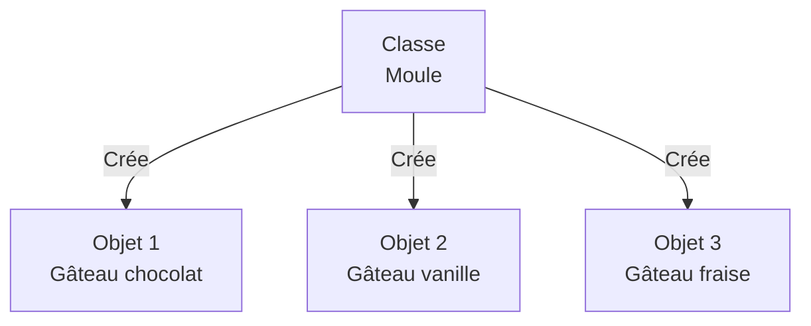

# Découvrir la POO

L'Analogie du Moule à Gâteau

::left::

## La Classe = Le Moule

- **Recette** : définit la forme, les ingrédients
- **Réutilisable** : on peut faire plusieurs gâteaux
- **Modèle** : décrit ce que sera chaque gâteau

::right::

## L'Objet = Le Gâteau

- **Réalisation concrète** : un gâteau spécifique
- **Unique** : chaque gâteau est différent (chocolat, vanille...)
- **Instance** : créé à partir du moule

<!--
Analogie forte pour ancrer le concept
Insister : Une classe = un plan, un objet = une réalisation
-->

