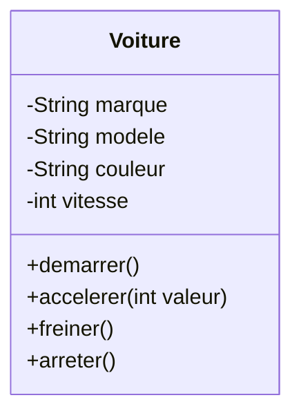

# Découvrir la POO

Anatomie d'une Classe

::left::

::right::

## Composants

**Attribut** (données) <small><i>ou propriété, membre, champ</i></small>
- `marque`, `modele`, `couleur`, `vitesse`
- Préfixe `-` : attribut <mark>**privé**</mark> (protégé de l'extérieur)

**Méthode** (actions)
- `demarrer()`, `accelerer()`, `freiner()`, `arreter()`
- Préfixe `+` : méthode <mark>**publique**</mark> (accessible de l'extérieur)

<!--
Diagramme UML pour visualiser la structure
Expliquer la notation : - pour privé, + pour public
Lien avec les concepts vus précédemment
-->

