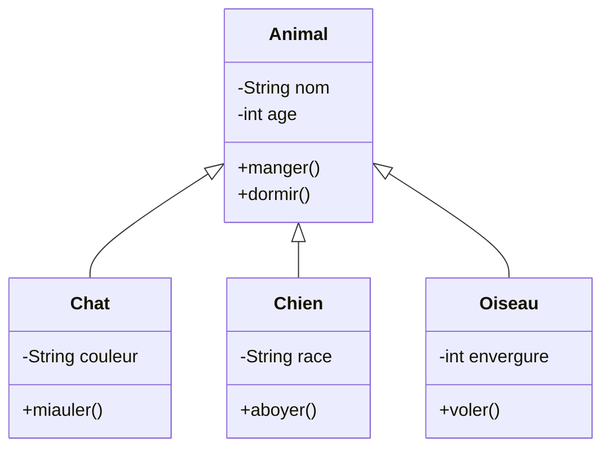

# Chapitre 04 - Héritage

<!--
Durée : 70 minutes
Objectif : Comprendre l'héritage et créer des hiérarchies de classes
-->

---
layout: two-cols-header
layoutClass: gap-x-4
---

# Héritage

Qu'est-ce que l'Héritage ?

::left::

<div v-click>

## Définition

L'**héritage** permet à une classe (classe enfant) de **réutiliser** et **étendre** les attributs et méthodes d'une autre classe (classe parent).

</div>

<div v-click class="mt-4">

## Objectifs

- **Réutiliser** du code existant
- **Éviter la duplication** de code
- **Créer des hiérarchies** de classes
- **Spécialiser** des comportements

</div>

::right::

<div v-click>

## Analogie : L'Arbre Généalogique

- Un **enfant hérite** des caractéristiques de ses parents
- Il peut avoir ses **propres caractéristiques** en plus
- Il peut **modifier** certains comportements hérités
- Relation **"est un"** : un chat **est un** animal

</div>

<!--
Expliquer la relation parent-enfant
Insister sur la réutilisation de code
Relation "est un" vs "a un"
-->

---
layout: two-cols-header
layoutClass: gap-x-4
---

# Héritage

Syntaxe `extends`

::left::

```ts
// Classe parent (ou classe de base)
class Animal {
  nom: string
  age: number

  constructor(nom: string, age: number) {
    this.nom = nom
    this.age = age
  }

  manger(): void {
    console.log(`${this.nom} mange`)
  }

  dormir(): void {
    console.log(`${this.nom} dort`)
  }
}
```

::right::

```ts
// Classe enfant (ou classe dérivée)
class Chat extends Animal {
  couleur: string

  constructor(nom: string, age: number, couleur: string) {
    super(nom, age) // Appel du constructeur parent
    this.couleur = couleur
  }

  miauler(): void {
    console.log(`${this.nom} miaule`)
  }
}
```

<div v-click class="mt-4">

```ts
const chat = new Chat("Minou", 3, "gris")
chat.manger()  // Hérité de Animal
chat.dormir()  // Hérité de Animal
chat.miauler() // Propre à Chat
```

</div>

<!--
Montrer la syntaxe extends
Expliquer super() pour appeler le constructeur parent
Chat hérite de tout ce que Animal possède
-->

---
layout: two-cols-header
layoutClass: gap-x-4
---

# Héritage

Appel du Constructeur Parent avec `super()`

::left::

```ts {maxHeight:'300px'}
class Animal {
  nom: string
  age: number

  constructor(nom: string, age: number) {
    this.nom = nom
    this.age = age
  }
}

class Chien extends Animal {
  race: string

  constructor(nom: string, age: number, race: string) {
    // OBLIGATOIRE : appeler super() en premier
    super(nom, age)
    
    // Ensuite initialiser les attributs propres
    this.race = race
  }

  aboyer(): void {
    console.log(`${this.nom} aboie`)
  }
}
```

::right::

<div v-click>

## Règles de `super()`

**Obligatoire**
- Doit être appelé dans le constructeur de la classe enfant
- Doit être la **première instruction** du constructeur

**Rôle**
- Initialise les attributs de la classe parent
- Appelle le constructeur parent avec les bons arguments

</div>

<div v-click class="mt-4">

```ts
const chien = new Chien("Rex", 5, "Labrador")
// 1. super("Rex", 5) initialise nom et age
// 2. race = "Labrador" initialise race
```

</div>

<!--
Insister sur l'obligation de super()
Doit être en premier dans le constructeur
Erreur si oublié
-->

---
layout: two-cols-header
layoutClass: gap-x-4
---

# Héritage

Surcharge de Méthodes (Override)

::left::

```ts {maxHeight:'300px'}
class Animal {
  nom: string

  constructor(nom: string) {
    this.nom = nom
  }

  sePresenter(): void {
    console.log(`Je suis ${this.nom}`)
  }
}

class Chat extends Animal {
  couleur: string

  constructor(nom: string, couleur: string) {
    super(nom)
    this.couleur = couleur
  }

  // Surcharge de la méthode parent
  sePresenter(): void {
    console.log(`Je suis ${this.nom}, un chat ${this.couleur}`)
  }
}
```

::right::

<div v-click>

```ts
const animal = new Animal("Inconnu")
animal.sePresenter()
// "Je suis Inconnu"

const chat = new Chat("Minou", "gris")
chat.sePresenter()
// "Je suis Minou, un chat gris"
```

</div>

<div v-click class="mt-4">

## Surcharge (Override)

- La classe enfant **redéfinit** une méthode du parent
- La version enfant **remplace** la version parent
- Permet de **spécialiser** le comportement

</div>

<!--
Expliquer le concept de surcharge
Même signature, implémentation différente
Polymorphisme (vu au prochain chapitre)
-->

---
layout: two-cols-header
layoutClass: gap-x-4
---

# Héritage

Diagramme UML d'Héritage

::left::



::right::

<div v-click>

## Notation UML

**Flèche vide** : Héritage
- De l'enfant vers le parent
- `Chat` hérite de `Animal`

**Hiérarchie**
- Un parent peut avoir plusieurs enfants
- Un enfant n'a qu'un seul parent (héritage simple)

**Attributs et méthodes**
- Les enfants héritent de tout le parent
- Ils ajoutent leurs propres membres

</div>

<!--
Expliquer la notation UML pour l'héritage
Flèche triangulaire vide
Plusieurs enfants possibles
-->

---
layout: two-cols-header
layoutClass: gap-x-4
---

# Héritage

Exemple Pratique - Hiérarchie Animal

::left::

```ts {2-3|23-24,40-41|13-16,30-33,47-50|all}{maxHeight:'300px'}
class Animal {
  protected nom: string
  protected age: number

  constructor(nom: string, age: number) {
    this.nom = nom
    this.age = age
  }

  manger(): void {
    console.log(`${this.nom} mange`)
  }

  sePresenter(): void {
    console.log(`${this.nom}, ${this.age} ans`)
  }
}

class Chat extends Animal {
  private couleur: string

  constructor(nom: string, age: number, couleur: string) {
    super(nom, age)
    this.couleur = couleur
  }

  miauler(): void {
    console.log(`${this.nom} fait miaou`)
  }

  sePresenter(): void {
    console.log(`${this.nom}, chat ${this.couleur} de ${this.age} ans`)
  }
}

class Chien extends Animal {
  private race: string

  constructor(nom: string, age: number, race: string) {
    super(nom, age)
    this.race = race
  }

  aboyer(): void {
    console.log(`${this.nom} fait wouf`)
  }

  sePresenter(): void {
    console.log(`${this.nom}, chien ${this.race} de ${this.age} ans`)
  }
}
```

::right::

## Points Clés

<div v-click="1">

- `protected` : accessible dans les enfants

</div>

<div v-click="2">

- Chaque enfant a ses propres attributs

</div>

<div v-click="3">

- Méthodes héritées réutilisées
- Méthode `sePresenter()` surchargée

</div>

<div v-click="4">

```ts
const chat = new Chat("Minou", 3, "gris")
chat.manger()      // Hérité
chat.miauler()     // Propre
chat.sePresenter() // Surchargé
// "Minou, chat gris de 3 ans"

const chien = new Chien("Rex", 5, "Labrador")
chien.manger()      // Hérité
chien.aboyer()      // Propre
chien.sePresenter() // Surchargé
// "Rex, chien Labrador de 5 ans"
```

</div>

<!--
Exemple complet avec protected
Montrer l'héritage en action
Réutilisation + spécialisation
-->

---
layout: two-cols-header
---

# Héritage

Exercice - Créer une Hiérarchie de Formes

::left::

**Classe parent `Forme`** :
- Attribut `couleur` (string, protected)
- Constructeur acceptant la couleur
- Méthode abstraite `calculerAire()`
- Méthode `afficher()` qui affiche la couleur

**Classe enfant `Rectangle`** :
- Attributs `largeur` et `hauteur` (private)
- Constructeur acceptant couleur, largeur, hauteur
- Implémente `calculerAire()` : largeur × hauteur

::right::

**Classe enfant `Cercle`** :
- Attribut `rayon` (private)
- Constructeur acceptant couleur et rayon
- Implémente `calculerAire()` : π × rayon²

**Test** :
- Créer un rectangle rouge de 5×3
- Créer un cercle bleu de rayon 4
- Afficher leurs aires

<!--
Objectif : Appliquer l'héritage sur des formes géométriques
Durée estimée : 25 minutes
Solution à préparer dans les exercices
Utiliser Math.PI pour le cercle
-->

---

# Héritage

Récapitulatif Chapitre 04

<div v-click>

## ✅ Ce qu'on a appris

- **Héritage** : réutiliser et étendre une classe
- **`extends`** : syntaxe pour hériter
- **`super()`** : appeler le constructeur parent
- **Surcharge** : redéfinir une méthode parent
- **`protected`** : accessible dans les enfants
- **Hiérarchie** : relation parent-enfant
- **Relation "est un"** : Chat est un Animal

</div>

<div v-click class="mt-8">

## 🎯 Prochaine étape

**Chapitre 05 - Polymorphisme** : Utiliser des objets de types différents de manière uniforme

</div>

<!--
Synthèse de l'héritage
Transition vers le polymorphisme
-->
