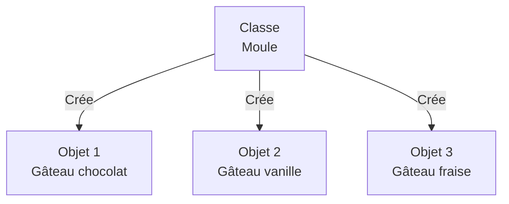
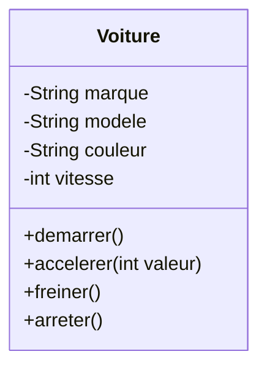
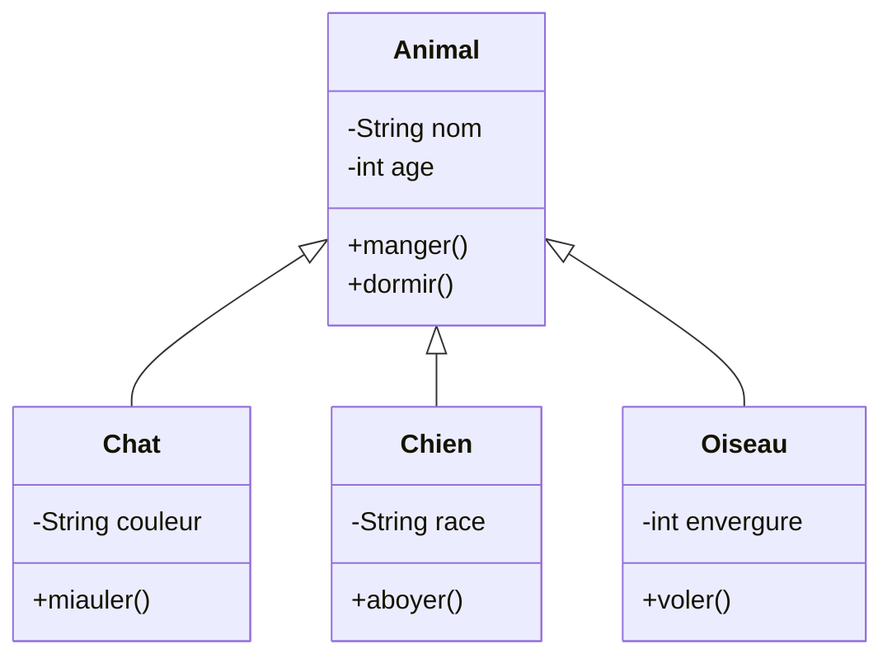

# Programmation Orientée Objet

Le paradigme de programmation qui fait tourner 90% des apps modernes 🚀

<!--
Objectif : Comprendre les concepts fondamentaux de la POO et créer ses premières classes
-->

---
layout: two-cols-header
class: mx-4
---

# Introduction

Qu'est-ce que la Programmation Orientée Objet ?

::left::

<div v-click>

## Définition

La **Programmation Orientée Objet (POO)** est un **paradigme de programmation** qui organise le code autour d'**objets** plutôt que de fonctions et de logique.

</div>

::right::

<div v-click>

## À quoi ça sert ?

- Structurer et organiser le code de manière intuitive
- Modéliser des entités du monde réel
- Faciliter la maintenance et la réutilisation du code
- Réduire la complexité des applications

</div>

<!--
Points clés à souligner :
- La POO est un paradigme parmi d'autres
- Elle permet de structurer le code de façon naturelle
- Particulièrement adaptée pour les systèmes complexes
-->

---

# Introduction

Les Paradigmes de Programmation

<div v-click>

Un **paradigme** = une façon de penser et d'organiser le code

</div>

<div v-click>

**Principaux paradigmes** :
- **Impératif** : séquence d'instructions (C, Pascal)
- **Procédural** : organisation en procédures/fonctions
- **Orienté Objet** : organisation en objets (Java, C#, Python)
- **Fonctionnel** : fonctions pures et immuabilité (Haskell, Lisp)
- **Déclaratif** : description du résultat souhaité (SQL, HTML)

</div>

<div v-click class="mt-8">

 📚 **Pour aller plus loin** : [Introduction aux paradigmes de programmation](https://www.datacamp.com/fr/blog/introduction-to-programming-paradigms)

</div>

<!--
- La POO n'est pas la seule façon de programmer
- C'est une approche parmi d'autres, très répandue dans l'industrie
- Chaque paradigme a ses avantages selon le contexte
- La POO est particulièrement adaptée pour modéliser des systèmes complexes
-->

---
layout: cover
background: https://cover.sli.dev?2
---

# Chapitre 01 - Découvrir la POO

<!--
Durée : 80 minutes
Objectif : Comprendre les concepts de classe, objet, attributs et méthodes
-->

---
layout: two-cols-header
layoutClass: gap-x-4
---

# Découvrir la POO

Problème du Quotidien : Comment organiser les informations d'une application de gestion de contacts ?

::left::

<div v-click>

**Option 1 : Variables séparées**

```ts
let contact1_nom = "Alice"
let contact1_telephone = "0601020304"
let contact1_email = "alice@email.com"

let contact2_nom = "Bob"
let contact2_telephone = "0605060708"
let contact2_email = "bob@email.com"
```

❌ Difficile à maintenir avec des milliers de contacts

</div>

::right::

<div v-click>

**Option 2 : Regrouper les informations**

```ts
let contact1 = {
  nom: "Alice",
  telephone: "0601020304",
  email: "alice@email.com"
}

let contact2 = {
  nom: "Bob",
  telephone: "0605060708",
  email: "bob@email.com"
}
```

✅ Plus structuré et maintenable

</div>

<!--
Anecdote : Dans une vraie application, on peut avoir des milliers de contacts
Question à poser : Quelle option est la plus maintenable ?
-->

---
layout: two-cols-header
layoutClass: gap-x-4
---

# Découvrir la POO

Avantage 1 : Éviter la Duplication de Code

::left::
<div v-click>

**❌ Sans POO**

```ts {*}{maxHeight:'300px'}
let contact1 = { 
    nom: "Alice",
    email: "alice@email.com"
}
let contact2 = { 
    nom: "Bob",
    email: "bob@email.com"
}

// Envoyer email à Alice
emailService.send({
  to: contact1.email,
  subject: `Bienvenue ${contact1.nom}`,
  body: templateEngine
    .render('welcome', contact1),
  tracking: analyticsService
    .createTracker(contact1.email)
})

// Envoyer email à Bob - MÊME CODE !
emailService.send({
  to: contact2.email,
  subject: `Bienvenue ${contact2.nom}`,
  body: templateEngine
    .render('welcome', contact2),
  tracking: analyticsService
    .createTracker(contact2.email)
})
```

</div>

::right::

<div v-click>

**✅ Avec POO**

```ts {*}{maxHeight:'300px'}
class Contact {
  constructor(nom, email) {
    this.nom = nom
    this.email = email
  }

  envoyerEmail(template) {
    emailService.send({
      to: this.email,
      subject: `Bienvenue ${this.nom}`,
      body: templateEngine
        .render(template, this),
      tracking: analyticsService
        .createTracker(this.email)
    })
  }
}

let contact1 = new Contact(
    "Alice",
    "alice@email.com"
)
let contact2 = new Contact(
    "Bob",
    "bob@email.com"
)

contact1.envoyerEmail('welcome')
contact2.envoyerEmail('welcome')
```

</div>

::bottom::
<div v-click>

**Le comportement complexe est écrit une seule fois**

</div>

<!--
Montrer que la duplication n'est pas juste 2 lignes mais toute la logique métier
Pseudo-code réaliste avec services externes
-->

---
layout: two-cols-header
layoutClass: gap-x-4
---

# Découvrir la POO

Avantage 2 : Garantir la Cohérence des Données

::left::

<div v-click>

**❌ Sans POO**

```ts {*}{maxHeight:'300px'}
let contact = { 
  nom: "Alice", 
  email: "alice@email.com",
  emailVerifie: true
}

// Ailleurs dans le code...
contact.email = "nouvelle-adresse"
// ⚠️ OUBLI : emailVerifie devrait être false !

// Plus tard...
if (contact.emailVerifie) {
  // Envoi à une mauvaise adresse !
  emailService.sendImportant(contact.email)
}
```

**Données incohérentes = bugs**

</div>

::right::

<div v-click>

**✅ Avec POO**

```ts {*}{maxHeight:'300px'}
class Contact {
  #email
  #emailVerifie

  constructor(nom, email) {
    this.nom = nom
    this.#email = email
    this.#emailVerifie = false
  }

  changerEmail(nouvelEmail) {
    if (!this.#validerFormatEmail(nouvelEmail)) {
      throw new Error("Email invalide")
    }
    this.#email = nouvelEmail
    this.#emailVerifie = false // Cohérence garantie !
    this.#envoyerEmailVerification()
  }

  get email() { return this.#email }
  get estVerifie() { return this.#emailVerifie }
}
```

**La méthode garantit la cohérence**

</div>

<!--
Montrer un vrai problème de cohérence de données
Les attributs privés (#) protègent les données
La méthode assure que les règles métier sont respectées
-->

---
layout: two-cols-header
layoutClass: gap-x-4
---

# Découvrir la POO

Avantage 3 : Responsabilité Claire

::left::

<div v-click>

**❌ Sans POO**

```ts {*}{maxHeight:'300px'}
let contact = { nom: "Alice", email: "alice@email.com" }

// Qui est responsable de formater l'affichage ?
function afficherContact(contact) {
  return `${contact.nom} <${contact.email}>`
}

// Qui est responsable de la validation ?
function validerContact(contact) {
  return contact.nom && contact.email.includes('@')
}

// Qui est responsable de l'export ?
function exporterContactVersJSON(contact) {
  return JSON.stringify({
    displayName: contact.nom,
    emailAddress: contact.email
  })
}

// Fonctions éparpillées partout !
```

</div>

::right::

<div v-click>

**✅ Avec POO**

```ts {*}{maxHeight:'300px'}
class Contact {
  constructor(nom, email) {
    this.nom = nom
    this.email = email
  }

  // Le contact sait se formater
  toString() {
    return `${this.nom} <${this.email}>`
  }

  // Le contact sait se valider
  estValide() {
    return this.nom && this.email.includes('@')
  }

  // Le contact sait s'exporter
  toJSON() {
    return {
      displayName: this.nom,
      emailAddress: this.email
    }
  }
}
```
</div>

::bottom::
<div v-click>

**Chaque objet gère ses propres responsabilités**

</div>

<!--
Principe de responsabilité unique
L'objet encapsule ses propres comportements
Plus facile à maintenir et à tester
-->

---
layout: two-cols-header
layoutClass: gap-x-4
---

# Découvrir la POO

Avantage 4 : Abstraction et Simplicité d'Usage

::left::

<div v-click>

**❌ Sans POO**

```ts {*}{maxHeight:'300px'}
let contact = {
    nom: "Alice",
    email: "alice@email.com"
}

// L'utilisateur doit connaître toute la complexité
const emailValide = 
    /^[^\s@]+@[^\s@]+\.[^\s@]+$/.test(contact.email)

if (!emailValide) {
  throw new Error("Email invalide")
}

const hash = crypto.createHash('md5')
  .update(contact.email.toLowerCase().trim())
  .digest('hex')

const gravatarUrl = 
    `https://gravatar.com/avatar/${hash}?d=identicon&s=200`

fetch(gravatarUrl)
  .then(response => response.blob())
  .then(blob => /* afficher l'avatar */)
```

**Complexité exposée à l'utilisateur**

</div>

::right::

<div v-click>

**✅ Avec POO**

```ts {*}{maxHeight:'300px'}
class Contact {
  constructor(nom, email) {
    this.nom = nom
    this.email = email
  }

  async chargerAvatar() {
    // Toute la complexité est cachée
    const hash = this.#genererGravatarHash()
    const url = this.#construireGravatarUrl(hash)
    const response = await fetch(url)
    return await response.blob()
  }

  #genererGravatarHash() { /* ... */ }
  #construireGravatarUrl(hash) { /* ... */ }
}

// Utilisation simple
const avatar = await contact.chargerAvatar()
```

**Interface simple, complexité cachée**

</div>

<!--
L'abstraction cache les détails d'implémentation
L'utilisateur n'a pas besoin de connaître le fonctionnement interne
Code plus lisible et maintenable
-->

---
layout: two-cols-header
layoutClass: gap-x-4
---

# Découvrir la POO

L'Analogie du Moule à Gâteau

::left::

<div v-click>

## La Classe = Le Moule

- **Recette** : définit la forme, les ingrédients
- **Réutilisable** : on peut faire plusieurs gâteaux
- **Modèle** : décrit ce que sera chaque gâteau

</div>

::right::

<div v-click>

## L'Objet = Le Gâteau

- **Réalisation concrète** : un gâteau spécifique
- **Unique** : chaque gâteau est différent (chocolat, vanille...)
- **Instance** : créé à partir du moule



</div>

<!--
Analogie forte pour ancrer le concept
Insister : Une classe = un plan, un objet = une réalisation
-->

---
layout: two-cols-header
layoutClass: gap-x-4
---

# Découvrir la POO

Définition : Classe vs Objet

::left::

<div v-click>

## Classe

**Définition** : Un modèle qui décrit la structure et le comportement

**Composants** :
- <mark>**Attributs**</mark> (ou propriétés) : les données
- <mark>**Méthodes**</mark> : les comportements/actions

**En résumé** : Un type de données personnalisé

</div>

::right::

<div v-click>

## Objet (ou Instance)

**Définition** : Une réalisation concrète créée à partir d'une classe

**Caractéristiques** :
- Possède un <mark>**état**</mark> : valeurs des attributs
- Peut exécuter des <mark>**comportements**</mark> : appel de méthodes

**En résumé** : Une entité en mémoire

</div>

<!--
Définitions sans analogies, focus sur les termes techniques
Insister sur : attributs/propriétés, méthodes, état, comportements
-->

---
layout: two-cols-header
layoutClass: gap-x-4
---

# Découvrir la POO

5 Exemples Concrets : Classe → Objets

::left::

<div v-click class="w-150 text-sm">

| Classe | Objets (Instances) |
|--------|-------------------|
| **Voiture** | Ma Renault Clio rouge, La Tesla de mon voisin, Un taxi parisien |
| **Contact** | Alice (alice@email.com), Bob (bob@email.com), Charlie (charlie@email.com) |
| **CompteBancaire** | Compte n°12345 (solde: 1500€), Compte n°67890 (solde: 300€) |
| **Personnage** | Mario (100 PV), Luigi (100 PV), Bowser (200 PV) |
| **Produit** | iPhone 15 (999€), MacBook Pro (2499€), AirPods (179€) |

</div>

::right::

<div v-click>

## 💡 À Retenir

- **Une classe** = le modèle général

- **Un objet** = une réalisation spécifique avec ses propres valeurs

- On peut créer **autant d'objets qu'on veut** à partir d'une même classe

</div>

<!--
Exemples variés pour montrer l'universalité du concept
Insister : même classe, objets différents avec des valeurs différentes
-->

---
layout: two-cols-header
layoutClass: gap-x-4
---

# Découvrir la POO

Anatomie d'une Classe

::left::

<div v-click>



</div>

::right::

<div v-click>

## Composants

**Attribut** (données) <small><i>ou propriété, membre, champ</i></small>
- `marque`, `modele`, `couleur`, `vitesse`
- Préfixe `-` : attribut <mark>**privé**</mark> (protégé de l'extérieur)

**Méthode** (actions)
- `demarrer()`, `accelerer()`, `freiner()`, `arreter()`
- Préfixe `+` : méthode <mark>**publique**</mark> (accessible de l'extérieur)

</div>

<!--
Diagramme UML pour visualiser la structure
Expliquer la notation : - pour privé, + pour public
Lien avec les concepts vus précédemment
-->

---
layout: cover
background: https://cover.sli.dev?4
---

# Chapitre 02 - Première Implémentation

<!--
Durée : 50 minutes
Objectif : Créer sa première classe en code et instancier des objets
-->

---
layout: two-cols-header
layoutClass: gap-x-4
---

# Première Implémentation

Créer une Classe Point

::left::

## Le Code

```ts {1-7|1|2-3|5|6|all}
class Point {
  public x: number = 0
  public y: number = 0

  afficher(): void {
    console.log(`Point(${this.x}, ${this.y})`)
  }
}
```

::right::

## Décortiquons

<div v-click="1">

- `class Point` : Déclaration de la classe

</div>

<div v-click="2">

- `x = 0` et `y = 0` : <mark>**Attributs**</mark> avec valeurs par défaut

</div>

<div v-click="3">

- `afficher()` : <mark>**Méthode**</mark> pour afficher le point

</div>

<div v-click="4">

- `this` : Référence à l'objet courant, ici pour accéder aux attributs `x` et `y`

</div>
<!--
Live coding : créer la classe étape par étape
Expliquer this : "moi-même", l'objet qui appelle la méthode
Montrer le surlignage progressif du code
-->

---
layout: two-cols-header
layoutClass: gap-x-4
---

# Première Implémentation

Instancier des Objets

::left::

**Créer des objets `Points` avec `new`**

```ts {1-9|11-13|15-17|19-21|all}{maxHeight:'300px'}
class Point {
  // Par défaut la visibilité est publique
  x: number = 0
  y: number = 0

  afficher(): void {
    console.log(`Point(${this.x}, ${this.y})`)
  }
}

// Créer deux objets Point
const point1 = new Point()
const point2 = new Point()

// Modifier leurs valeurs
point1.x = 10
point1.y = 10

// Afficher les points
point1.afficher()
point2.afficher()
```

::right::

<div v-click="1">

- `new Point()` crée une **nouvelle instance** en mémoire

</div>

<div v-click="2">

- Modifier les valeurs des attributs publics

</div>

<div v-click="3">

- Afficher les points avec la méthode `afficher()`

</div>

<div v-click="4">

- Chaque objet a ses **propres valeurs** indépendantes
```ts
Point(10, 10) // Valeurs du point 1
Point(0, 0) // Valeurs du point 2
```

</div>

<!--
Montrer que new crée un nouvel objet en mémoire
Insister : même classe, objets différents avec des valeurs différentes
Expliquer que point1 et point2 sont deux entités distinctes
-->

---
layout: two-cols-header
layoutClass: gap-x-4
---

# Première Implémentation

Le Constructeur

::left::

**Initialiser avec des valeurs personnalisées**

````md magic-move
```ts
class Point {
  x: number = 0
  y: number = 0

  afficher(): void {
    console.log(`Point(${this.x}, ${this.y})`)
  }
}
```

```ts {5-8}
class Point {
  x: number = 0
  y: number = 0

  constructor(x: number, y: number) {
    this.x = x
    this.y = y
  }

  afficher(): void {
    console.log(`Point(${this.x}, ${this.y})`)
  }
}
```

```ts {15-17}
class Point {
  x: number = 0
  y: number = 0

  constructor(x: number, y: number) {
    this.x = x
    this.y = y
  }

  afficher(): void {
    console.log(`Point(${this.x}, ${this.y})`)
  }
}

const point1 = new Point(10, 20)
//                       ↓   ↓
//                       x   y
```
````

::right::

<div v-click="1">

**Qu'est-ce qu'un constructeur ?**

- Méthode spéciale appelée automatiquement lors de la création d'un objet avec `new`
- Permet d'<mark>**initialiser**</mark> les attributs avec des valeurs personnalisées
- Nom obligatoire : `constructor`

</div>

<div v-click="2">

**Fonctionnement**

- Les arguments `(10, 20)` sont passés au constructeur

</div>

<!--
Expliquer que le constructeur est appelé automatiquement
Montrer le lien entre les paramètres et les attributs
Insister sur this qui fait référence à l'objet en cours de création
-->

---
layout: two-cols-header
layoutClass: gap-x-4
---

# Première Implémentation

Constructeur avec Paramètres Optionnels

::left::

```ts
class Point {
  x: number
  y: number

  constructor(x: number = 0, y: number = 0) {
    this.x = x
    this.y = y
  }

  afficher(): void {
    console.log(`Point(${this.x}, ${this.y})`)
  }
}
```

::right::

```ts
// Avec valeurs
const p1 = new Point(10, 20)
p1.afficher() // Point(10, 20)

// Avec valeurs partielles
const p2 = new Point(5)
p2.afficher() // Point(5, 0)

// Sans valeurs (utilise les défauts)
const p3 = new Point()
p3.afficher() // Point(0, 0)
```

<!--
Expliquer les paramètres par défaut
Montrer la flexibilité d'initialisation
Cas d'usage : valeurs par défaut sensées
-->

---

# Première Implémentation

Exercice Pratique - Créer une Classe Rectangle

<!--
Objectif : Appliquer les concepts vus (classe, attributs, constructeur, méthodes)
Durée estimée : 15 minutes
-->

**Créer une classe `Rectangle` avec :**

1. **Attributs** :
   - `largeur` (number)
   - `hauteur` (number)

2. **Constructeur** :
   - Accepte `largeur` et `hauteur` en paramètres
   - Valeurs par défaut : 1 pour les deux

3. **Méthodes** :
   - `calculerAire()` : retourne largeur × hauteur
   - `calculerPerimetre()` : retourne 2 × (largeur + hauteur)
   - `afficher()` : affiche "Rectangle(largeur x hauteur)"

4. **Test** :
   - Créer un rectangle de 5 × 3
   - Afficher son aire et son périmètre

<!--
Solution à préparer dans les exercices
Critères de réussite : code compile, tests passent, méthodes correctes
-->

---

# Première Implémentation

Récapitulatif Chapitre 02

<div v-click>

## ✅ Ce qu'on a appris

- **Créer une classe** avec `class NomClasse { }`
- **Déclarer des attributs** : données de la classe
- **Créer des méthodes** : comportements de la classe
- **Utiliser `this`** : référence à l'objet courant
- **Instancier des objets** avec `new`
- **Le constructeur** : méthode spéciale pour initialiser
- **Paramètres optionnels** : valeurs par défaut

</div>

<div v-click class="mt-8">

## 🎯 Prochaine étape

**Chapitre 03 - Encapsulation** : Protéger les données et contrôler l'accès

</div>

<!--
Synthèse des concepts clés
Transition vers l'encapsulation
-->

---
layout: cover
background: https://cover.sli.dev?5
---

# Chapitre 03 - Encapsulation

<!--
Durée : 60 minutes
Objectif : Comprendre l'encapsulation et protéger les données
-->

---
layout: two-cols-header
layoutClass: gap-x-4
---

# Encapsulation

Qu'est-ce que l'Encapsulation ?

::left::

<div v-click>

## Définition

L'**encapsulation** est le principe de **cacher les détails d'implémentation** et de **contrôler l'accès** aux données d'un objet.

</div>

<div v-click class="mt-4">

## Objectifs

- **Protéger** les données contre les modifications non contrôlées
- **Garantir** la cohérence des données
- **Simplifier** l'interface publique
- **Faciliter** la maintenance

</div>

::right::

<div v-click>

## Analogie : Le Distributeur de Billets

- Vous ne pouvez pas **accéder directement** à l'argent
- Vous passez par une **interface contrôlée** (clavier, écran)
- Le distributeur **valide** vos actions
- Les mécanismes internes sont **cachés**

</div>

<!--
Expliquer le concept de boîte noire
Interface publique vs implémentation privée
Lien avec la cohérence des données vue au Chapitre 01
-->

---
layout: two-cols-header
layoutClass: gap-x-4
---

# Encapsulation

Modificateurs d'Accès

::left::

```ts {1-16|3-4|6-7|9-10|all}
class CompteBancaire {
  // Public : accessible partout
  public titulaire: string

  // Private : accessible uniquement dans la classe
  private solde: number

  // Protected : accessible dans la classe et ses enfants
  protected historique: string[]

  constructor(titulaire: string, soldeInitial: number) {
    this.titulaire = titulaire
    this.solde = soldeInitial
    this.historique = []
  }
}
```

::right::


<div v-click="1">

**`public`** _(par défaut)_
- Accessible de partout
- Utilisé pour l'interface publique

</div>

<div v-click="2">

**`private`**
- Accessible uniquement dans la classe
- Protège les données sensibles

</div>

<div v-click="3">

**`protected`**
- Accessible dans la classe et ses classes enfants
- Pour l'héritage (vu plus tard)

</div>

<!--
Expliquer les trois niveaux de visibilité
Insister sur private pour protéger les données
Protected sera détaillé au chapitre héritage
-->

---
layout: two-cols-header
layoutClass: gap-x-4
---

# Encapsulation

Getters et Setters

::left::

````md magic-move
```ts
class CompteBancaire {
  private solde: number

  constructor(soldeInitial: number) {
    this.solde = soldeInitial
  }
}
```

```ts {8-11}
class CompteBancaire {
  private solde: number

  constructor(soldeInitial: number) {
    this.solde = soldeInitial
  }

  // Getter : lire le solde
  getSolde(): number {
    return this.solde
  }
}
```

```ts {13-18}
class CompteBancaire {
  private solde: number

  constructor(soldeInitial: number) {
    this.solde = soldeInitial
  }

  // Getter : lire le solde
  getSolde(): number {
    return this.solde
  }

  // Setter : modifier le solde avec validation
  deposer(montant: number): void {
    if (montant <= 0) {
      throw new Error("Montant invalide")
    }
    this.solde += montant
  }
}
```

```ts {20-25}
class CompteBancaire {
  private solde: number

  constructor(soldeInitial: number) {
    this.solde = soldeInitial
  }

  // Getter : lire le solde
  getSolde(): number {
    return this.solde
  }

  // Setter : modifier le solde avec validation
  deposer(montant: number): void {
    if (montant <= 0) {
      throw new Error("Montant invalide")
    }
    this.solde += montant
  }

  retirer(montant: number): void {
    if (montant > this.solde) {
      throw new Error("Solde insuffisant")
    }
    this.solde -= montant
  }
}
```
````

::right::

## Pourquoi des Getters/Setters ?

<div v-click="1">

**Contrôle d'accès**
- Validation des données
- Règles métier appliquées

</div>

<div v-click="2">

**Lecture seule**
- Getter sans setter
- Données protégées en écriture

</div>

<div v-click="3">

**Calculs dynamiques**
- Valeur calculée à la demande
- Pas stockée en attribut

</div>

<div v-click="4" class="mt-4">

```ts
const compte = new CompteBancaire(100)
console.log(compte.getSolde()) // 100
compte.deposer(50) // ✅
compte.retirer(200) // ❌ Erreur
```

</div>

<!--
Expliquer le pattern getter/setter
Montrer la validation dans les setters
Avantage : contrôle total sur l'accès aux données
-->

---
layout: two-cols-header
layoutClass: gap-x-4
---

# Encapsulation

Exemple Pratique - Classe CompteBancaire Complète

::left::

```ts {2-4|16-18|38-41|all}{maxHeight:'300px'}
class CompteBancaire {
  private solde: number
  private historique: string[]
  public readonly titulaire: string

  constructor(titulaire: string, soldeInitial: number) {
    this.titulaire = titulaire
    this.solde = soldeInitial
    this.historique = []
    this.ajouterHistorique(`Création compte: ${soldeInitial}€`)
  }

  getSolde(): number {
    return this.solde
  }

  deposer(montant: number): void {
    if (montant <= 0) {
      throw new Error("Montant doit être positif")
    }
    this.solde += montant
    this.ajouterHistorique(`Dépôt: +${montant}€`)
  }

  retirer(montant: number): void {
    if (montant <= 0) {
      throw new Error("Montant doit être positif")
    }
    if (montant > this.solde) {
      throw new Error("Solde insuffisant")
    }
    this.solde -= montant
    this.ajouterHistorique(`Retrait: -${montant}€`)
  }

  private ajouterHistorique(operation: string): void {
    const date = new Date().toISOString()
    this.historique.push(`[${date}] ${operation}`)
  }

  afficherHistorique(): void {
    console.log(`Historique de ${this.titulaire}:`)
    this.historique.forEach(op => console.log(op))
  }
}
```

::right::

## Points Clés

<div v-click="1">

- `solde` et `historique` : **privés**

</div>

<div v-click="2">

- `titulaire` : **public readonly** (lecture seule)

</div>

<div v-click="3">

- Méthodes publiques : interface contrôlée
- Méthode privée : `ajouterHistorique()`

</div>

<div v-click="4">

```ts
const compte = new CompteBancaire("Alice", 1000)

compte.deposer(500)
compte.retirer(200)

console.log(compte.getSolde()) // 1300

compte.afficherHistorique()
// [2026-05-18...] Création compte: 1000€
// [2026-05-18...] Dépôt: +500€
// [2026-05-18...] Retrait: -200€
```

</div>

<!--
Exemple complet et réaliste
Montrer l'encapsulation en action
Validation, historique, cohérence garantie
-->

---

# Encapsulation

Exercice - Encapsuler une Classe Existante

<!--
Objectif : Appliquer l'encapsulation sur une classe
Durée estimée : 20 minutes
-->

**Transformer cette classe en appliquant l'encapsulation :**

```ts
class Personne {
  nom: string
  age: number
  email: string

  constructor(nom: string, age: number, email: string) {
    this.nom = nom
    this.age = age
    this.email = email
  }
}
```

**Consignes :**
1. Rendre `age` et `email` **privés**
2. Créer un getter pour `age`
3. Créer un setter `setEmail(email)` qui valide le format (contient @)
4. Créer une méthode `anniversaire()` qui incrémente l'âge
5. Le `nom` reste public mais en **readonly**

<!--
Solution à préparer dans les exercices
Validation email : regex simple ou includes('@')
-->

---

# Encapsulation

Récapitulatif Chapitre 03

<div v-click>

## ✅ Ce qu'on a appris

- **Encapsulation** : cacher les détails, contrôler l'accès
- **Modificateurs d'accès** : `public`, `private`, `protected`
- **Getters** : lire des données protégées
- **Setters** : modifier avec validation
- **`readonly`** : attribut en lecture seule
- **Méthodes privées** : logique interne cachée

</div>

<div v-click class="mt-8">

## 🎯 Prochaine étape

**Chapitre 04 - Héritage** : Réutiliser et étendre des classes existantes

</div>

<!--
Synthèse de l'encapsulation
Transition vers l'héritage
-->

---
layout: cover
background: https://cover.sli.dev?6
---

# Chapitre 04 - Héritage

<!--
Durée : 70 minutes
Objectif : Comprendre l'héritage et créer des hiérarchies de classes
-->

---
layout: two-cols-header
layoutClass: gap-x-4
---

# Héritage

Qu'est-ce que l'Héritage ?

::left::

<div v-click>

## Définition

L'**héritage** permet à une classe (classe enfant) de **réutiliser** et **étendre** les attributs et méthodes d'une autre classe (classe parent).

</div>

<div v-click class="mt-4">

## Objectifs

- **Réutiliser** du code existant
- **Éviter la duplication** de code
- **Créer des hiérarchies** de classes
- **Spécialiser** des comportements

</div>

::right::

<div v-click>

## Analogie : L'Arbre Généalogique

- Un **enfant hérite** des caractéristiques de ses parents
- Il peut avoir ses **propres caractéristiques** en plus
- Il peut **modifier** certains comportements hérités
- Relation **"est un"** : un chat **est un** animal

</div>

<!--
Expliquer la relation parent-enfant
Insister sur la réutilisation de code
Relation "est un" vs "a un"
-->

---
layout: two-cols-header
layoutClass: gap-x-4
---

# Héritage

Syntaxe `extends`

::left::

```ts
// Classe parent (ou classe de base)
class Animal {
  nom: string
  age: number

  constructor(nom: string, age: number) {
    this.nom = nom
    this.age = age
  }

  manger(): void {
    console.log(`${this.nom} mange`)
  }

  dormir(): void {
    console.log(`${this.nom} dort`)
  }
}
```

::right::

```ts
// Classe enfant (ou classe dérivée)
class Chat extends Animal {
  couleur: string

  constructor(nom: string, age: number, couleur: string) {
    super(nom, age) // Appel du constructeur parent
    this.couleur = couleur
  }

  miauler(): void {
    console.log(`${this.nom} miaule`)
  }
}
```

<div v-click class="mt-4">

```ts
const chat = new Chat("Minou", 3, "gris")
chat.manger()  // Hérité de Animal
chat.dormir()  // Hérité de Animal
chat.miauler() // Propre à Chat
```

</div>

<!--
Montrer la syntaxe extends
Expliquer super() pour appeler le constructeur parent
Chat hérite de tout ce que Animal possède
-->

---
layout: two-cols-header
layoutClass: gap-x-4
---

# Héritage

Appel du Constructeur Parent avec `super()`

::left::

```ts {maxHeight:'300px'}
class Animal {
  nom: string
  age: number

  constructor(nom: string, age: number) {
    this.nom = nom
    this.age = age
  }
}

class Chien extends Animal {
  race: string

  constructor(nom: string, age: number, race: string) {
    // OBLIGATOIRE : appeler super() en premier
    super(nom, age)
    
    // Ensuite initialiser les attributs propres
    this.race = race
  }

  aboyer(): void {
    console.log(`${this.nom} aboie`)
  }
}
```

::right::

<div v-click>

## Règles de `super()`

**Obligatoire**
- Doit être appelé dans le constructeur de la classe enfant
- Doit être la **première instruction** du constructeur

**Rôle**
- Initialise les attributs de la classe parent
- Appelle le constructeur parent avec les bons arguments

</div>

<div v-click class="mt-4">

```ts
const chien = new Chien("Rex", 5, "Labrador")
// 1. super("Rex", 5) initialise nom et age
// 2. race = "Labrador" initialise race
```

</div>

<!--
Insister sur l'obligation de super()
Doit être en premier dans le constructeur
Erreur si oublié
-->

---
layout: two-cols-header
layoutClass: gap-x-4
---

# Héritage

Surcharge de Méthodes (Override)

::left::

```ts {maxHeight:'300px'}
class Animal {
  nom: string

  constructor(nom: string) {
    this.nom = nom
  }

  sePresenter(): void {
    console.log(`Je suis ${this.nom}`)
  }
}

class Chat extends Animal {
  couleur: string

  constructor(nom: string, couleur: string) {
    super(nom)
    this.couleur = couleur
  }

  // Surcharge de la méthode parent
  sePresenter(): void {
    console.log(`Je suis ${this.nom}, un chat ${this.couleur}`)
  }
}
```

::right::

<div v-click>

```ts
const animal = new Animal("Inconnu")
animal.sePresenter()
// "Je suis Inconnu"

const chat = new Chat("Minou", "gris")
chat.sePresenter()
// "Je suis Minou, un chat gris"
```

</div>

<div v-click class="mt-4">

## Surcharge (Override)

- La classe enfant **redéfinit** une méthode du parent
- La version enfant **remplace** la version parent
- Permet de **spécialiser** le comportement

</div>

<!--
Expliquer le concept de surcharge
Même signature, implémentation différente
Polymorphisme (vu au prochain chapitre)
-->

---
layout: two-cols-header
layoutClass: gap-x-4
---

# Héritage

Diagramme UML d'Héritage

::left::



::right::

<div v-click>

## Notation UML

**Flèche vide** : Héritage
- De l'enfant vers le parent
- `Chat` hérite de `Animal`

**Hiérarchie**
- Un parent peut avoir plusieurs enfants
- Un enfant n'a qu'un seul parent (héritage simple)

**Attributs et méthodes**
- Les enfants héritent de tout le parent
- Ils ajoutent leurs propres membres

</div>

<!--
Expliquer la notation UML pour l'héritage
Flèche triangulaire vide
Plusieurs enfants possibles
-->

---
layout: two-cols-header
layoutClass: gap-x-4
---

# Héritage

Exemple Pratique - Hiérarchie Animal

::left::

```ts {2-3|23-24,40-41|13-16,30-33,47-50|all}{maxHeight:'300px'}
class Animal {
  protected nom: string
  protected age: number

  constructor(nom: string, age: number) {
    this.nom = nom
    this.age = age
  }

  manger(): void {
    console.log(`${this.nom} mange`)
  }

  sePresenter(): void {
    console.log(`${this.nom}, ${this.age} ans`)
  }
}

class Chat extends Animal {
  private couleur: string

  constructor(nom: string, age: number, couleur: string) {
    super(nom, age)
    this.couleur = couleur
  }

  miauler(): void {
    console.log(`${this.nom} fait miaou`)
  }

  sePresenter(): void {
    console.log(`${this.nom}, chat ${this.couleur} de ${this.age} ans`)
  }
}

class Chien extends Animal {
  private race: string

  constructor(nom: string, age: number, race: string) {
    super(nom, age)
    this.race = race
  }

  aboyer(): void {
    console.log(`${this.nom} fait wouf`)
  }

  sePresenter(): void {
    console.log(`${this.nom}, chien ${this.race} de ${this.age} ans`)
  }
}
```

::right::

## Points Clés

<div v-click="1">

- `protected` : accessible dans les enfants

</div>

<div v-click="2">

- Chaque enfant a ses propres attributs

</div>

<div v-click="3">

- Méthodes héritées réutilisées
- Méthode `sePresenter()` surchargée

</div>

<div v-click="4">

```ts
const chat = new Chat("Minou", 3, "gris")
chat.manger()      // Hérité
chat.miauler()     // Propre
chat.sePresenter() // Surchargé
// "Minou, chat gris de 3 ans"

const chien = new Chien("Rex", 5, "Labrador")
chien.manger()      // Hérité
chien.aboyer()      // Propre
chien.sePresenter() // Surchargé
// "Rex, chien Labrador de 5 ans"
```

</div>

<!--
Exemple complet avec protected
Montrer l'héritage en action
Réutilisation + spécialisation
-->

---

# Héritage

Exercice - Créer une Hiérarchie de Formes

<!--
Objectif : Appliquer l'héritage sur des formes géométriques
Durée estimée : 25 minutes
-->

**Créer une hiérarchie de classes pour des formes géométriques :**

1. **Classe parent `Forme`** :
   - Attribut `couleur` (string, protected)
   - Constructeur acceptant la couleur
   - Méthode abstraite `calculerAire()` (à implémenter dans les enfants)
   - Méthode `afficher()` qui affiche la couleur

2. **Classe enfant `Rectangle`** :
   - Attributs `largeur` et `hauteur` (private)
   - Constructeur acceptant couleur, largeur, hauteur
   - Implémente `calculerAire()` : largeur × hauteur

3. **Classe enfant `Cercle`** :
   - Attribut `rayon` (private)
   - Constructeur acceptant couleur et rayon
   - Implémente `calculerAire()` : π × rayon²

4. **Test** :
   - Créer un rectangle rouge de 5×3
   - Créer un cercle bleu de rayon 4
   - Afficher leurs aires

<!--
Solution à préparer dans les exercices
Utiliser Math.PI pour le cercle
-->

---

# Héritage

Récapitulatif Chapitre 04

<div v-click>

## ✅ Ce qu'on a appris

- **Héritage** : réutiliser et étendre une classe
- **`extends`** : syntaxe pour hériter
- **`super()`** : appeler le constructeur parent
- **Surcharge** : redéfinir une méthode parent
- **`protected`** : accessible dans les enfants
- **Hiérarchie** : relation parent-enfant
- **Relation "est un"** : Chat est un Animal

</div>

<div v-click class="mt-8">

## 🎯 Prochaine étape

**Chapitre 05 - Polymorphisme** : Utiliser des objets de types différents de manière uniforme

</div>

<!--
Synthèse de l'héritage
Transition vers le polymorphisme
-->

---
layout: cover
background: https://cover.sli.dev?7
---

# Chapitre 05 - Polymorphisme

<!--
Durée : 60 minutes
Objectif : Comprendre le polymorphisme et l'utiliser pour écrire du code flexible
-->

---
layout: two-cols-header
layoutClass: gap-x-4
---

# Polymorphisme

Qu'est-ce que le Polymorphisme ?

::left::

<div v-click>

## Définition

Le **polymorphisme** permet de traiter des objets de types différents de manière **uniforme** via une interface commune.

Du grec *poly* (plusieurs) + *morphe* (forme)

</div>

<div v-click class="mt-4">

## Objectifs

- **Flexibilité** : code qui fonctionne avec plusieurs types
- **Extensibilité** : ajouter de nouveaux types sans modifier le code existant
- **Abstraction** : manipuler des objets par leur interface, pas leur implémentation

</div>

::right::

<div v-click>

## Analogie : La Prise Électrique

- Une **prise** accepte différents appareils
- Tous les appareils ont la **même interface** (fiche)
- Chaque appareil a son **propre comportement** (lampe, ordinateur, téléphone)
- La prise ne connaît pas les détails de chaque appareil

</div>

<!--
Expliquer le concept de polymorphisme
Interface commune, comportements différents
Lien avec l'héritage et la surcharge
-->

---
layout: two-cols-header
layoutClass: gap-x-4
---

# Polymorphisme

Polymorphisme par Héritage

::left::

```ts {1-8|10-14|16-20|22-26|all}{maxHeight:'300px'}
class Animal {
  nom: string

  constructor(nom: string) {
    this.nom = nom
  }

  faireDuBruit(): void {
    console.log("...")
  }
}

class Chat extends Animal {
  faireDuBruit(): void {
    console.log(`${this.nom} fait miaou`)
  }
}

class Chien extends Animal {
  faireDuBruit(): void {
    console.log(`${this.nom} fait wouf`)
  }
}

class Vache extends Animal {
  faireDuBruit(): void {
    console.log(`${this.nom} fait meuh`)
  }
}
```

::right::

## Points Clés

<div v-click="5">

- Type déclaré : `Animal`
- Types réels : `Chat`, `Chien`, `Vache`
- Méthode appelée selon le type réel
- **Un seul code** pour plusieurs types

</div>

<div v-click="6">

```ts
// Tableau d'animaux de types différents
const animaux: Animal[] = [
  new Chat("Minou"),
  new Chien("Rex"),
  new Vache("Marguerite")
]

// Même code pour tous les types
animaux.forEach(animal => {
  animal.faireDuBruit()
})

// Résultat :
// "Minou fait miaou"
// "Rex fait wouf"
// "Marguerite fait meuh"
```

</div>

<!--
Montrer le polymorphisme en action
Même interface, comportements différents
Dispatch dynamique : méthode appelée selon le type réel
-->

---
layout: two-cols-header
layoutClass: gap-x-4
---

# Polymorphisme

Interfaces et Contrats

::left::

```ts {2-5|7-18|20-31|all}{maxHeight:'300px'}
// Interface : contrat à respecter
interface Payable {
  effectuerPaiement(montant: number): void
  obtenirRecu(): string
}

class CarteBancaire implements Payable {
  private numero: string

  constructor(numero: string) {
    this.numero = numero
  }

  effectuerPaiement(montant: number): void {
    console.log(`Paiement de ${montant}€ par carte`)
  }

  obtenirRecu(): string {
    return `Reçu carte ${this.numero}`
  }
}

class PayPal implements Payable {
  private email: string

  constructor(email: string) {
    this.email = email
  }

  effectuerPaiement(montant: number): void {
    console.log(`Paiement de ${montant}€ via PayPal`)
  }

  obtenirRecu(): string {
    return `Reçu PayPal ${this.email}`
  }
}
```

::right::

<div v-click="4">

```ts
function traiterPaiement(
  moyenPaiement: Payable,
  montant: number
): void {
  moyenPaiement.effectuerPaiement(montant)
  const recu = moyenPaiement.obtenirRecu()
  console.log(recu)
}

// Fonctionne avec n'importe quel Payable
const carte = new CarteBancaire("1234")
const paypal = new PayPal("user@email.com")

traiterPaiement(carte, 100)
traiterPaiement(paypal, 50)
```

</div>

<div v-click="5" class="mt-4">

## Interface vs Classe

**Interface**
- Définit un **contrat** (méthodes à implémenter)
- Pas d'implémentation
- Une classe peut implémenter plusieurs interfaces

**Classe**
- Définit structure + implémentation
- Héritage simple uniquement

</div>

<!--
Expliquer les interfaces
Contrat sans implémentation
Différence avec l'héritage
-->

---
layout: two-cols-header
layoutClass: gap-x-4
---

# Polymorphisme

Exemple Pratique - Système de Paiement

::left::

```ts {1-6|8-30|32-56|all}{maxHeight:'300px'}
interface MoyenPaiement {
  payer(montant: number): boolean
  obtenirNom(): string
}

class CarteBancaire implements MoyenPaiement {
  private numero: string
  private solde: number

  constructor(numero: string, solde: number) {
    this.numero = numero
    this.solde = solde
  }

  payer(montant: number): boolean {
    if (montant > this.solde) {
      console.log("Solde insuffisant")
      return false
    }
    this.solde -= montant
    console.log(`Paiement de ${montant}€ par carte`)
    return true
  }

  obtenirNom(): string {
    return `Carte **** ${this.numero.slice(-4)}`
  }
}

class Crypto implements MoyenPaiement {
  private wallet: string
  private montantBTC: number

  constructor(wallet: string, montantBTC: number) {
    this.wallet = wallet
    this.montantBTC = montantBTC
  }

  payer(montant: number): boolean {
    const btcNeeded = montant / 50000 // Taux fictif
    if (btcNeeded > this.montantBTC) {
      console.log("BTC insuffisant")
      return false
    }
    this.montantBTC -= btcNeeded
    console.log(`Paiement de ${btcNeeded} BTC`)
    return true
  }

  obtenirNom(): string {
    return `Wallet ${this.wallet.slice(0, 8)}...`
  }
}
```

::right::

<div v-click="4">

```ts {maxHeight:'300px'}
class Caisse {
  private moyensPaiement: MoyenPaiement[]

  constructor() {
    this.moyensPaiement = []
  }

  ajouterMoyenPaiement(moyen: MoyenPaiement): void {
    this.moyensPaiement.push(moyen)
  }

  effectuerAchat(montant: number): void {
    console.log(`Achat de ${montant}€`)
    
    for (const moyen of this.moyensPaiement) {
      console.log(`Tentative avec ${moyen.obtenirNom()}`)
      if (moyen.payer(montant)) {
        console.log("Paiement réussi !")
        return
      }
    }
    
    console.log("Aucun moyen de paiement valide")
  }
}

const caisse = new Caisse()
caisse.ajouterMoyenPaiement(
  new CarteBancaire("1234567890", 50)
)
caisse.ajouterMoyenPaiement(
  new Crypto("abc123xyz", 0.002)
)

caisse.effectuerAchat(100)
```

</div>

<!--
Exemple complet et réaliste
Polymorphisme avec interfaces
Extensibilité : ajouter de nouveaux moyens de paiement
-->

---

# Polymorphisme

Exercice - Implémenter une Interface

<!--
Objectif : Créer des classes implémentant une interface commune
Durée estimée : 20 minutes
-->

**Créer un système de notification polymorphe :**

1. **Interface `Notifiable`** :
   - Méthode `envoyerNotification(message: string): void`
   - Méthode `obtenirDestination(): string`

2. **Classe `NotificationEmail`** :
   - Attribut `email` (private)
   - Implémente `envoyerNotification()` : affiche "Email envoyé à [email]: [message]"
   - Implémente `obtenirDestination()` : retourne l'email

3. **Classe `NotificationSMS`** :
   - Attribut `telephone` (private)
   - Implémente `envoyerNotification()` : affiche "SMS envoyé au [telephone]: [message]"
   - Implémente `obtenirDestination()` : retourne le téléphone

4. **Fonction `envoyerAlertes()`** :
   - Accepte un tableau de `Notifiable[]`
   - Envoie le même message à tous

5. **Test** :
   - Créer un email et un SMS
   - Envoyer une alerte aux deux

<!--
Solution à préparer dans les exercices
Montrer le polymorphisme en action
-->

---

# Polymorphisme

Récapitulatif Chapitre 05

<div v-click>

## ✅ Ce qu'on a appris

- **Polymorphisme** : traiter des objets différents de manière uniforme
- **Interface commune** : même méthodes, implémentations différentes
- **`implements`** : implémenter une interface
- **Flexibilité** : code qui fonctionne avec plusieurs types
- **Extensibilité** : ajouter de nouveaux types facilement
- **Dispatch dynamique** : méthode appelée selon le type réel

</div>

<div v-click class="mt-8">

## 🎯 Prochaine étape

**Chapitre 06 - Classes Abstraites et Interfaces** : Approfondir les concepts d'abstraction

</div>

<!--
Synthèse du polymorphisme
Transition vers les classes abstraites
-->

---
layout: cover
background: https://cover.sli.dev?8
---

# Chapitre 06 - Classes Abstraites et Interfaces

<!--
Durée : 40 minutes
Objectif : Comprendre la différence entre classes abstraites et interfaces, et savoir quand utiliser chacune
-->

---
layout: two-cols-header
layoutClass: gap-x-4
---

# Classes Abstraites et Interfaces

Classes Abstraites vs Interfaces

::left::

## Classe Abstraite

<div v-click="1">

```ts {1-12|14-17|19-21|all}{maxHeight:'300px'}
abstract class Forme {
  protected couleur: string

  constructor(couleur: string) {
    this.couleur = couleur
  }

  // Méthode concrète (avec implémentation)
  afficherCouleur(): void {
    console.log(`Couleur: ${this.couleur}`)
  }

  // Méthode abstraite (sans implémentation)
  abstract calculerAire(): number
  abstract calculerPerimetre(): number
}

class Rectangle extends Forme {
  private largeur: number
  private hauteur: number

  constructor(couleur: string, largeur: number, hauteur: number) {
    super(couleur)
    this.largeur = largeur
    this.hauteur = hauteur
  }

  calculerAire(): number {
    return this.largeur * this.hauteur
  }

  calculerPerimetre(): number {
    return 2 * (this.largeur + this.hauteur)
  }
}
```

</div>

::right::

## Interface

<div v-click="2">

```ts {1-4|6-8|10|all}{maxHeight:'300px'}
interface Dessinable {
  dessiner(): void
  effacer(): void
}

interface Redimensionnable {
  redimensionner(facteur: number): void
}

class Cercle implements Dessinable, Redimensionnable {
  private rayon: number

  constructor(rayon: number) {
    this.rayon = rayon
  }

  dessiner(): void {
    console.log(`Dessiner cercle de rayon ${this.rayon}`)
  }

  effacer(): void {
    console.log("Effacer cercle")
  }

  redimensionner(facteur: number): void {
    this.rayon *= facteur
  }
}
```

</div>

<!--
Montrer les deux concepts côte à côte
Classe abstraite : peut avoir implémentation
Interface : contrat pur
-->

---
layout: two-cols-header
layoutClass: gap-x-4
---

# Classes Abstraites et Interfaces

Quand Utiliser Quoi ?

::left::

<div v-click>

## Classe Abstraite

**Utiliser quand :**
- Vous voulez partager du **code commun** entre classes
- Vous avez une **relation "est un"** forte
- Vous voulez définir un **comportement par défaut**
- Les classes enfants sont **étroitement liées**

**Caractéristiques :**
- Peut avoir des méthodes concrètes
- Peut avoir des attributs
- Peut avoir un constructeur
- Héritage simple uniquement
- Mot-clé `abstract`

</div>

::right::

<div v-click>

## Interface

**Utiliser quand :**
- Vous voulez définir un **contrat** sans implémentation
- Vous avez une **capacité** à implémenter
- Plusieurs classes **non liées** partagent un comportement
- Vous voulez le **multi-implémentation**

**Caractéristiques :**
- Pas d'implémentation (contrat pur)
- Pas d'attributs (seulement signatures)
- Pas de constructeur
- Multi-implémentation possible
- Mot-clé `interface`

</div>

<!--
Expliquer les cas d'usage
Classe abstraite : hiérarchie forte
Interface : capacité, contrat
-->

---
layout: two-cols-header
layoutClass: gap-x-4
---

# Classes Abstraites et Interfaces

Exemple Pratique - Combinaison des Deux

::left::

```ts {2-5|7-24|26-28|all}{maxHeight:'300px'}
// Interface : capacité
interface Volant {
  voler(): void
  atterrir(): void
}

// Classe abstraite : base commune
abstract class Animal {
  protected nom: string
  protected age: number

  constructor(nom: string, age: number) {
    this.nom = nom
    this.age = age
  }

  manger(): void {
    console.log(`${this.nom} mange`)
  }

  abstract faireDuBruit(): void
}

// Classe concrète héritant et implémentant
class Oiseau extends Animal implements Volant {
  private envergure: number

  constructor(nom: string, age: number, envergure: number) {
    super(nom, age)
    this.envergure = envergure
  }

  faireDuBruit(): void {
    console.log(`${this.nom} fait cui-cui`)
  }

  voler(): void {
    console.log(`${this.nom} vole avec ${this.envergure}cm d'envergure`)
  }

  atterrir(): void {
    console.log(`${this.nom} atterrit`)
  }
}
```

::right::

## Points Clés

<div v-click="1">

- `Volant` : interface (capacité)

</div>

<div v-click="2">

- `Animal` : classe abstraite (base commune)

</div>

<div v-click="3">

- `Oiseau` et `Chauve_Souris` : héritent + implémentent
- Polymorphisme sur `Volant`

</div>

<div v-click="4">

```ts {maxHeight:'300px'}
class Chauve_Souris extends Animal implements Volant {
  constructor(nom: string, age: number) {
    super(nom, age)
  }

  faireDuBruit(): void {
    console.log(`${this.nom} fait des ultrasons`)
  }

  voler(): void {
    console.log(`${this.nom} vole la nuit`)
  }

  atterrir(): void {
    console.log(`${this.nom} se suspend`)
  }
}

// Utilisation polymorphe
const volants: Volant[] = [
  new Oiseau("Piou", 2, 30),
  new Chauve_Souris("Batman", 3)
]

volants.forEach(v => {
  v.voler()
  v.atterrir()
})
```

</div>

<!--
Montrer la combinaison classe abstraite + interface
Héritage pour la base, interface pour la capacité
Polymorphisme sur l'interface
-->

---

# Classes Abstraites et Interfaces

Récapitulatif Chapitre 06

<div v-click>

## ✅ Ce qu'on a appris

- **Classe abstraite** : base commune avec implémentation partielle
- **Interface** : contrat pur sans implémentation
- **`abstract`** : méthode à implémenter obligatoirement
- **Classe abstraite** : relation "est un", héritage simple
- **Interface** : capacité, multi-implémentation
- **Combinaison** : hériter d'une classe abstraite + implémenter des interfaces

</div>

<div v-click class="mt-8">

## 🎯 Prochaine étape

**Conclusion** : Récapitulatif général et les 4 piliers de la POO

</div>

<!--
Synthèse des classes abstraites et interfaces
Transition vers la conclusion
-->

---
layout: cover
background: https://cover.sli.dev?9
---

# Conclusion

<!--
Durée : 20 minutes
Objectif : Synthèse générale et ouverture
-->

---

# Conclusion

Récapitulatif Général

<div v-click>

## 🎓 Ce que vous avez appris

**Chapitre 01 - Découvrir la POO**
- Classe vs Objet, Attributs, Méthodes

**Chapitre 02 - Première Implémentation**
- Créer une classe, Constructeur, Instanciation

**Chapitre 03 - Encapsulation**
- Visibilité (public, private, protected), Getters/Setters

**Chapitre 04 - Héritage**
- `extends`, `super()`, Surcharge, Hiérarchies

**Chapitre 05 - Polymorphisme**
- Interfaces, `implements`, Flexibilité

**Chapitre 06 - Classes Abstraites**
- `abstract`, Différence avec interfaces

</div>

<!--
Rappel de tous les chapitres
Progression logique du cours
-->

---
layout: two-cols-header
layoutClass: gap-x-4
---

# Conclusion

Les 4 Piliers de la POO

::left::

<div v-click>

## 1. Encapsulation

Cacher les détails d'implémentation et contrôler l'accès aux données

```ts
class CompteBancaire {
  private solde: number
  
  deposer(montant: number): void {
    if (montant > 0) {
      this.solde += montant
    }
  }
}
```

</div>

<div v-click class="mt-4">

## 2. Héritage

Réutiliser et étendre du code existant

```ts
class Animal { }
class Chat extends Animal { }
```

</div>

::right::

<div v-click>

## 3. Polymorphisme

Traiter des objets différents de manière uniforme

```ts
const animaux: Animal[] = [
  new Chat("Minou"),
  new Chien("Rex")
]
animaux.forEach(a => a.faireDuBruit())
```

</div>

<div v-click class="mt-4">

## 4. Abstraction

Simplifier la complexité en cachant les détails

```ts
abstract class Forme {
  abstract calculerAire(): number
}
```

</div>

<!--
Les 4 piliers fondamentaux
Chaque concept avec un exemple minimal
-->

---

# Conclusion

Ressources pour Aller Plus Loin

<div v-click>

## 📚 Documentation et Tutoriels

- **TypeScript Handbook** : [typescriptlang.org/docs](https://www.typescriptlang.org/docs/)
- **MDN Web Docs - Classes** : [developer.mozilla.org](https://developer.mozilla.org/fr/docs/Web/JavaScript/Reference/Classes)
- **Refactoring Guru - Design Patterns** : [refactoring.guru](https://refactoring.guru/design-patterns)

</div>

<div v-click class="mt-4">

## 🎯 Prochaines Étapes

- **Design Patterns** : Apprendre les patterns de conception (Singleton, Factory, Observer...)
- **SOLID Principles** : Principes de conception orientée objet
- **Architecture** : MVC, Clean Architecture, Hexagonal Architecture
- **Pratique** : Créer des projets réels pour consolider

</div>

<div v-click class="mt-4">

## 💪 Continuez à Pratiquer !

La POO s'apprend par la pratique. Créez des projets, lisez du code, refactorisez !

</div>

<!--
Ressources pour continuer l'apprentissage
Ouverture vers des concepts avancés
Encouragement à la pratique
-->
