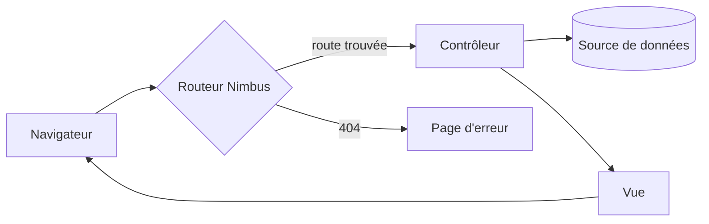
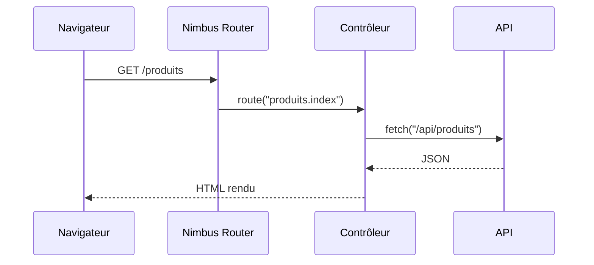
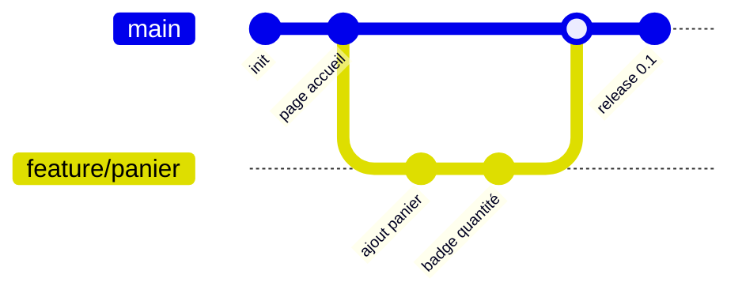

# Concepts clés

- Suivre le cycle de vie d'une requête
- Écrire votre premier composant Nimbus
- Adopter les bonnes pratiques dès le départ

<!--
Layout `chapter` de l'addon — ouverture du chapitre 3.
-->

---
transition: slide-up | slide-down
---

# Le cycle de vie d'une requête

<Steps
  :clicks="true"
  :items="[
    { title: 'Requête', desc: 'Le navigateur envoie GET /accueil', icon: '🌐' },
    { title: 'Routeur', desc: 'Nimbus matche l\'URL à une route' },
    { title: 'Contrôleur', desc: 'Votre logique prépare les données' },
    { title: 'Vue', desc: 'Le template reçoit les données' },
    { title: 'Réponse', desc: 'HTML renvoyé au navigateur', icon: '📦' }
  ]"
/>

<!--
Démontre `<Steps>` horizontal avec `clicks` : chaque étape se révèle au click, idéal pour dérouler un processus séquentiel. Les props `icon` remplacent le numéro.
-->

---
layout: two-cols-header
layoutClass: gap-x-4
transition: slide-up | slide-down
---

# Le même cycle, en coulisses

::left::

<Steps
  direction="vertical"
  :items="[
    { title: 'Résolution de la route', desc: 'correspondance URL → contrôleur' },
    { title: 'Middlewares', desc: 'auth, logs, compression' },
    { title: 'Exécution du contrôleur', desc: 'accès données, règles métier' },
    { title: 'Rendu de la vue', desc: 'template + données = HTML' }
  ]"
/>

::right::

<div class="pt-2">

**Pourquoi décomposer ?**

Chaque étape a une responsabilité unique : vous pouvez tester, remplacer ou déboguer l'une sans toucher aux autres.

**Où intervenez-vous ?**

Vous n'écrivez que le **contrôleur** et la **vue** — Nimbus s'occupe du reste du pipeline.

</div>

<!--
Démontre `<Steps>` vertical SANS clicks (tout visible) en colonne gauche, explications à droite. La direction verticale convient aux timelines détaillées dans une colonne.
-->

---
layout: two-cols-header
layoutClass: gap-x-4
transition: slide-up | slide-down
---

# Un composant qui grandit

::left::

````md magic-move
```ts
// Étape 1 — le plus simple possible
import { defineView } from 'nimbus'

export default defineView(() => {
  return () => <h1>Bonjour</h1>
})
```
```ts
// Étape 2 — on ajoute un état
import { defineView } from 'nimbus'
import { ref } from 'vue'

export default defineView(() => {
  const nom = ref('vous')

  return () => <h1>Bonjour {nom.value}</h1>
})
```
```ts
// Étape 3 — on ajoute une interaction
import { defineView } from 'nimbus'
import { ref } from 'vue'

export default defineView(() => {
  const nom = ref('vous')
  const inverser = () => {
    nom.value = nom.value.split('').reverse().join('')
  }

  return () => (
    <h1 onClick={inverser}>Bonjour {nom.value}</h1>
  )
})
```
````

::right::

<div>

**Étape 1** — `defineView` retourne une fonction de rendu : le minimum viable d'une page Nimbus.

</div>

<div v-click="1">

**Étape 2** — `ref` crée une donnée réactive : le template se met à jour tout seul quand elle change.

</div>

<div v-click="2">

**Étape 3** — `onClick` branche une fonction sur l'événement : votre composant devient interactif.

</div>

<!--
Démontre `magic-move` (3 étapes d'évolution du code, Shiki anime les différences). L'étape 1 est visible dès l'arrivée (click 0, explication sans v-click) ; chaque transition vers une étape suivante consomme un click, donc étape 2 → v-click="1", étape 3 → v-click="2". À utiliser pour faire grandir un code progressivement.
-->

---
layout: two-cols-header
layoutClass: gap-x-4
transition: slide-up | slide-down
---

# Décortiquer un composant

::left::

```ts {none|1-2|4-6|8|all}
import { defineView } from 'nimbus'
import { ref } from 'vue'

interface Compteur {
  valeur: number
}

export default defineView(() => {
  const compteur = ref<Compteur>({ valeur: 0 })
  return () => <button>{compteur.value.valeur}</button>
})
```

::right::

<div v-click="1">

Les **imports** : `defineView` vient de Nimbus, `ref` de Vue — deux sources distinctes.

</div>

<div v-click="2">

L'<Tag label="TypeScript">interface</Tag> décrit la forme de l'état : TypeScript vérifie chaque accès.

</div>

<div v-click="3">

<Tag label="Nimbus">defineView</Tag> déclare la vue : Nimbus l'enregistre et l'exécute au rendu.

</div>

<div v-click="4">

**Règle** : décrire l'état (interface), le créer (ref), le rendre (template) — toujours dans cet ordre.

</div>

<!--
Démontre le line highlighting `{none|1-2|4-6|8|all}` synchronisé : 4 segments après l'état initial = v-click 1 à 4, `all` final pour la synthèse. Les `<Tag>` annotent le vocabulaire dans les explications.
-->

---
transition: slide-up | slide-down
---

# Structurer une route

<Compare>
  <template #bad>

```ts
// Tout mélangé dans la vue
export default defineView(async () => {
  const users = await fetch('/api/users')
    .then(r => r.json())
  return () => <ul>{users.map(u => <li>{u.nom}</li>)}</ul>
})
```

  </template>
  <template #good>

```ts
// Contrôleur : données. Vue : affichage.
// controllers/users.ts
export async function chargerUsers() {
  return fetch('/api/users').then(r => r.json())
}
// vue : <ul>{users.map(...)}</ul>
```

  </template>
</Compare>

<!--
Démontre `<Compare>` avec slots nommés `#bad` / `#good` (labels configurables). Les blocs de code markdown passent dans les slots. À utiliser pour opposer un anti-pattern à la bonne pratique.
-->

---
transition: slide-up | slide-down
---

# Faut-il adopter Nimbus ?

<ProsCons
  :pros="[
    'Zéro configuration pour démarrer',
    'Conventions claires : chaque fichier a sa place',
    'Messages d\'erreur lisibles et actionnables',
    'Hot reload quasi instantané'
  ]"
  :cons="[
    'Écosystème de plugins encore jeune',
    'Communauté plus petite que les frameworks établis',
    'Peu de ressources tierces (tutoriels, templates)'
  ]"
/>

<!--
Démontre `<ProsCons>` (deux cartes vert/rouge, items préfixés ✓/✗, titres personnalisables). À utiliser pour aider à la décision en pesant le pour et le contre.
-->

---
transition: slide-up | slide-down
---

# L'architecture en un diagramme



<!--
Démontre Mermaid `flowchart LR` natif (bloc ```mermaid). À utiliser pour un graphe de flux de données ou de décision.
-->

---
transition: slide-up | slide-down
---

# Qui parle à qui ?



<!--
Démontre Mermaid `sequenceDiagram` natif. À utiliser pour des échanges chronologiques entre acteurs (client/serveur/API).
-->

---
transition: slide-up | slide-down
---

# Versionner votre travail



<!--
Démontre Mermaid `gitGraph` natif. À utiliser pour illustrer branches, merges et releases.
-->

---
layout: center
transition: slide-up | slide-down
---

# Du code à l'écran

<div class="text-center">
  <div class="relative inline-flex items-center gap-16 mt-8">
    <div class="card h-28 w-64 flex flex-col justify-center rounded-xl bg-[#1e293b] text-slate-200"
         v-motion :initial="{ x: -80, opacity: 0 }" :enter="{ x: 0, opacity: 1 }">
      <div class="font-bold mb-1">📄 Votre code</div>
      <div class="text-sm opacity-75">composants, routes, vues</div>
    </div>
    <div class="card h-28 w-64 flex flex-col justify-center rounded-xl bg-[#1e293b] text-slate-200">
      <div class="font-bold mb-1">🖥️ Votre écran</div>
      <div class="text-sm opacity-75">HTML servi au navigateur</div>
    </div>
    <Arrow x1="262" y1="56" x2="314" y2="56" color="#00b5ff" width="3" />
  </div>
</div>

<!--
Démontre `<Arrow>` natif (coordonnées en pixels relatives à l'ancêtre `relative` le plus proche — ici le conteneur inline-flex dimensionné par les cartes : 256 px de carte + 64 px de gap, flèche centrée verticalement à mi-hauteur des cartes h-28) et `v-motion` (animation d'entrée : la carte glisse depuis la gauche). À utiliser pour matérialiser un flux ou une transformation.
-->

---
layout: center
class: text-center
transition: slide-up | slide-down
---

# Trois mots pour retenir Nimbus

<div class="flex justify-center gap-16 mt-10">
  <div>
    <carbon-rocket class="text-4xl" />
    <div class="mt-2 font-bold">Rapide</div>
    <div class="text-sm opacity-70">démarrage en millisecondes</div>
  </div>
  <div>
    <carbon-cloud class="text-4xl" />
    <div class="mt-2 font-bold">Léger</div>
    <div class="text-sm opacity-70">zéro config, zéro surcharge</div>
  </div>
  <div>
    <carbon-code class="text-4xl" />
    <div class="mt-2 font-bold">Lisible</div>
    <div class="text-sm opacity-70">du code qui se raconte</div>
  </div>
</div>

<!--
Démontre les icônes natives : `<carbon-rocket />` etc. viennent de la collection @iconify-json/carbon installée avec Slidev — aucune dépendance à ajouter. Préfixe `carbon-` + nom de l'icône du catalogue Iconify.
-->
