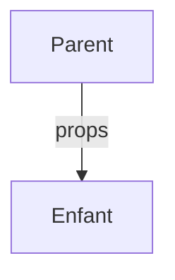

# Les props sont en lecture seule

Les données circulent dans un seul sens

::left::

```tsx {all|2|all}
function Card({ name }: CardProps) {
  name = "Autre nom"   // ❌ à ne jamais faire
  return <h2>{name}</h2>
}
```

<div v-click="2">



</div>

::right::

**Flux descendant**

Les données vont **du parent vers l'enfant**, jamais l'inverse. Le parent décide, l'enfant affiche.

<div v-click="1">

**Lecture seule (read-only)**

Un composant **lit** ses props mais ne les **modifie pas**.

</div>

<div v-click="2">

> 💬 Pour qu'une carte change après affichage, il faudra autre chose que les props...

</div>

<!--
Concept clé : flux de données unidirectionnel (one-way data flow).
Les props sont immuables du point de vue de l'enfant.
La dernière phrase amorce le state (séance 4) sans le nommer : on reste sur "comment faire évoluer l'affichage dans le temps ?".
-->
