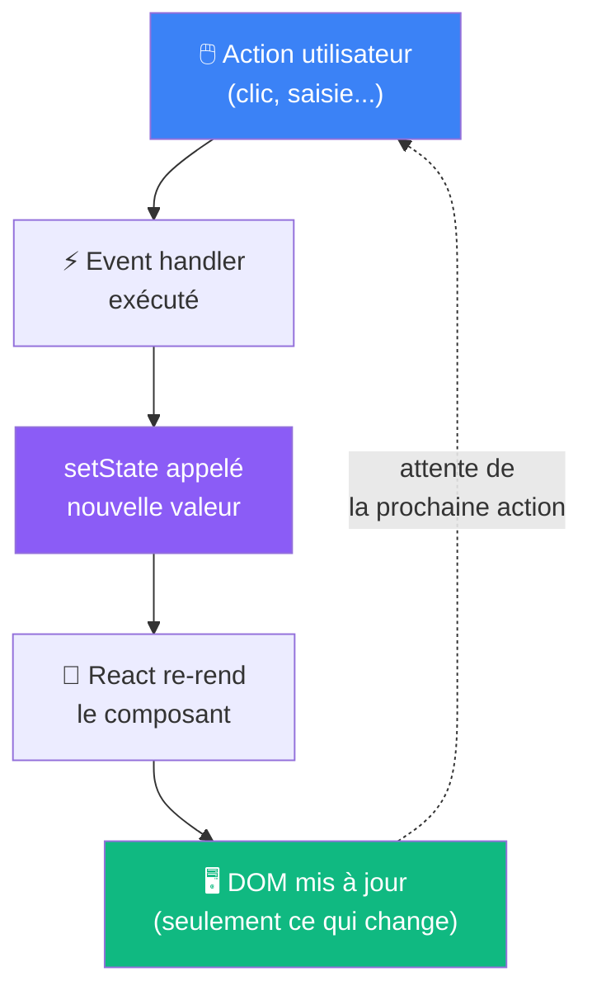

# Le cycle de re-rendu

Ce qui se passe quand le state change

::left::



::right::

**Ce qui se passe concrètement**

<v-click>

Quand `setCount(1)` est appelé, React **rappelle la fonction** `Counter()` depuis le début — avec la nouvelle valeur.

```tsx
function Counter() {
  const [count, setCount] = useState(0)
  //             ↑ vaut 1 au prochain rendu
  return <p>{count}</p>
}
```

</v-click>

<v-click>

**React ne met à jour que le strict nécessaire**

Seuls les nœuds du DOM qui ont réellement changé sont mis à jour — pas tout le composant entier.

</v-click>

<v-click>

> ⚠️ Il y a une subtilité sur la valeur de `count` pendant un rendu — on y revient juste après le compteur.

</v-click>

<!--
Rester sur le modèle mental simple : setState → React rappelle la fonction → nouvel affichage.
La mention du Virtual DOM est volontairement absente ici pour ne pas alourdir.
La dernière puce amorce la slide snapshot sans le spoiler.
-->
