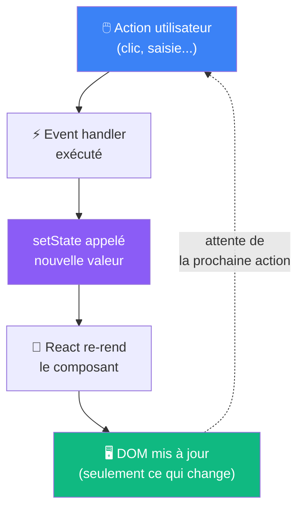

# Le cycle de re-rendu

Ce qui se passe quand le state change

::left::



::right::

**Points clés**

<v-click>

**React ne met à jour que le strict nécessaire**

Le Virtual DOM compare l'ancien et le nouveau JSX — seuls les nœuds différents sont mis à jour dans le vrai DOM.

</v-click>

<v-click>

**Le state est un snapshot**

Pendant un rendu, la valeur de `count` est figée. Plusieurs `setCount` dans le même handler ne s'accumulent pas immédiatement.

```tsx
function handleClick() {
  setCount(count + 1)  // count = 0
  setCount(count + 1)  // count = 0 encore !
  // résultat : count = 1, pas 2
}
```

</v-click>

<!--
Le diagramme Mermaid représente la boucle événement → setter → rendu → affichage.
Le concept de snapshot est contre-intuitif : insister dessus avec un exemple live.
Pour incrémenter plusieurs fois dans le même handler, il faut la forme fonctionnelle : setCount(prev => prev + 1).
-->
