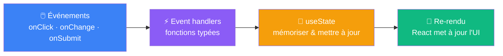

# Ce qu'on retient

Événements, state, re-rendu

::left::

<v-click>

**La formule s'enrichit**

$$UI = f(state)$$

L'interface est une fonction de l'**état interne**, qui évolue en réponse aux **actions utilisateur**.

</v-click>

::right::

**À retenir**

<v-clicks>

- `onClick={fn}` — on passe la fonction, on ne l'appelle pas
- `const [val, setVal] = useState<T>(init)` — anatomie du hook
- Appeler `setVal` → React re-rend le composant
- Le state est un **snapshot** : utiliser `prev =>` pour s'appuyer sur la valeur courante
- Typer l'événement : `React.ChangeEvent<HTMLInputElement>`
- Ne jamais appeler un hook conditionnellement

</v-clicks>

<!--
Ce récapitulatif remplace la slide "bonnes pratiques" qui redoublait du contenu déjà vu.
La liste à puces suit l'ordre de la séance : piège onClick → useState → re-rendu → snapshot → typage → règle des hooks.
Rappeler la progression : S1 Setup → S2 Composants → S3 Props → S4 State → S5 Listes & rendu conditionnel.
-->
