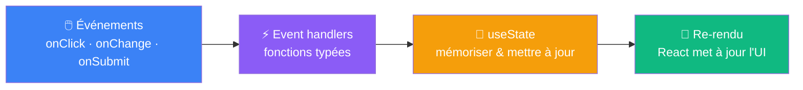

# Ce qu'on a appris aujourd'hui

&nbsp;

<v-click>

 

**La formule s'enrichit**

$$UI = f(state)$$

L'interface est maintenant une fonction de l'**état interne** — et cet état évolue en réponse aux **actions de l'utilisateur**.

</v-click>

<!--
Rappeler la progression : S1 Setup → S2 Composants → S3 Props → S4 State → S5 Listes & rendu conditionnel.
La formule UI = f(state) étend UI = f(data) vue en S3 : state est une forme de data qui vit dans le composant.
-->
