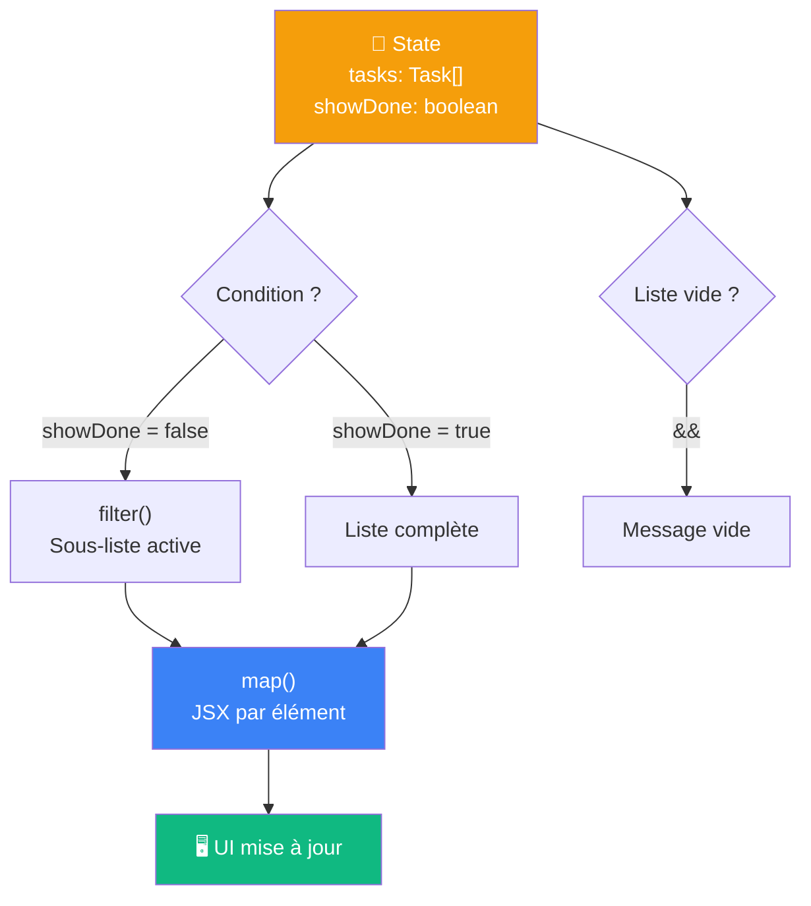

# Ce qu'on retient

Rendu conditionnel et listes dynamiques

::left::

::right::

**À retenir**

<v-clicks>

- JSX n'accepte que des **expressions** entre `{ }`
- `if` → avant le `return`&nbsp;&nbsp;·&nbsp;&nbsp;`? :` → deux branches&nbsp;&nbsp;·&nbsp;&nbsp;`&&` → une branche
- `&&` + nombre : toujours forcer un **booléen**
- `map()` transforme un tableau de données en tableau de JSX
- `key` doit être **stable et unique** — éviter l'index si la liste change
- `filter()` + `map()` se chaînent sans modifier le tableau original
- Une valeur qu'on peut **calculer** depuis le state n'a pas besoin d'être un state

</v-clicks>

<!--
Rappeler la progression : S1 Setup → S2 Composants → S3 Props → S4 State → S5 Rendu conditionnel & Listes.
Le diagramme montre que filter/map sont une transformation du state vers l'UI — concept de données dérivées.
La règle "ne pas mettre en state ce qu'on peut calculer" est un principe fondamental — y revenir en S10 avec Redux.
-->
