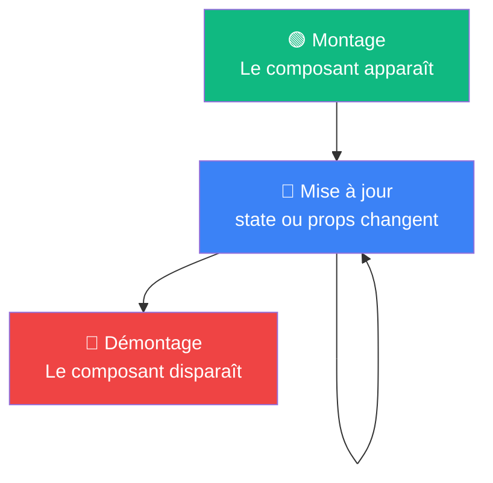

# Le cycle de vie d'un composant

Trois moments dans la vie d'un composant

::left::

::right::

<v-clicks>

1. **Montage** — le composant est créé et inséré dans le DOM pour la première fois
2. **Mise à jour** — le composant se re-rend après un changement de state ou de props
3. **Démontage** — le composant est retiré du DOM

</v-clicks>

<!--
Analogie possible : ouverture d'une page (montage), rafraîchissement du contenu (mise à jour), fermeture de l'onglet (démontage).
Insister : jusqu'ici tout le code s'exécute PENDANT le rendu (calcul du JSX). Le cycle de vie permet d'exécuter du code À CES MOMENTS PRÉCIS, en dehors du rendu.
Pas encore de code ici — le schéma doit rester gravé avant d'attaquer useEffect.
-->
