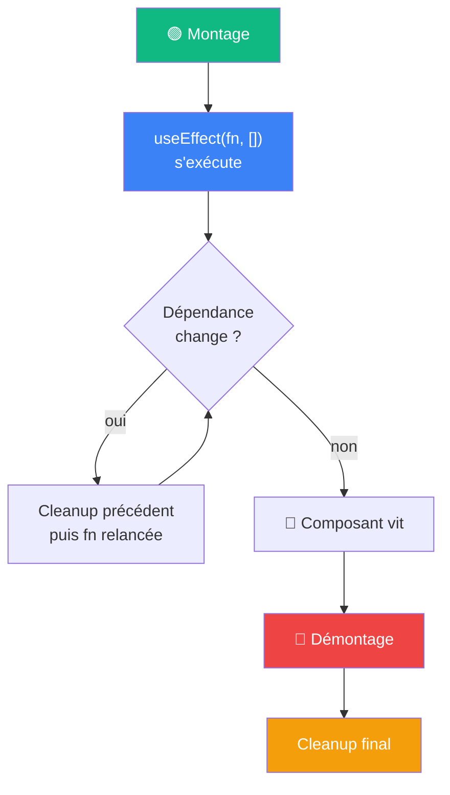

# Ce qu'on retient

Cycle de vie, useEffect et useRef

::left::

::right::

**À retenir**

- `useEffect` exécute du code **après** le rendu, jamais pendant
- Le tableau de dépendances a 3 formes : `[]`, absent, `[dep]`
- Le `return` d'un Effet est son **cleanup** : avant le prochain Effet, ou au démontage
- `useRef` garde une valeur **sans** provoquer de re-rendu
- Un ref DOM (`ref={...}`) n'existe qu'après le rendu → à utiliser dans `useEffect`
- Deux besoins différents, deux Effets séparés plutôt qu'un seul Effet qui fait tout

<!--
Rappeler la progression : S4 State/événements → S5 Rendu conditionnel/listes → S6 Cycle de vie/Hooks.
Le diagramme montre le cycle complet : montage → (dépendance change → cleanup + relance) → démontage → cleanup final.
Ce schéma sera directement réutilisé en S7 quand l'Effet chargera des données au lieu d'un simple minuteur.
-->
