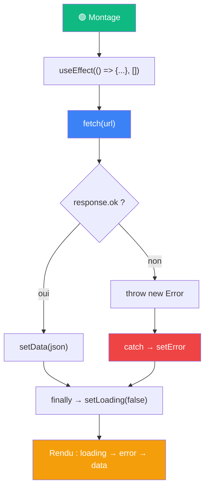

# Ce qu'on retient

Le pattern fetch + useEffect + états typés

::left::

::right::

**À retenir**

- Le fetch part dans un `useEffect(..., [])`, jamais dans le corps du composant
- Toujours vérifier `response.ok` avant `response.json()`
- 3 états typés : `data`, `isLoading`, `error` — un seul s'affiche à la fois
- `.then()` / `.catch()` / `.finally()` couvrent respectivement succès, échec, "dans tous les cas"
- Le rendu conditionnel (S5) et le montage (S6) s'assemblent ici en un seul pattern réutilisable

<!--
Rappeler la progression : S5 Rendu conditionnel/listes → S6 Cycle de vie/Hooks → S7 Appel d'API.
Le diagramme représente le pattern complet qui sera réutilisé tel quel en S8-S9 avec React Router (charger les données d'un post selon son id dans l'URL).
Insister : ce pattern (fetch + 3 états + useEffect) est LE pattern le plus copié-collé de tout React avant l'arrivée de librairies comme React Query.
-->
