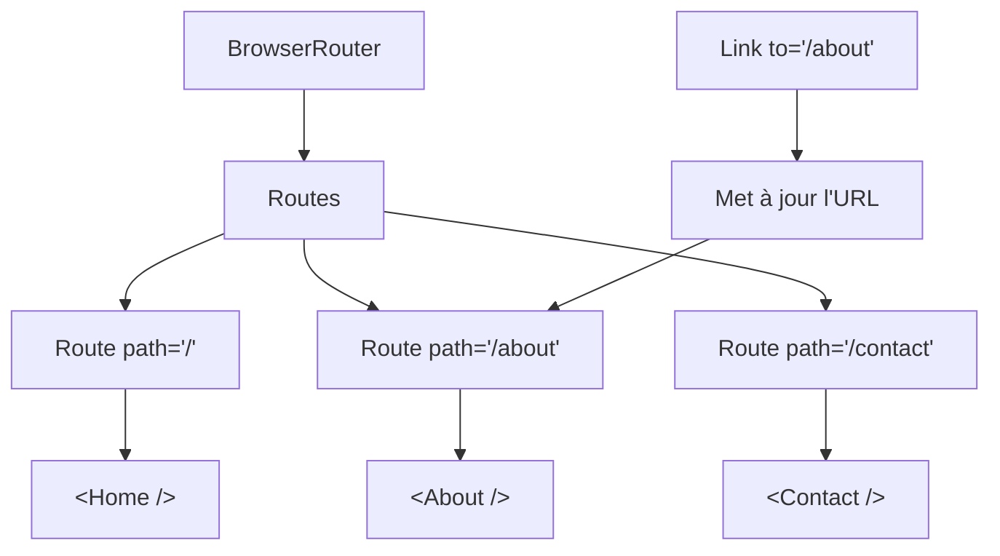

# Ce qu'on retient

La structure de base d'une SPA navigable

::left::

::right::

**À retenir**

- `BrowserRouter` enveloppe l'application **une seule fois**
- `Routes` contient les `Route` et choisit la première correspondance
- `Route` relie un `path` à un `element`
- `Link` navigue sans rechargement et peut styliser le lien actif
- Le menu peut rester **fixe** au-dessus du contenu changeant

<!--
Rappeler la progression : S5 rendu conditionnel → S6 cycle de vie → S7 API → S8 navigation.
Cette structure (Router → Routes → Route) est la fondation de toutes les apps multi-pages React.
-->
