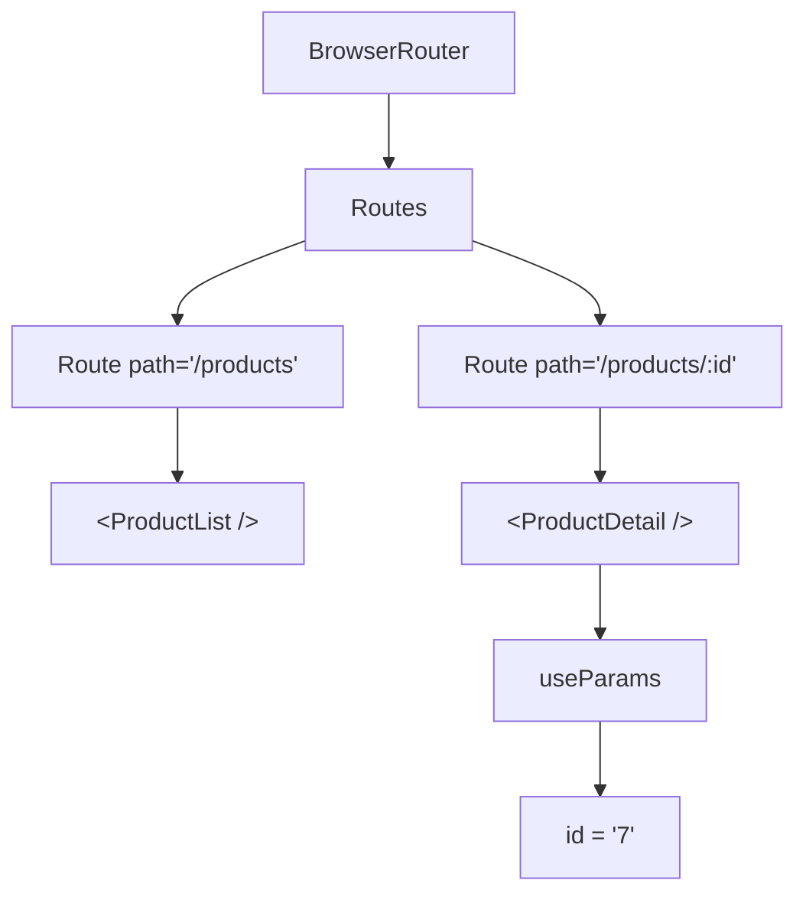

# Ce qu'on retient

De la page fixe à la page dynamique

::left::

::right::

**À retenir**

- `:id` dans `path` crée un segment variable
- `useParams` lit le paramètre sous forme de `string`
- `Outlet` affiche le contenu d'une route imbriquée
- Les layouts partagés évitent de dupliquer le menu
- `useNavigate` permet de naviguer depuis le code

<!--
Synthèse rapide. Insister sur le fil narratif : on a passé de la navigation simple (S8) à des URLs riches et des pages de détail.
-->
