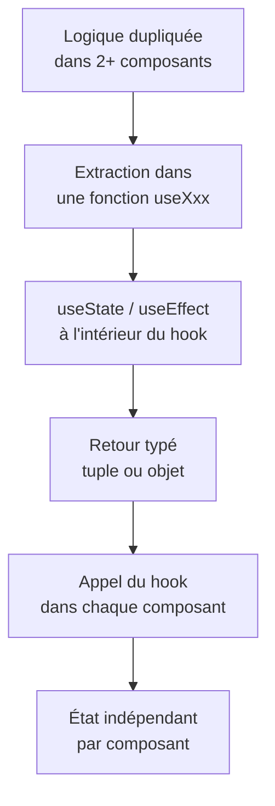

# Ce qu'on retient

De la duplication à la réutilisation

::left::

::right::

**À retenir**

- Un hook personnalisé est une **fonction normale**, préfixée `use`
- Il appelle d'autres hooks (`useState`, `useEffect`) selon les **mêmes règles**
- Chaque appel crée son **propre état**, jamais partagé entre composants
- Le typage suit la convention native : **tuple** (comme `useState`) ou **objet nommé**
- Les generics (`<T>`) rendent un hook réutilisable avec n'importe quel type de donnée

<!--
Rappeler la progression : S4 useState → S6 useEffect/useRef → S7 fetch → S10 extraction de tout ça dans des hooks réutilisables.
Le diagramme résume le geste central de la séance : repérer une duplication, l'extraire, la typer, puis l'appeler à plusieurs endroits.
-->
